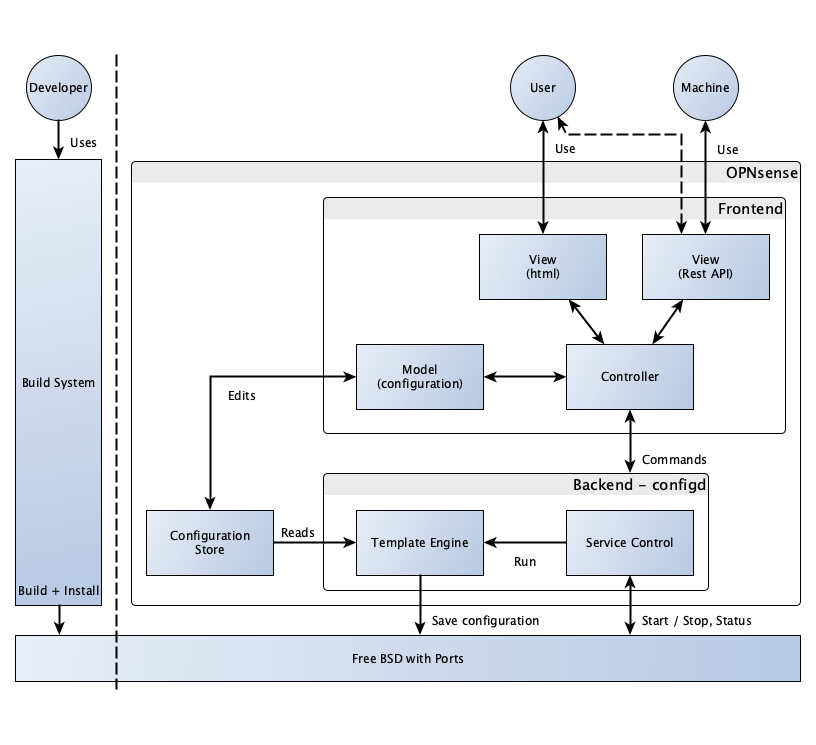
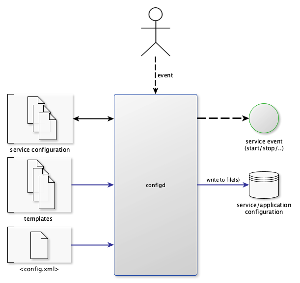
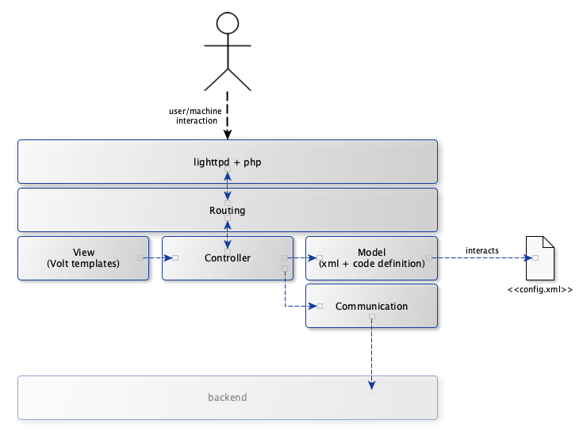

============
Architecture
============

The main focus of the OPNsense project is to provide a secure and
manageable platform for all your security applications. This means high
quality software that is easily maintainable and bug free. We think that
having a framework with a clear separation of concerns is essential to
achieving these goals.

OPNsense is a fork of pfSense ®. The existing code base of pfSense ®
does not always apply a clear separation of concerns. This means we need
a transition of the old (legacy) code base to a new one with a clear
separation. We have chosen a gradual transition to avoid a big bang and
keep the product feature rich while increasing code quality. This
enables simple addition of new features with less bugs and shorter time
to market.

This article describes how this will be achieved.

-----------------------
High-level architecture
-----------------------

|OPNsense Components.png|

As the above model shows there are two main areas in our stack, the
frontend implemented with PHP/Phalcon and the backend using a custom
service built in Python.

The frontend handles user interaction and communicates with the backend
service. Applying configuration changes, monitoring and controlling
services offered by OPNsense is done by the backend service.

By using a fully configurable backend service, we avoid hardcoding of
services and ease the implementation of new features.

The frontend stack delivers a model driven approach to handle
configuration data, including automatic validation.

Manipulation of the core configuration file is handled at the frontend
model; the backend service is merely a consumer of the information
provided.

--------------------
Backend Architecture
--------------------

|OPNsense backend.png|

Configd, is responsible
for the core system interaction like starting and stopping of daemons
and generating configuration files for used services and applications.

The daemon listens on a unix domain socket and is capable of executing
actions defined in it’s own configuration directory
(“/usr/local/opnsense/service/conf/actions\_\*.conf”).

Currently there are two types of services implemented in the daemon:

-  script : execute external (rc) scripts
-  inline : perform inline actions which are part of configd, currently
   only template generation.

|
| Template generation is handled by Jinja2 (http://jinja.pocoo.org/),
  more information on how to create application templates can be found
  at :doc:`/development/backend/templates`.

---------------------
Frontend Architecture
---------------------

|OPNsense frontend.png|

Routing
-------

The OPNsense framework uses components from Phalcon where possible; the
first layer initializes Phalcon’s routing, which handles requests and
delivers them to the controller based on its url. User content is
generated using Volt templates, which are picked by the controller.
Because Phalcon’s default Models function with (relational) databases
and we are using XML data, our model implementation is custom. But
wherever possible we use components from Phalcon (for example,
validation is handled using Phalcon’s classes). For a detailed
description on the routing principles used in OPNsense, visit Frontend
:doc:`/development/frontend/routing`.

Controllers and views
---------------------

Not all parts of the framework are already implemented, but by deriving
all controllers from the base in the OPNsense project it’s easy to
extend and adapt to future needs. Documentation on how to implement
controllers, with the use of views, can be found at :doc:`/development/frontend/controller`.

Models
------

All models are defined by a combination of a class and an XML containing
a (nested) definition. More information on defining models can be found
at the frontend model page :doc:`/development/frontend/models`.

Communication
-------------

Communication to the backend service is handled via a unix domain
socket.

Core system
-----------

The core of OPNsense is powered by an almost standard FreeBSD ® system
extended with packages using the pkg system. GIT is used for version
control and the repositories are split into 4 parts:

-  src : the base (FreeBSD ®) system
-  ports : the ports collection containing third party software
-  core : the OPNsense gui and system configuration parts
-  tools : easy tools to build OPNsense

.. TIP::

   | For detailed information about the development workflow see:
   | :doc:`OPNsense development workflow </development/workflow>`

