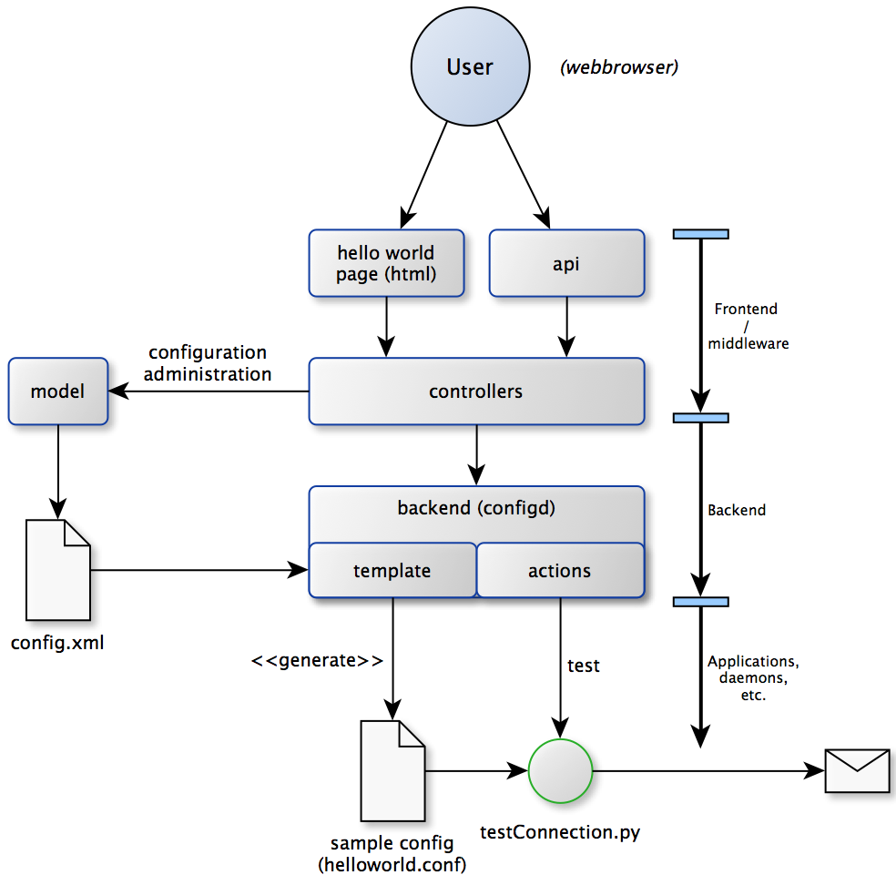
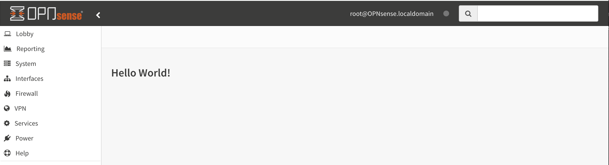
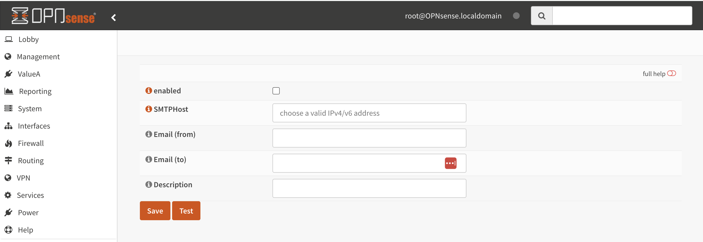
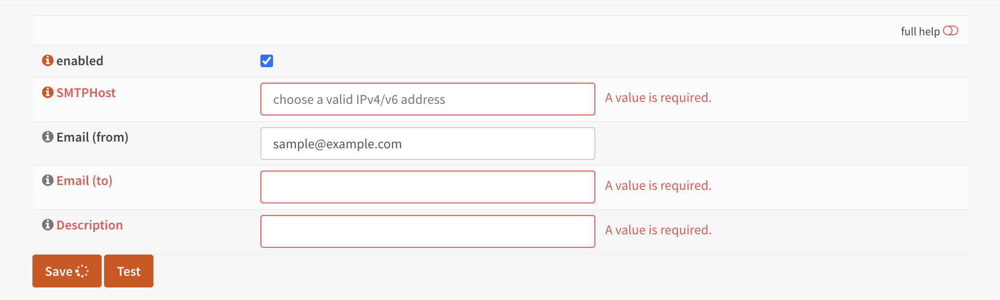
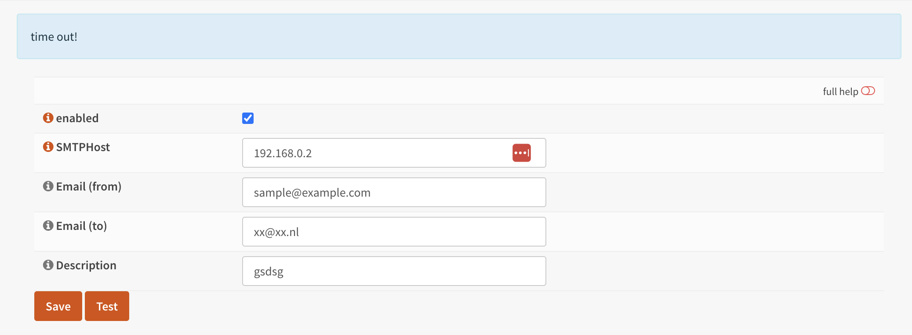
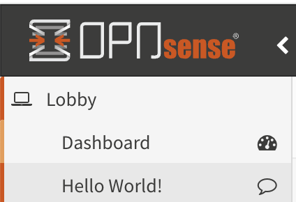

===========================
Hello world module & plugin
===========================

.. sidebar:: Creating the hello world module

    .. image:: images/Hello-World.jpg
       :width: 300px
       :align: center

----
Goal
----

.. rubric:: Goal for this sample
   :name: goal-for-this-sample

----------------------------------

The goal of the "Hello world" module we're creating in the example is to
control a program on our system named "testConnection.py", which is part
of the example package available on GitHub. It will try to send an email
using plain smtp and will respond with a json text message about the
result of that attempt.

Our application will need some settings to operate correctly, like an ip
address and an email address and we need to be able to run that
application. Because this application returns some valuable data for our
users, we need to be able to fetch the response data back.

|overview|

-----------------------------

----------
Guidelines
----------

.. rubric:: Guidelines and coding style
   :name: guidelines-and-coding-style

For all OPNsense modules and applications there are some basic style and
coding guides which you should use.

Naming
------

When creating modules for OPNsense, always name your components like
this: VendorName/ModuleName

In our sample case this will be: OPNsense/HelloWorld

PHP code
--------

Please use PSR-2 style (http://www.php-fig.org/psr/psr-2/) for all new
code.

Architecture
------------

Always make sure there's a clear separation of concerns, back-end calls
(like shell scripts) should be implemented using the configd system, all
communication to the client should be handled from an api endpoint. (the
example provides more insights on how this works).

Back-end programs should not access the config.xml directly, if data is
needed let the template system handle the desired output (most
applications, daemons and tools deliver their own desired configuration
format). There's generally no good reason to avoid the standards that
are already there.

If you follow this basic rules, you're automatically building a command
structure for the system administrators and provide a connector to third
party tools to the API of your component (as of version 16.1).

--------
Skeleton
--------

.. rubric:: Setup a skeleton for the frontend / middleware
   :name: setup-a-skeleton-for-the-frontend-middleware

First step for our project is to build a skeleton which holds the
structure for our frontend/middleware.

Model
-----

For our sample application we want to setup some configuration data,
which for all new style projects should live in it’s own model.

First we start by creating two files inside the
models/OPNsense/HelloWorld directory.

The first one is the boilerplate for the model class, which should
contain model specific methods and (by deriving it from BaseModel)
automatically understands the second file.

.. code-block:: php

    <?php
    namespace OPNsense\HelloWorld;
     
    use OPNsense\Base\BaseModel;
     
    class HelloWorld extends BaseModel
    {
    }

(/usr/local/opnsense/mvc/app/models/OPNsense/HelloWorld/HelloWorld.php)

Not all modules contain additional code in the php class, sometimes all
the standard behaviour is already sufficient for your
modules/application.

Which is the model xml template, our skeleton starts with something like
this:

.. code-block:: xml

    <model>
        <mount>//OPNsense/helloworld</mount>
        <description>
            the OPNsense "Hello World" application
        </description>
        <items>
        </items>
    </model>

(/usr/local/opnsense/mvc/app/models/OPNsense/HelloWorld/HelloWorld.xml)

The content of the mount tag is very important, this is the location
within the config.xml file where this model is responsible. Other models
cannot write data into the same area. You should name this location with
your vendor and module name to make sure others could easily identify
it.

Use the description tag to identify your model, the last tag in place is
the items tag, where the actual definition will live. We leave it empty
for now as we proceed with the next step of creating our skeleton.

View
----

.. rubric:: Page template (View)
   :name: page-template-view

We should add a (Volt) template to use for the index page of our module;
we will use the same naming convention here.

Create a template named index.volt inside the views/OPNsense/HelloWorld
directory containing the following data:

.. code-block:: html

    <h1>Hello World!</h1>

(/usr/local/opnsense/mvc/app/views/OPNsense/HelloWorld/index.volt)

Controller
----------

Next step is to add controllers, which will be automatically picked up
by the system routing. A controller connects the user interaction to
logic and presentation.

Every OPNsense module should separate presentation from logic, that’s
why there should always be multiple controllers per module.

Our first controller handles the template rendering to the user and
connects the user view we just created. We start by creating a php file
in controllers/OPNsense/HelloWorld/ with the following name
IndexController.php and contents:

.. code-block:: php

    <?php
    namespace OPNsense\HelloWorld;
    class IndexController extends \OPNsense\Base\IndexController
    {
        public function indexAction()
        {
            // pick the template to serve to our users.
            $this->view->pick('OPNsense/HelloWorld/index');
        }
    }

(/usr/local/opnsense/mvc/app/controllers/OPNsense/HelloWorld/IndexController.php)

At this point you should be able to test if your work so far was
successful, by going to the following location (after being logged in to
the firewall as root user):

::

  http[s]://<your ip>/ui/helloworld/

Which should serve you the “Hello World!” text you’ve added in the
template.

|Serving the first "hello world" page|

Next two controllers we are going to create are to be used for the api
to the system, they should take care of service actions and the
retrieval/changing of configuration data.

They should live in a subdirectory of the controller called Api and
extend the corresponding class.

For our modules we create two api controllers, one for controlling
settings and one for performing service actions. (Named
SettingsController.php and ServiceController.php) Both should look like
this (replace Settings with Service for the other one):

.. code-block:: php

    <?php
    namespace OPNsense\HelloWorld\Api;
     
    use \OPNsense\Base\ApiControllerBase;
    class SettingsController extends ApiControllerBase
    {
    }

(/usr/local/opnsense/mvc/app/controllers/OPNsense/HelloWorld/Api/SettingsController.php)

----------------
First Input Form
----------------

.. rubric:: Building your first input form
   :name: building-your-first-input-form

The first step in building forms is to determine what information we
should collect.

Our simple application will send an email using data in our
configuration xml. For this very module we want to collect the
following:

+-----------------------+----------------------+----------------------------------------------+
| Property              | Default              | Description                                  |
+=======================+======================+==============================================+
| General.Enabled       | Enabled (1)          | Should this module be enabled (Boolean)      |
+-----------------------+----------------------+----------------------------------------------+
| General.SMTPHost      | <empty>              | IP address for the remote smtp host          |
+-----------------------+----------------------+----------------------------------------------+
| General.FromEmail     | sample@example.com   | Email address of the sender                  |
+-----------------------+----------------------+----------------------------------------------+
| General.ToEmail       | <empty>              | Email address to send our test email to      |
+-----------------------+----------------------+----------------------------------------------+
| General.Description   | <empty>              | Description, used as subject of the email.   |
+-----------------------+----------------------+----------------------------------------------+

Adding Fields
-------------

.. rubric:: Adding fields to your model
   :name: adding-fields-to-your-model

When building the skeleton, we have created an empty model (xml), which
we are going to fill with some attributes now. The items section of the
model xml should contain the structure you want to use for your
application, you can create trees to hold data in here. All leaves
should contain a field type to identify and validate it’s content. The
list of attributes for our application can be translated to this:

.. code-block:: xml

    ………
    <items>
        <!-- container -->
        <general>
            <!-- fields -->
            <Enabled type="BooleanField">
                <default>1</default>
                <Required>Y</Required>
            </Enabled>
            <SMTPHost type="NetworkField">
                <Required>Y</Required>
            </SMTPHost>
            <FromEmail type="EmailField">
                <default>sample@example.com</default>
                <Required>Y</Required>
            </FromEmail>
            <ToEmail type="EmailField">
                <Required>Y</Required>
            </ToEmail>
            <Description type="TextField">
                <Required>Y</Required>
            </Description>
        </general>
    </items>
    ………

All available field types can be found in the
models/OPNsense/Base/FieldTypes directory. If specific field types
support additional parameters, for example for validation, they should
be registered in the model as well (just like the default tag in
Enabled).

Presentation XML
----------------

.. rubric:: Create a presentation xml to feed your template
   :name: create-a-presentation-xml-to-feed-your-template

Because creating forms is one of the key assets of the system, we have
build some easy to use wrappers to guide you through the process. First
we create an xml file for the presentation, which defines fields to use
and adds some information for your template to render. Create a file in
your controller directory using the sub directory forms and name it
general.xml. Next copy in the following content:

.. code-block:: xml

    <form>
        <field>
            <id>helloworld.general.Enabled</id>
            <label>enabled</label>
            <type>checkbox</type>
            <help>Enable this feature</help>
        </field>
        <field>
            <id>helloworld.general.SMTPHost</id>
            <label>SMTPHost</label>
            <type>text</type>
            <help><![CDATA[ip address of the mail host]]></help>
            <hint>choose a valid IPv4/v6 address</hint>
        </field>
        <field>
            <id>helloworld.general.FromEmail</id>
            <label>Email (from)</label>
            <type>text</type>
        </field>
        <field>
            <id>helloworld.general.ToEmail</id>
            <label>Email (to)</label>
            <type>text</type>
        </field>
        <field>
            <id>helloworld.general.Description</id>
            <label>Description</label>
            <type>text</type>
        </field>
     </form>

(/usr/local/opnsense/mvc/app/controllers/OPNsense/HelloWorld/forms/general.xml)

All items should contain at least an id (where to map data from/to), a
type (how to display) and a label, which identifies it to the user.
Optional you may add additional fields like help or mark features as
being only for advanced users. (The Volt template defines which
attributes are usable.)

Now we need to tell the controller to use this information and pass it
to your template, so change the IndexController.php and add this line:

.. code-block:: php

    $this->view->generalForm = $this->getForm("general");

And we are ready to update the (Volt) template with this information.
Let’s remove the "<h1>Hello World!</h1>" line and replace it with
something like this:

.. code-block:: jinja

    {{ partial("layout_partials/base_form",['fields':generalForm,'id':'frm_GeneralSettings'])}}

This tells the template system to add a form using the contents of
generalForm and name it frm\_GeneralSettings in the html page. Based on
a standard template part which is already part of the standard system,
named base\_form.volt.

When opening the page again it will render like this:

|Template with fields without content|

Create API calls
----------------

.. rubric:: Create API calls to retrieve and store data
   :name: create-api-calls-to-retrieve-and-store-data

The framework provides some helpful utilities to get and set data from
and to the configuration xml by using your defined model. First step in
binding your model to the system is to add a method to the
SettingsController to fetch the data from our configuration (or provide
the defaults if there is no content).

We start by adding the model to our SettingsController, by adding this
in the “use” section:

.. code-block:: php

    use \OPNsense\HelloWorld\HelloWorld;

Which includes our model into the controller. Next we create an action
to get data from our system, and put it into a json object for the
client (browser) to parse, by using the wrappers already in our model.

.. code-block:: php

    * retrieve HelloWorld general settings
     * @return array general settings
     */
    public function getAction()
    {
        // define list of configurable settings
        $result = array();
        if ($this->request->isGet()) {
            $mdlHelloWorld = new HelloWorld();
            $result['helloworld'] = $mdlHelloWorld->getNodes();
        }
        return $result;
    }

(/usr/local/opnsense/mvc/app/controllers/OPNsense/HelloWorld/Api/SettingsController.php)

You will probably notice the return value of the action, it's a standard
array which uses "helloworld" for all attributes from getNodes() which
will automatically be converted by the framework to a json object for
the client. The getNodes method itself returns a tree a values, as
defined by your model.

You can test the result (while logged in as root), by going to this
address:

::

    http[s]://<your ip>/api/helloworld/settings/get

For saving the data back, we need a similar kind of call, let’s name it
“set” and add this to the same php file:

.. code-block:: php

    /**
     * update HelloWorld settings
     * @return array status
     */
    public function setAction()
    {
        $result = array("result"=>"failed");
        if ($this->request->isPost()) {
            // load model and update with provided data
            $mdlHelloWorld = new HelloWorld();
            $mdlHelloWorld->setNodes($this->request->getPost("helloworld"));
     
            // perform validation
            $valMsgs = $mdlHelloWorld->performValidation();
            foreach ($valMsgs as $field => $msg) {
                if (!array_key_exists("validations", $result)) {
                    $result["validations"] = array();
                }
                $result["validations"]["general.".$msg->getField()] = $msg->getMessage();
            }
     
            // serialize model to config and save
            if ($valMsgs->count() == 0) {
                $mdlHelloWorld->serializeToConfig();
                Config::getInstance()->save();
                $result["result"] = "saved";
            }
        }
        return $result;
    }

(/usr/local/opnsense/mvc/app/controllers/OPNsense/HelloWorld/Api/SettingsController.php)

And include the Config class from our base system by adding this to the
“use” section:

.. code-block:: php

    use \OPNsense\Core\Config;

Support jQuery API calls
------------------------

.. rubric:: Update the view to support the API calls using jQuery
   :name: update-the-view-to-support-the-api-calls-using-jquery

Now we need to link the events to the backend code to be able to load
and save our form, by using the OPNsense libraries you can validate your
data automatically.

Add this to the index.volt template from the HelloWorld module:

.. code-block:: html

    
     
    

        <button class="btn btn-primary"  id="saveAct" type="button"><b>{{ lang._('Save') }}</b></button>
    

The first piece of javascript code handles the loading of data when
opening the form, then a button is linked to the save event.

Let’s give it a try and save our data, without modifying it first.

|Form with validation errors|

Next correct the errors and save again, on successful save the data
should be stored in the config.xml. If you want to change validation
messages, just edit the model xml and add your message in the
ValidationMessage tag. For example:

.. code-block:: xml

    <ToEmail type="EmailField">
        <Required>Y</Required>
        <ValidationMessage>please specify a valid email address</ValidationMessage>
    </ToEmail>

Changes the “email address invalid” into “please specify a valid email
address”

Add actions
-----------

.. rubric:: Add some activity to the module
   :name: add-some-activity-to-the-module

Our basic module provides a way to read and modify configuration data
using the web interface (and in time also other consumers using the
api). Next step is to add some activity to our system, all backend
applications should use their own configuration, which in real life we
would keep as standard as possible.

For our example we will follow the same process as for any other service
and start writing some configuration data for our sample application.
Which means, creating a template and hooking it into our save action.

Our example will write a simple configuration file, stored in
/usr/local/etc/helloworld/helloworld.conf

The configd system is responsible for updating the contents of that file
when requested, it does so by using a definition found in its template
folder. This sample will use the following path to store the backend
templates:

::

    /usr/local/opnsense/service/templates/OPNsense/HelloWorld/

First we add a content definition, by creating a file named +TARGETS,
which should hold the following information:

::

    helloworld.conf:/usr/local/etc/helloworld/helloworld.conf

This basically tells the engine that there will be a file in the same
folder named “helloworld.conf” which provides, together with config.xml,
data for the file in /usr/local/etc/helloworld/helloworld.conf

Next thing to do is create that helloworld.conf file in the templates
directory. We will keep things very simple for this one and just copy in
our data into an ini file structured configuration, when the module is
enabled.

.. code-block:: html+jinja

    
    [general]
    SMTPHost={{ OPNsense.helloworld.general.SMTPHost|default("") }}
    FromEmail={{ OPNsense.helloworld.general.FromEmail|default("") }}
    ToEmail={{ OPNsense.helloworld.general.ToEmail|default("") }}
    Subject={{ OPNsense.helloworld.general.Description|default("") }}
    

Now we need to be able to reload this module (or in real life, this
would probably be a service) by adding a service action into our
ServiceController. Edit
controllers/OPNsense/HelloWorld/Api/ServiceController.php and add the
backend module to the use section, like this:

.. code-block:: php

    use \OPNsense\Core\Backend;

By doing this we can use the backend communication in this class. Next
add a new action to the class called “reloadAction” using this piece of
code:

.. code-block:: php

    public function reloadAction()
    {
        $status = "failed";
        if ($this->request->isPost()) {
            $backend = new Backend();
            $bckresult = trim($backend->configdRun("template reload OPNsense/HelloWorld"));
            if ($bckresult == "OK") {
                $status = "ok";
            }
        }
        return array("status" => $status);
    }

(/usr/local/opnsense/mvc/app/controllers/OPNsense/HelloWorld/Api/ServiceController.php)

This validates the type of action (it should always be POST to enable
csrf protection) and adds a backend action for reloading the template.
When successful the action will return “status”:”ok” as json object back
to the client.

Now we are able to refresh the template content, but the user interface
doesn’t know about it yet. To hook loading of the template into the save
action, we will go back to the index.volt view and add the following
jQuery / framework code between the braces of “saveFormToEndPoint”.

.. code-block:: javascript

    ajaxCall(url="/api/helloworld/service/reload", sendData={},callback=function(data,status) {
        // action to run after reload
    });

If you save the form now (when enabled), you should see a new file in

::

    helloworld.conf:/usr/local/etc/helloworld/helloworld.conf

Containing something like this:

.. code-block:: ini

    [general]
    SMTPHost=127.0.0.1
    FromEmail=sample@example.com
    ToEmail=sample@example.com
    Subject=test

What have we accomplished now, we can input data, validate it and save
it to the corresponding format of the actual service or application,
which uses this data. So if you have a third party application, which
you want to integrate into the user interface. You should be able to
generate what it needs now. (There’s more to learn, but these are the
basics).

But how do should we control that third part program now? That’s the
next step.

----------------------
Controlling the sample
----------------------

In stead of running all kinds of shell commands directly from the php
code, which very often need root access (starting/stopping services,
etc), we should always communicate to our backend process which holds
templates of possible things to run and protects your system from
executing arbitrary commands.

Another advantage of this approach is that all commands defined here,
can also be ran from the command line of the firewall providing easier
serviceability. For example, the command to refresh the helloworld
configuration can be run from the command line by running:

::

  configctl template reload OPNsense/HelloWorld

First thing to do when registering new actions to the system for a new
application is to create a config template.

::

    /usr/local/opnsense/service/conf/actions.d/actions_helloworld.conf

And add a command to the template like this:

::

    [test]
    command:/usr/local/opnsense/scripts/OPNsense/HelloWorld/testConnection.py
    parameters:
    type:script_output
    message:hello world module test

Let’s test our new command by restarting configd from the command line:

::

    service configd restart

And test our new command using:

::

    configctl helloworld test

Which should return some response in json format.

Next step is to use this command in our controller (middleware), just
like we did with the template action. For consistency we call our action
testAction and let it pass json data to our clients when using a POST
type request.

.. code-block:: php

    public function testAction()
    {
        if ($this->request->isPost()) {
            $backend = new Backend();
            $bckresult = json_decode(trim($backend->configdRun("helloworld test")), true);
            if ($bckresult !== null) {
                // only return valid json type responses
                return $bckresult;
            }
        }
        return array("message" => "unable to run config action");
    }

(/usr/local/opnsense/mvc/app/controllers/OPNsense/HelloWorld/Api/ServiceController.php)

And now we can make our user interface aware of the action, place a
button and link an action in the index.volt. Using the following
elements:

|
| (in script section)

.. code-block:: javascript

    $("#testAct").click(function(){
        $("#responseMsg").removeClass("hidden");
        ajaxCall(url="/api/helloworld/service/test", sendData={},callback=function(data,status) {
            // action to run after reload
            $("#responseMsg").html(data['message']);
        });
    });

(in html section)

.. code-block:: xml

    

     
    

    <button class="btn btn-primary"  id="testAct" type="button"><b>{{ lang._('Test') }}</b></button>

(/usr/local/opnsense/mvc/app/views/OPNsense/HelloWorld/index.volt)

Now go back to the page and save some data using the save button, next
press test to see some results.

|test the application action|

-----------------------------
Multi language / Translations
-----------------------------

OPNsense is available in may different languages like english, german or japanese.
This works because we are using the gettext library which is available to all GUI components.
While the XML based user interfaces are supporting it automatically,
there may still the need to call it manually (buttons, tabs etc.).

If you have a static string, you should add it like this into a classic php page:

.. code-block:: php

    <?= gettext('your string here') ?>

And this way into a volt template:

.. code-block:: html+jinja

    {{ lang._('your string here') }}

If your string is not only plaintext because it contains non-static words, HTML tags and other dynamic content,
you need to use a format string. This way, you can use placeholders for such elements which should not land in
the translation file.

For php it works this way:

.. code-block:: php

    <?= sprintf(gettext('your %s here'), $data) ?>

And for volt templates it works this way:

.. code-block:: html+jinja

    {{ lang._('your %s here') | format(data) }}

.. Note::
    You should NEVER split strings which should belong together like a sentence.
    This makes plugins hard to translate and will decrease the quality of OPNsense in other languages.

-------------------------
Plugin to the menu system
-------------------------

Most modules and applications need a place in the menu system, you could
easily arrange that by creating a Menu.xml definition for your module in
the model directory under Menu/Menu.xml.

Now let’s register our “hello world” in the user section of our menu, by
adding this content into the menu.xml:

.. code-block:: xml

    <menu>
        <!-- Plugin HelloWorld menu -->
        <User order="999">
            <HelloWorld VisibleName="Hello World!" url="/ui/helloworld/"/>
        </User>
    </menu>

When you refresh your page now, you should notice the menu system
automatically picks up this new information.

|menu registration|

------------------------------
Plugin to access control (ACL)
------------------------------

If we want to authorize users to access this module, we can add an acl
to this module. Without it, only admin users can access it. Create an
xml file in the model directory name ACL/ACL.xml and place the following
content in it:

.. code-block:: xml

    <acl>
        <!-- unique acl key, must be globally unique for all acl's  -->
        <page-user-helloworld>
            <name>WebCfg - Users: Hello World! </name>
            <description>Allow access to the Hello World! module</description>
            <patterns>
                <pattern>ui/helloworld/*</pattern>
                <pattern>api/helloworld/*</pattern>
            </patterns>
        </page-user-helloworld>
    </acl>

This creates an acl key named “page-user-helloworld” which authorizes
access to both the ui and api urls of this application. You can now
grant access to this module from the system user manager.

|

----------------------------
Create an installable plugin
----------------------------

All files are created in their original locations (on the OPNsense
machine /usr/local/…), now we are ready to create a package from them.
To fully use this process and create the actual package, it’s best to
setup a full build environment (explained over here:
https://github.com/opnsense/tools )

When everything is in place, we will create a new plugin directory. For
this example we will use the following:

::

    /usr/plugins/devel/helloworld/

Add a new Makefile, containing the information for our plugin:

.. code-block:: kconfig

    PLUGIN_NAME=     helloworld
    PLUGIN_VERSION=        1.0
    PLUGIN_COMMENT=        A sample framework application
    #PLUGIN_DEPENDS=
    PLUGIN_MAINTAINER= user@domain
     
    .include "../../Mk/plugins.mk"

|
| Then create an src directory in here:

::

    /usr/plugins/devel/helloworld/src/

Next copy all files created and located in /usr/local/ into this new src
directory, which results in the following file listing:

::

    src/opnsense/mvc/app/controllers/OPNsense/HelloWorld/Api/ServiceController.php
    src/opnsense/mvc/app/controllers/OPNsense/HelloWorld/Api/SettingsController.php
    src/opnsense/mvc/app/controllers/OPNsense/HelloWorld/IndexController.php
    src/opnsense/mvc/app/controllers/OPNsense/HelloWorld/forms/general.xml
    src/opnsense/mvc/app/models/OPNsense/HelloWorld/ACL/ACL.xml
    src/opnsense/mvc/app/models/OPNsense/HelloWorld/HelloWorld.php
    src/opnsense/mvc/app/models/OPNsense/HelloWorld/HelloWorld.xml
    src/opnsense/mvc/app/models/OPNsense/HelloWorld/Menu/Menu.xml
    src/opnsense/mvc/app/views/OPNsense/HelloWorld/index.volt
    src/opnsense/scripts/OPNsense/HelloWorld/testConnection.py
    src/opnsense/service/templates/OPNsense/HelloWorld/+TARGETS
    src/opnsense/service/templates/OPNsense/HelloWorld/helloworld.conf
    src/opnsense/service/conf/actions.d/actions_helloworld.conf

Next add a +POST\_INSTALL file in the plugin directory, to reload the
configd process after installation. This is needed for the new “test”
command to register.

.. code-block:: sh

    if /usr/local/etc/rc.d/configd status > /dev/null; then
            /usr/local/etc/rc.d/configd restart
    fi

With everything in place, you could build the plugin package using the
“make plugins” command in the /usr/tools directory. The result of this
will be a standard pkg package, which you can install on any OPNsense
system and will be usable right after installing. All plugins are
prefixed with os-, our new package file will be called:

::

    os-helloworld-1.0.txz

(-1.0 comes from the version in the makefile)

.. rubric:: Reference
   :name: reference

-  source of this example :
   https://github.com/opnsense/plugins/tree/master/devel/helloworld
-  build instructions : https://github.com/opnsense/tools
-  frontend template language reference (Volt) :
   https://docs.phalconphp.com/en/latest/reference/volt.html
-  configuration template language reference (mostly the same as Volt) :
   http://jinja.pocoo.org/docs/dev/
-  OPNsense architecture :doc:`Architecture <../architecture>`
-  OPNsense creating models
   `Develop:Frontend/Creating\_models </index.php/Develop:Frontend/Creating_models>`__

