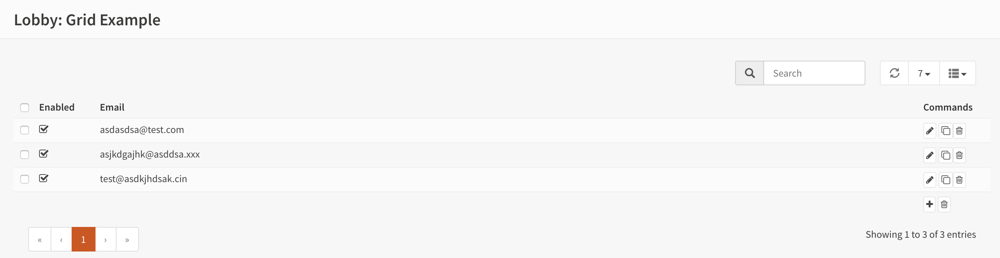

=============================
Using grids  module & plugin
=============================

.. sidebar:: Creating grid enabled forms

    .. image:: images/grid-sample.png
       :width: 300px
       :align: center

---------
Goal
---------

The purpose of this example is to show how to build data grids in OPNsense, using the various components
within our framework.

If you haven't read the HelloWorld example yet, we advise you to start there. This example assumes you already know
the basics.

Our topic of choice for this module is a basic list for email addresses, for which you should be able to add, remove and
change items.

--------
Model
--------

Our example starts with a model, which is constructed by creating a php class deriving from :code:`BaseModel` and an XML
file containing the actual model definition.

.. code-block:: php
    :linenos:
    :caption: /usr/local/opnsense/mvc/app/models/OPNsense/GridExample/GridExample.php

    <?php
    namespace OPNsense\GridExample;

    use OPNsense\Base\BaseModel;

    class GridExample extends BaseModel
    {
    }

.. code-block:: xml
    :emphasize-lines: 8, 9, 13, 16
    :linenos:
    :caption: /usr/local/opnsense/mvc/app/models/OPNsense/GridExample/GridExample.xml

    <model>
        <mount>//OPNsense/GridExample</mount>
        <description>
            the OPNsense "GridExample" application
        </description>
        <items>
            <addresses>
                <address type="ArrayField">
                    <enabled type="BooleanField">
                        <default>1</default>
                        <Required>Y</Required>
                    </enabled>
                    <email type="EmailField">
                        <Required>Y</Required>
                    </email>
                    <description type="DescriptionField"/>
                </address>
            </addresses>
        </items>
    </model>

Note the :code:`ArrayField` type in the XML, this is a special field type for nested items in automatically includes an internal uuid for easy referencing when written to disk.
Both other field types are also used in the HelloWorld example earlier. All
the preinstalled types can be found in our field type directory on `GitHub <https://github.com/opnsense/core/tree/master/src/opnsense/mvc/app/models/OPNsense/Base/FieldTypes>`__.

----------------------------
API controller
----------------------------

The :code:`ApiMutableModelControllerBase` class supports most model manipulations, all :code:`*Base` methods embody
shared functionality to operate on either new or existing model items.

Our example below uses the base methods to link all operations we need and link them on endpoints ending at :code:`Item`:

* searchItemAction, queries the items in your configuration
* getItemAction, fetches an existing record (or returns a blank one with all defaults)
* addItemAction, add a new record
* setItemAction, update a record
* delItemAction, delete a record
* toggleItemAction, toggle [0|1] the "enabled" property  (see the enabled :code:`BooleanField` in the model)

.. code-block:: php
    :linenos:
    :caption: /usr/local/opnsense/mvc/app/controllers/OPNsense/GridExample/Api/SettingsController.php

    namespace OPNsense\GridExample\Api;

    use \OPNsense\Base\ApiMutableModelControllerBase;

    class SettingsController extends ApiMutableModelControllerBase
    {
        protected static $internalModelName = 'gridexample';
        protected static $internalModelClass = 'OPNsense\GridExample\GridExample';

        public function searchItemAction()
        {
            return $this->searchBase("addresses.address", null, "email");
        }

        public function setItemAction($uuid)
        {
            return $this->setBase("address", "addresses.address", $uuid);
        }

        public function addItemAction()
        {
            return $this->addBase("address", "addresses.address");
        }

        public function getItemAction($uuid = null)
        {
            return $this->getBase("address", "addresses.address", $uuid);
        }

        public function delItemAction($uuid)
        {
            return $this->delBase("addresses.address", $uuid);
        }

        public function toggleItemAction($uuid, $enabled = null)
        {
            return $this->toggleBase("addresses.address", $uuid, $enabled);
        }
    }

The parameters of all methods contain at least the root of the :code:`ArrayField` type you want to operate on
and in cases the action involves form data the name of the root property used as in the container to transport data in.

For example, a getItem (/api/gridexample/settings/getItem/my-uuid-id) would return a response like this (highlighted the container):

.. code-block:: json
    :linenos:
    :emphasize-lines: 2

    {
      "address": {
        "enabled": "1",
        "email": "test@example.com"
        "description": "Test Address"
      }
    }

----------------------------
Define dialog items
----------------------------

To edit the data we define which fields should be presented to the user and how they are formatted.
Below a simple layout, the id fields reference the actual data points to map (:code:`address.enabled` for example), which is exactly
what the api endpoint returns.

For the grid creation, the same form will also create columns for each field id. The grid column formatting can be controlled via
the ``grid_view`` tag. Inside this tag, we can define ``width``, ``type``, ``formatter``, ``sequence``, ``visible``, ``ignore`` and
other tags.

.. code-block:: xml
    :caption: /usr/local/opnsense/mvc/app/controllers/OPNsense/GridExample/forms/dialogAddress.xml

    <form>
        <field>
            <id>address.enabled</id>
            <label>Enabled</label>
            <type>checkbox</type>
            <help>Enable this address</help>
            <grid_view>
                <width>6em</width>
                <type>boolean</type>
                <formatter>rowtoggle</formatter>
            </grid_view>
        </field>
        <field>
            <id>address.email</id>
            <label>Email</label>
            <type>text</type>
            <help>Enter the email address</help>
        </field>
        <field>
            <id>address.description</id>
            <label>Description</label>
            <type>text</type>
            <help>Enter an optional description</help>
            <grid_view>
                <visible>false</visible>
            </grid_view>
        </field>
    </form>

---------------------------------------
UI controller
---------------------------------------

The user interface controller sets the template (view) to use and collects the dialog form and grid properties from the xml file
defined earlier.

.. code-block:: php
    :linenos:
    :caption: /usr/local/opnsense/mvc/app/controllers/OPNsense/GridExample/IndexController.php

    namespace OPNsense\GridExample;

    class IndexController extends \OPNsense\Base\IndexController
    {
        public function indexAction()
        {
            $this->view->pick('OPNsense/GridExample/index');
            $this->view->formDialogAddress = $this->getForm("dialogAddress");
            $this->view->formGridAddress = $this->getFormGrid("dialogAddress");
        }
    }

------------------------------------
Constructing the volt template
------------------------------------

We ship a javascript wrapper to implement a slightly modified version of `jquery-bootgrid <http://www.jquery-bootgrid.com/>`__, to
use this in our template (view) we define three different blocks.

First of all we bind a table by id ``{{formGridAddress['table_id']}}`` using :code:`UIBootgrid()`. Then we define the table which will be
changed into a dynamic searchable grid and we link our dialog content. Both grid (base_bootgrid_table) and dialog (base_dialog)
use a volt :code:`partial()`.

The basic "UIBootgrid" bind connects all actions which we have defined in our API controller earlier, there are more options
available, but these are not needed for this use-case.

Our edit dialog is being written in advance so the javascript code can open the statically defined form when needed,
the last highlighted block takes care of this. The partial uses three argument, the variable connected via the
controller containing all form entries, the name (id) of the form ``'id':formGridAddress['edit_dialog_id']``, which is referenced in
the table ``{{formGridAddress['table_id']}}``, and finally the caption of the dialog.

To apply changes, there is a (base_apply_button) volt :code:`partial()` which calls a reconfigure API endpoint.
The event listener is attached to SimpleActionButton(), a shared javascript function for most reconfiguration use cases.

Whenever a change in the grid is performed, the (base_apply_button) will automatically show a data change dialog.

.. code-block:: html
    :caption: /usr/local/opnsense/mvc/app/views/OPNsense/GridExample/index.volt
    :linenos:
    :emphasize-lines: 3, 19, 22

    

    

        {{ partial('layout_partials/base_bootgrid_table', formGridAddress) }}
    

    {{ partial('layout_partials/base_apply_button', {'data_endpoint': '/api/gridexample/service/reconfigure'}) }}
    {{ partial("layout_partials/base_dialog",['fields':formDialogAddress,'id':formGridAddress['edit_dialog_id'],'label':lang._('Edit address')])}}

---------------------------------------
Service controller
---------------------------------------

The service controller in this example is a stub and generates a generic status response when calling ``/api/gridexample/service/reconfigure`` via
the SimpleActionButton().

.. code-block:: php
    :linenos:
    :caption: /usr/local/opnsense/mvc/app/controllers/OPNsense/GridExample/Api/ServiceController.php

    namespace OPNsense\GridExample\Api;

    use OPNsense\Base\ApiControllerBase;

    class ServiceController extends ApiControllerBase
    {
        public function reconfigureAction()
        {
            sleep(1);
            return ["status" => "ok"];
        }
    }

--------------------------------------
Menu and ACL
--------------------------------------

The sample package on `GitHub <https://github.com/opnsense/plugins/tree/master/devel/grid_example>`__ also contains a
menu definition (xml) and ACL (xml), which are similar to the ones explained in the hello world example.

--------------------------------
Test drive your app
--------------------------------

Now go to http[s]://your.host/ui/gridexample and try it out.

