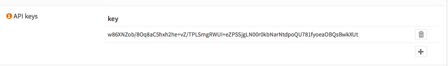

===========
Use the API
===========

.. contents:: Index

--------
Overview
--------

All components that are using the full architecture of OPNsense
automatically receive API capabilities, for this simple tutorial we use
the firmware module but others will function in the same way. API access
is part of the local user authentication system, but uses key/secret
pairs to separate account information from machine to machine
communication. Secrets are not stored on OPNsense and can be downloaded
only once, if lost, a new key has to be generated for your application.

A user can have multiple keys, our advice is to create a unique key for
every application in use.

-------------
Creating keys
-------------

API keys are managed in the user manager (system\_usermanager.php), go
to the user manager page and select a user. Somewhere down the page you
will find the API section for this user.

|Usermanager add api key.png|

Click on the + sign to add a new key. When the key is created, you will
receive a (single download) with the credentials in one text file (ini
formatted). The contents of this file look like this:

.. code-block:: c

    key=w86XNZob/8Oq8aC5r0kbNarNtdpoQU781fyoeaOBQsBwkXUt
    secret=XeD26XVrJ5ilAc/EmglCRC+0j2e57tRsjHwFepOseySWLM53pJASeTA3

--------------------
Code sample (python)
--------------------

For the python code sample we use the nice "requests" library
(http://docs.python-requests.org/en/latest/), which makes HTTP calls
very easy.

Before you can start, make sure your OPNsense has a valid SSL
certificate (or choose to ignore it for testing purposes by setting
verify=False), don't forget to verify that the selected user may access
the firmware page.

The web interface uses the same logic that will be available for the
api, in this example we will collect some status information from the
firmware module and print it out for the user.

It all starts with creating the request and waiting for the response,
all data interaction is using json format, both for the responses as for
the request data (when sending POST data).

First step of the example is importing the required libraries, then
define the endpoint url and credentials to use and finally fire the (get
type) request. As soon as we receive the response, we parse the json
string back to a dictionary and print some data depending on the
response.

.. code-block:: php

   # import libraries
   import json
   import requests

   # define endpoint and credentials
   api_key = 'w86XNZob/8Oq8aC5hxh2he+vLN00r0kbNarNtdpoQU781fyoeaOBQsBwkXUt'
   api_secret = 'puOyw0Ega3xZXeD26XVrJ5WYFepOseySWLM53pJASeTA3'
   url = 'https://192.168.1.1/api/core/firmware/status'
 
   # request data
   r = requests.get(url,
                    verify='OPNsense.pem',
                    auth=(api_key, api_secret))

   if r.status_code == 200:
       response = json.loads(r.text)

       if response['status'] == 'ok':
           print ('OPNsense can be upgraded')
           print ('download size : %s' % response['download_size'])
           print ('number of packages : %s' % response['updates'])
           if response['upgrade_needs_reboot'] == '1':
               print ('REBOOT REQUIRED')
       elif 'status_msg' in response:
           print (response['status_msg'])
   else:
       print ('Connection / Authentication issue, response received:')
       print r.text

----------
Using cURL
----------

Simple testing with curl is also possible, the sample below uses the
same credentials, but ignores the SSL certificate check (-k) for
testing.

.. code-block:: sh

    curl -k -u "w86XNZob/8Oq8aC5hxh2he+vLN00r0kbNarNtdpoQU781fyoeaOBQsBwkXUt":"puOyw0Ega3xZXeD26XVrJ5WYFepOseySWLM53pJASeTA3" https://192.168.1.1/api/core/firmware/status

And schedule the actual update of all packages using:

.. code-block:: sh

    curl -XPOST -k -u "w86XNZob/8Oq8aC5hxh2he+vLN00r0kbNarNtdpoQU781fyoeaOBQsBwkXUt":"puOyw0Ega3xZXeD26XVrJ5WYFepOseySWLM53pJASeTA3" https://10.211.55.100/api/core/firmware/update

--------------------------------------------------
Using browser console to inspect API
--------------------------------------------------

All API endpoints are used by the WebGUI to interact between view and controller. There are only very few endpoints that are not
directly used in the WebGUI. This makes inspecting the API requests and responses in a browser console the best way
to inspect the correct usage of the API.

All API requests can be easily reproduced using command-line tools like cURL.

Below is a simple guide using Google Chrome and Firefox:

1. Open an UI Component
--------------------------------------------------

In our example, we want to inspect how to create a new group in :menuselection:`System --> Access --> Groups`.

First we browse to the UI page that offers the option to add a new group. Afterwards we press the **+** button
to open the form dialog for input. We will input the following data:

==================================  ===========================================================================
Option                              Value
==================================  ===========================================================================
**Group name**                      HelloWorld
**Description**                     HelloWorld
**Privileges**                      Lobby: Dashboard
**Members**                         root
==================================  ===========================================================================

Before pressing **Save**, we will open the browser developer tools to inspect what happens when we do.

2. Open Browser Developer Tools
--------------------------------------------------

Google Chrome or Firefox:

Press F12 or Ctrl+Shift+I (Windows/Linux) or Cmd+Option+I (macOS).

Navigate to the **Network** tab.

Now press the **Save** button in the open form dialog. This will trigger the serialization of the data via
API endpoint. You will see the ``add/`` in the network tab.

3. Inspect the API Call
--------------------------------------------------

Click on the relevant request (e.g., /api/auth/group/add/).

Inspect the following details:

- Headers: Method (POST, GET), URL, headers (like content-type, accept, authorization, and cookie).
- Payload: Inspect the request payload in the Payload tab.
- Response: View the response data under the Response tab.

In our case it will look like this:

- Request URL: ``https://192.168.1.1/api/auth/group/add/``
- Request Method: ``POST``
- Request Payload: ``group: {name: "HelloWorld", description: "HelloWorld", priv: "page-system-login-logout", member: "0"}``
- Response: ``{"result":"saved","uuid":"569118e0-006b-4a2d-8eb6-332d29300a2a"}``

With this information, you know exactly how to use the group API to add a new group.

4. Replicate the API Call with cURL
--------------------------------------------------

In Chrome and Firefox, you can easily generate a cURL command out of the previous API call.

Right-click the request entry (e.g., ``add/``), select Copy → Copy as cURL.

This provides a complete cURL command that can be completed with an API token for authorization.

.. code-block:: sh

    curl -X POST 'https://172.16.0.254:4444/api/auth/group/add/' \
    -H 'accept: application/json, text/javascript, */*; q=0.01' \
    -H 'content-type: application/json' \
    --data-raw '{"group":{"name":"HelloWorld","description":"HelloWorld","priv":"page-system-login-logout","member":"0"}}' \
    --insecure

This approach allows you to test or automate API interactions outside of the GUI for debugging, automation and scripting.
