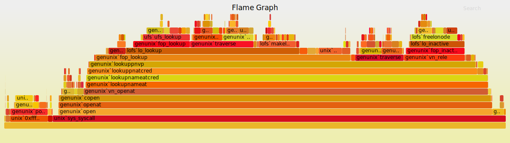

==============================
Profiling/Debugging the kernel
==============================

--------
Overview
--------

Kernel development often involves writing code without an IDE. Even if an IDE is used,
proper profiling support is often lacking. Luckily, FreeBSD includes DTrace. 

Since OPNsense runs on a fork of FreeBSD, DTrace is natively available on the 
system for developers to use in debugging and profiling. To quote the FreeBSD handbook on DTrace:

::

	“DTrace, also known as Dynamic Tracing, was developed by Sun™ as a tool 
	for locating performance bottlenecks in production and pre-production 
	systems. In addition to diagnosing performance problems, DTrace can be used 
	to help investigate and debug unexpected behavior in both the FreeBSD kernel 
	and in userland programs.

	DTrace is a remarkable profiling tool, with an impressive array of features 
	for diagnosing system issues. It may also be used to run pre-written scripts 
	to take advantage of its capabilities. Users can author their own utilities 
	using the DTrace D Language, allowing them to customize their profiling based 
	on specific needs.”

We will be looking at setting up DTrace on OPNsense, and running a sample script 
to perform some useful analysis on kernel space. An example for generating a FlameGraph 
will also be presented. Keep in mind that user space can also be analyzed using DTrace, 
but this is beyond the scope of this document.

Although detailed steps for enabling DTrace in a custom kernel are widely available, 
this document provides an explanation in combination with the use of OPNsense-specific tools. 
Further resources will be provided at the end of this document.

.. note::
	
	All generic DTrace concepts, as well as default probe providers are 
	documented `here <http://dtrace.org/guide/preface.html#preface>`__. 
	If you are interested in using DTrace to profile performance issues, we suggest reading
	the documentation before proceeding. We will not go into too much detail here to prevent 
	cluttering the document and keep it simple and to-the-point.

---------------
Enabling DTrace
---------------

Make sure the OPNsense/src repository is present on the system and navigate to 
:code:`/usr/src/sys/[ARCHITECTURE, e.g. amd64]/conf` and open up :code:`GENERIC`. 
Add the following options:

.. code-block:: sh

	makeoptions 	DEBUG=-g 		# Will build a debug kernel (using gdb debug symbols)
	makeoptions 	WITH_CTF=1 		# Adds CTF type data to built executables
	options		KDTRACE_FRAME 		# Ensure frames are compiled in

.. note::
	
	CTF type data is described 
	`here <https://www.freebsd.org/cgi/man.cgi?query=ctf&sektion=5&manpath=freebsd-release-ports>`__. 
	The idea is to represent the types used in a C program within the executable, 
	allowing users of DTrace to access symbols and function parameters during runtime.

As a best practice, under stock FreeBSD you would save the file under a different name
(e.g. DTRACE) and build the kernel by specifying :code:`KERNCONF=DTRACE`. 
The opnsense-tools require the name to be :code:`GENERIC`, so we will leave it as is. 
It is advisable to create a backup of the original :code:`GENERIC` file though.
Make sure the OPNsense-tools repository is installed and navigate to :code:`/usr/tools/config/[VERSION]`. 
Open up :code:`SMP` and make sure the following line is either removed or commented out:

.. code-block:: sh

	nomakeoptions DEBUG

Furthermore, should you wish to enable DTrace in Userspace, it is imperative that you also 
add the following line to :code:`/usr/tools/conf/[VERSION]/make.conf`

.. code-block:: sh

	STRIP=
	CFLAGS+=-fno-omit-frame-pointer

Now clean and build the new kernel

.. code-block:: sh

	# make clean-obj,kernel kernel

A kernel package will be available at the following location:

	   :code:`/usr/local/opnsense/build/[Version]/[Architecture]/sets/kernel*.txz`

Install the package using our :code:`opnsense-update` command:

.. code-block:: sh

	# opnsense-update -ikfr [version] -l /location/from/

Where [version] is the version part of the kernel package, such as :code:`21.1.a_83`

---------------------
Test the installation
---------------------

Follow the steps described in the section 'Getting Started' `here <https://wiki.freebsd.org/DTrace/KernelSupport>`__ 

--------------
DTrace program
--------------

Although it is possible to instruct DTrace to execute a certain function on the 
command line (and there are a lot of one-liners for this `here  <https://wiki.freebsd.org/DTrace/One-Liners>`__), instead we present a D script that measures some statistics on the ixgbe 10GbE driver and
shows some interesting capabilities of DTrace in one go. Specifically, it measures the amount
of interrupts fired on the packet receive side, as well as the time spent in the relevant functions
in nanoseconds. It also measures how many threads on average are waiting to be serviced because
another thread is busy.

.. literalinclude:: ./files/example.d

The one-line command to pre-process, compile and run the script is:

.. code-block:: sh

	# dtrace -C -s example.d 

The :code:`-C` option specifies that the standard C preprocessor should evaluate the file, ensuring
that the C-specific code like macro definitions are defined. 

The output (when pinging the device):

Notice how the queue behaviour section shows no output, this is because there is no actual
queue behaviour going on. There is simply too little traffic for the kernel to be queueing threads.
When stressing the driver, it might look something like this:

------------
Flame Graphs
------------

If you run the following command:

.. code-block:: sh

	# dtrace -n 'uiomove:entry{ @[stack()] = count(); }'

Let it run for a while, and exit using :code:`CTRL-C`

You will see all `stack frames <https://en.wikipedia.org/wiki/Call_stack>`__ associated with
:code:`uiomove()` that have taken place, aggregated to only unique frames. The number below the individual 
frame represents the amount of times that particular frame was executed. Although this is nice,
it isn't particulary visually pleasing or helpful in spotting potential bottlenecks.

A senior performance analyst at Netflix, named Brendan Gregg, developed the 
`FlameGraph <https://github.com/brendangregg/FlameGraph>`__ for use with DTrace (and other profiling tools).
The program consists of a set of Perl files that take in the data produced by a command 
similar to the one we executed, and generate a graph that helps spot 'hot code paths'.
This time however, we will look at the kernel as a whole and sample it in a set interval.

1. Clone the `repository <https://github.com/brendangregg/FlameGraph>`__ and instruct dtrace to
sample kernel stacks at a rate of 997 Hertz for 60 seconds:

.. code-block:: sh

	# dtrace -x stackframes=100 -n 'profile-997 /arg0/ { @[stack()] = count(); } tick-60s { exit(0); }' -o out.kern_stacks

2. Collapse the individual lines in the output file by folding it into single lines:

.. code-block:: sh

	# ./stackcollapse.pl out.kern_stacks > out.kern_folded

Having a separate folded input file allows for grepping functions of interest:

.. code-block:: sh

	# grep cpuid out.kern_folded | ./flamegraph.pl > cpuid.svg

.. note::

	If you get the message "Command not found", use the command 
	:code:`perl stackcollapse.pl out.kern_stacks > out.kern_folded`

3. Generate a flame graph:

.. code-block:: sh

	# ./flamegraph.pl out.kern_folded > kernel.svg

The output image is an SVG file, enabling interaction within a browser. 

---------------
Other Resources
---------------
Brendan Gregg's collection of DTrace programs:
http://www.brendangregg.com/dtrace.html 

Using the right datatypes in DTrace to increase profiling performance:
http://dtrace.org/blogs/brendan/2011/11/25/dtrace-variable-types/
 
FreeBSD DTrace manual page:
https://www.freebsd.org/cgi/man.cgi?query=dtrace

FreeBSD DTrace one-liners:
https://wiki.freebsd.org/DTrace/One-Liners

