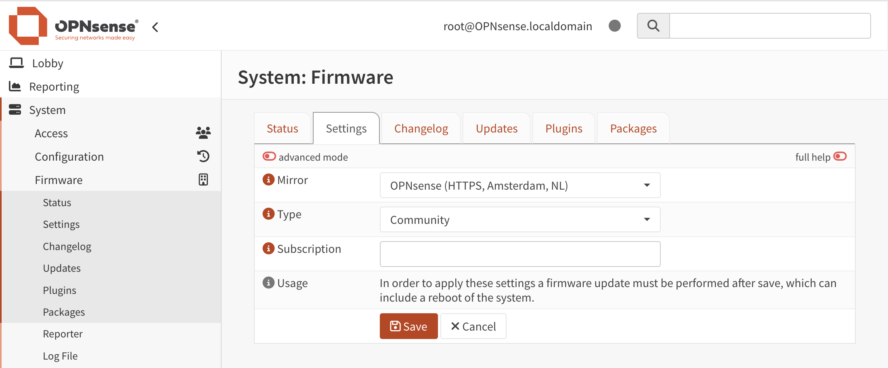

====================================
Quickstart / getting started
====================================

------------------------------------
Intro
------------------------------------

After opening the box of your just delivered appliance, there should be a quickstart included.
Your OPNsense® appliance has been pre-installed with the OPNsense® Business Edition software

This quickstart applies to all of the devices acquired from the OPNsense® Shop (https://shop.opnsense.com/), which includes
the following series:

========= ============ ============================= ==================
Serie     Formfactor   Range                         Network driver(s)
========= ============ ============================= ==================
DEC6XX    Desktop      Entry level                   igb
DEC7XX    Desktop      Midrange                      igb, ax
DEC8XX    Desktop      Enterprise                    igb, ax
DEC26XX   Rack         Entry level                   igb
DEC27XX   Rack         Midrange                      igb, ax
DEC38XX   Rack         Enterprise                    igb, ax
DEC40XX   Rack         Enterprise / Datacenter       igb, ax, [ice]
========= ============ ============================= ==================

------------------------------------
Port assignments
------------------------------------

The Ethernet ports of the appliance are assigned as follows:

Port **0** is assigned to LAN with IP address :code:`192.168.1.1` and has a DHCP Server running with IP range
from :code:`192.168.1.100` to :code:`192.168.1.199`.

Port **1** is assigned to WAN and uses DHCP Client to obtain an IP-address.

Additional ports available on the device are left unconfigured, you can  assign them later using :menuselection:`Interfaces->Assignments`.

.. Note::

      Ports on the devices are all numbered, 0-**X** (e.g. 0,1,2) for all 1 gbps standard ethernet ports,
      X0-X\ **X** for SFP+ ports (e.g. X0, X1), XXV0-XXV\ **X** for SFP28 ports (e.g. XXV0, XXV1).
      The numbering corresponds with the driver numbering, e.g. port **0** is usually :code:`igb0`, see the product
      range for drivers used in the different models

------------------------------------
Console connectivity
------------------------------------

The supplied USB-cable can be used to gain console access (settings are: 115200 8N1).
Console access is restricted with a login. Use the following credentials:

* user : **root**
* password : **opnsense**

------------------------------------
Web interface
------------------------------------

To gain access to the web interface (default IP: :code:`192.168.1.1`) use the following credentials:

* user : **root**
* password : **opnsense**

------------------------------------
Next steps
------------------------------------

After performing basic setup, activate your OPNsense Business Edition license token and then update your system or
change to community when not planning to use the supplied license.
(The firmware update module is located at :menuselection:`System>Firmware>Settings`)

**Option 1**: use Business Edition license

.. image:: ./images/quickstart_be.png
    :width: 500px

**Option 2**: use Community Edition

.. Note::

    The OPNsense Business Edition license token is sent by email including instructions on how to activate.

.. Tip::

    Always update your device after gaining access to the internet, updates are usually available once the device
    reaches your destination. Just go to the status tab in the firmware section, press "check for updates" and install the
    pending updates.
