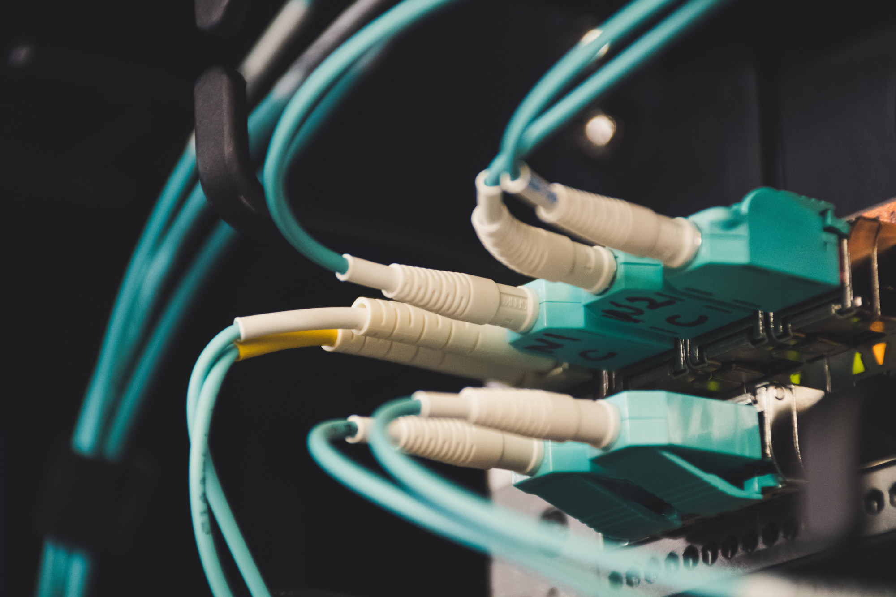

====================================
Interfaces
====================================

All traffic flowing through your appliance is using (virtual) interfaces, this is where you manage most settings.

----------------

.. toctree::
   :maxdepth: 2
   :titlesonly:

   manual/interfaces
   manual/interfaces_overview
   manual/interfaces_settings
   manual/firewall_vip
   manual/wireless
   manual/other-interfaces
   manual/ipv6
   manual/diagnostics_interfaces
   manual/logging_interfaces

---------------
Setup guides
---------------

.. toctree::
   :maxdepth: 2
   :titlesonly:

   manual/how-tos/cellular
   manual/how-tos/IPv6_ZenUK
   manual/how-tos/ipv6_dsl
   manual/how-tos/ipv6_tunnelbroker
   manual/how-tos/lan_bridge
   manual/how-tos/transparent_bridge
   manual/how-tos/interface_wireless_internal
   manual/how-tos/dt_ger_iptv
   manual/how-tos/orange_fr_fttp
   manual/how-tos/orange_fr_tvf
   manual/how-tos/sfr_red_fr_ftth
   manual/how-tos/SkyUK
