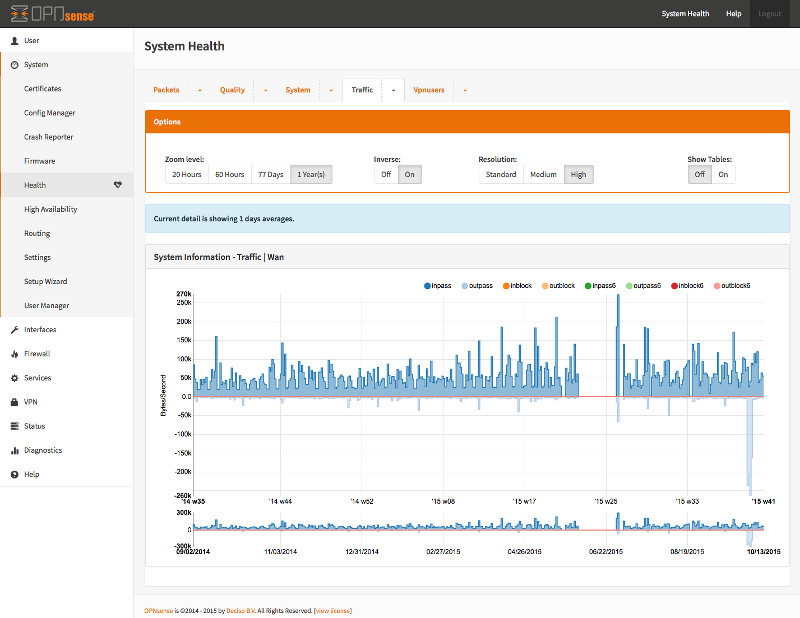

============
Introduction
============

Welcome to the OPNsense documentation & wiki project!
The documentation is work in progress and is updated frequently.
If you would like to contribute in anyway, please take a look at our guide
how to :doc:`contribute`.

.. image:: ./images/opnsense_logo-zilver_grijs.png

------------------------------------
Welcome to OPNsense's documentation!
------------------------------------
`OPNsense® <https://opnsense.org>`__ is an open source,
easy-to-use and easy-to-build HardenedBSD based firewall and routing platform.

**OPNsense** includes most of the features available in expensive commercial
firewalls, and more in many cases. It brings the rich feature set of commercial
offerings with the benefits of open and verifiable sources.

-----------------
Mission Statement
-----------------

  Give users, developers and businesses a friendly, stable and transparent
  environment. Make OPNsense the most widely used open source security platform.
  The project’s name is derived from open and sense and stands for:
  “Open (source) makes sense.”

-------------------

-----------
Feature set
-----------

The feature set of OPNsense includes high-end features such as forward caching
proxy, traffic shaping, intrusion detection and easy OpenVPN client setup.
The latest release is based on a recent HardenedBSD for long-term support and uses a
newly developed MVC-framework based on Phalcon. OPNsense’s focus on security
brings unique features such as the option to use LibreSSL instead of OpenSSL
(selectable in the GUI).

The robust and reliable update mechanism gives OPNsense the ability to provide
important security updates in a timely fashion.

----------------------

----------------------
OPNsense Core Features
----------------------

- Traffic Shaper
- Captive portal

  - Voucher support
  - Template manager
  - Multi zone support

- Forward Caching Proxy

  - Transparent mode supported
  - Blacklist support

- Virtual Private Network

  - Site to site
  - Road warrior
  - IPsec
  - OpenVPN

- High Availability & Hardware Failover

  - Includes configuration synchronization & synchronized state tables
  - Moving virtual IPs

- Intrusion Detection and Inline Prevention

  - Built-in support for Emerging Threats rules
  - Simple setup by use of rule categories
  - Scheduler for period automatic updates

- Built-in reporting and monitoring tools

  - System Health, the modern take on RRD Graphs
  - Packet Capture
  - Netflow

- Support for plugins
- DNS Server & DNS Forwarder
- DHCP Server and Relay
- Dynamic DNS
- Backup & Restore

  - Encrypted cloud backup to Google Drive and Nextcloud
  - Configuration history with colored diff support
  - Local drive backup & restore

- Stateful inspection firewall
- Granular control over state table
- 802.1Q VLAN support
- and more…
