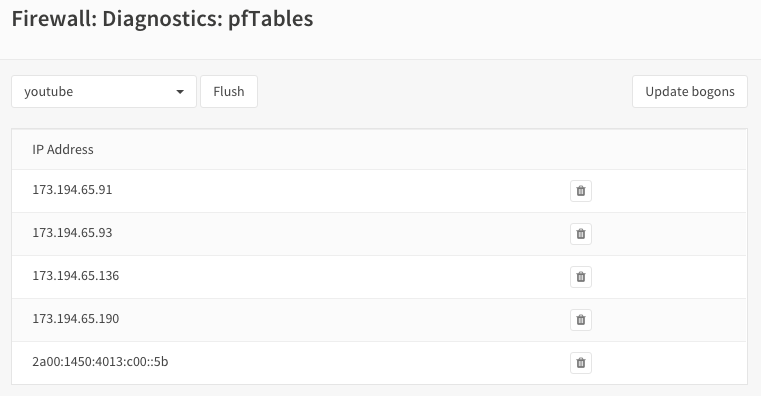
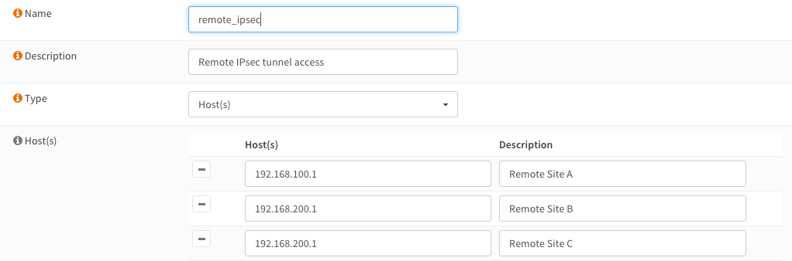
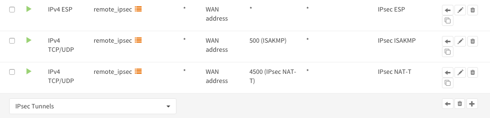

=============
Aliases
=============
Aliases are named lists of networks, hosts or ports that can be used as one entity
by selecting the alias name in the various supported sections of the firewall.
These aliases are particularly useful to condense firewall rules and minimize
changes.

Aliases can be added, modified and removed via :menuselection:`Firewall --> Aliases`.

-----------------------------------
Overview
-----------------------------------

The page opens with an overview of the aliases available, including some internal ones available from installed software.
At the top of the page you can search for aliases or preselect various types or categories to which they belong.

In order to gain some insights into the current status of the plugins, two additional (meta) fields are being displayed, being:

* Loaded#

  * Shows the amount of entries planned to install into the table, in case there's not enough memory available to load the
    item in question, one can easily find the alias causing the overflow in table entries (bar at the right top of the page)

* Last updated

    * Shows the last timestamp from the entries saved to disk.

-----------
Alias Types
-----------
OPNsense offers the following alias types:

+------------------+------------------------------------------------------+
| Type             | Description                                          |
+==================+======================================================+
| Hosts            | Single hosts by IP or Fully Qualified Domain Name  or|
|                  | host exclusions (starts with "!" sign)               |
+------------------+------------------------------------------------------+
| Networks         | Entire network p.e. 192.168.1.1/24 or network        |
|                  | exclusion eg !192.168.1.0/24                         |
+------------------+------------------------------------------------------+
| Ports            | Port numbers or a port range like 20:30              |
+------------------+------------------------------------------------------+
| MAC addresses    | MAC address or partial mac addresses like            |
|                  | :code:`f4:90:ea`                                     |
+------------------+------------------------------------------------------+
| URL (IPs)        | A table of IP addresses that are fetched once        |
+------------------+------------------------------------------------------+
| URL Tables (IPs) | A table of IP addresses that are fetched on regular  |
|                  | intervals.                                           |
+------------------+------------------------------------------------------+
| GeoIP            | Select countries or whole regions                    |
+------------------+------------------------------------------------------+
| Network group    | Combine different network type aliases into one      |
+------------------+------------------------------------------------------+
| Dynamic IPv6 Host| A Host entry that will auto update on a prefixchange |
+------------------+------------------------------------------------------+
| BGP ASN          | Maps autonomous system (AS) numbers to networks      |
|                  | where they are responsible for.                      |
+------------------+------------------------------------------------------+
| OpenVPN group    | Map user groups to logged in OpenVPN users           |
+------------------+------------------------------------------------------+
| Internal         | Internal aliases which are managed by the product    |
| (automatic)      |                                                      |
+------------------+------------------------------------------------------+
| External         | Externally managed alias, this only handles the      |
| (advanced)       | placeholder. Content is set from another source      |
|                  | (plugin, api call, etc)                              |
+------------------+------------------------------------------------------+

..................
Hosts
..................

Hosts can be entered as a single IP address, a range (separated with a minus sign, e.g. :code:`10.0.0.1-10.0.0.10`)
or a fully qualified domain name.

When using a fully qualified domain name, the name will be resolved periodically
(default is each 300 seconds).

Sample
  Let's say we want to create an alias table for **www.youtube.com**

  .. image:: images/aliases_host.png
      :width: 100%

**Apply changes** and look at the content of our newly created pf table.

Go to :menuselection:`Firewall --> Diagnostics --> Aliases` and select our newly created youtube table.

As you can see there are multiple IP addresses for this domain.

.. Tip::

    To change the alias domain resolve interval, go to :menuselection:`Firewall --> Settings --> Advanced` and
    set **Aliases Resolve Interval** to the number of seconds to refresh.

Hosts type Aliases can contain exclusion hosts.
Exclusion addresses starts with "!" sign (eg !192.168.0.1) and can be used to exclude hosts from Network Group Aliases.

.. Warning::

    Please note thet the **Flush** action is not persistent!

    **"flush"** means flush the current contents of the alias, which will be repopulated when it's not an external type,
    so flush in most cases isn't very useful.

    Same behaviour applies to the API call `alias_util flush </development/api/core/firewall.html>`_

..................
Networks
..................
Networks are specified in Classless Inter-Domain Routing format (CIDR). Use the
the correct CIDR mask for each entry. For instance a /32 specifies a single IPv4 host,
or /128 specifies a single IPv6 host, whereas /24 specifies 255.255.255.0 and
/64 specifies a normal IPv6 network.
Network type Aliases can contain exclusion hosts or networks.
Exclusion addresses starts with "!" sign (eg !192.168.0.0/24) and can be used to
exclude hosts or networks from current Alias or Network Group Alias

Apart from the CIDR notation, one could also use a `wildcard mask <https://en.wikipedia.org/wiki/Wildcard_mask>`__
to match ranges of hosts or networks.

.. Tip::

    To match all servers ending at .1 in the 192.168.X.1 networks, use a wildcard definition like :code:`192.168.0.1/0.0.255.0`

..................
Ports
..................
Ports can be specified as a single number or a range using a colon **:**.
For instance to add a range of 20 to 25 one would enter 20:25 in the **Port(s)**
section.

..................
MAC addresses
..................

Hardware mac addresses can be specified as a (partial) hex value, such as :code:`F4:90:EA` to match all addresses from
Deciso or :code:`f4:90:ea:00:00:01` to match a single item (the input is case insensitive).

The way these aliases function is approximately the same as hostnames in host type aliases, they are resolved on periodic
intervals from the :code:`arp` and :code:`ndp` tables.

.. Warning::

    Please be aware that hardware addresses can be spoofed (https://en.wikipedia.org/wiki/MAC_spoofing), which doesn't make
    filters on them more secure than ip addresses in any way.

.. Note::

    Since mappings between addresses and mac addresses are resolved periodically the actual situation can differ, you can
    always check :menuselection:`Firewall -> Diagnostics -> Aliases` to inspect the current contents of the alias.

..................
URL Tables
..................
URL tables can be used to fetch a list of IP addresses from a remote server.
There are several IP lists available for free, most notably are the "Don't Route
Or Peer" lists from Spamhaus.

.. Note::

    The content of the file being fetched should contain one IPv[4|6] address per line, lines that start with a :code:`whitespace`
    , colon (:code:`,`), semicolon (:code:`;`), pipe (:code:`|`) or hash (:code:`#`) will be ignored.

..................
GeoIP
..................
With GeoIP alias you can select one or more countries or whole continents to block
or allow. Use the *toggle all* checkbox to select all countries within the given
region.

  .. image:: images/firewall_geoip_alias.png
      :width: 100%

To use GeoIP, you need to configure a source in the :menuselection:`Firewall --> Aliases -> GeoIP settings` tab, the most commonly
used source is MaxMind, for which we have a how-to available : :doc:`how-tos/maxmind_geo_ip`

The configured url should point to a zip file containing the following csv files:

.. list-table:: Title
   :widths: 50 25 25 25
   :header-rows: 1

   * - Filename
     - Purpose
     - Format
     - Example
   * - %prefix%-locations-en.csv
     - maps geo locations to iso countries
     - geoname_id,,,,country_iso_code
     - 1,,,,NL
   * - %prefix%-IPv4.csv
     - IPv4 networks
     - network,geoname_id
     - 2.21.241.0/28,1
   * - %prefix%-IPv6.csv
     - IPv6 networks
     - network,geoname_id
     - 2001:470:1f15:210::/64,1

The :code:`%prefix%` can be used to identify the product and/or vendor, in MaxMind's case these files are named
:code:`GeoLite2-Country-Locations-en.csv`, :code:`GeoLite2-Country-Blocks-IPv4.csv`, :code:`GeoLite2-Country-Blocks-IPv6.csv` for example.

.. Tip::

    Geo ip lists can be rather large, especially when using IPv6. When creating rules, always try to minimize the number of
    addresses needed in your selection. A selection of all countries in the world not being the Netherlands can usually be
    rewritten as only addresses from the Netherlands for example.

.. Tip::

    If the number of items is larger than the allocated alias size, you can assign more memory to aliases.
    :menuselection:`Firewall --> Settings --> Advanced : Firewall Maximum Table Entries`

..................
Network group
..................

Combine different network type aliases into one, this type of alias accepts other host type aliases (networks, hosts, ...).
Although nesting is possible with other alias types as well, this type only displays valid aliases easing administration, functionally
a :code:`Networks` type alias can do the same but uses a different presentation.

..................
Dynamic IPv6 Host
..................

An IPv6 Dynamic Host is used where the system is using a dynamic prefix on the LAN, a tracking interface. When the prefix
changes, either due to the ISP changing the prefix at will or the prefix changes when the WAN connection is reset, any alias
containing an address of a client such as a server on the LAN would no longer be valid.

For example, you obtain a prefix 2001:db8:2222:2800::/56.  You have a /56 prefix and if the tracking id was set to 0 for your
LAN, you would have an address range on your LAN of 2001:db8:2222:2800:: to 2001:db8:2222:2800:FFFF:FFFF:FFFF:FFFF.

You want to run a server on your LAN that is accessable from the WAN so you give it a static address of
2001:db8:2222:2800:1000:1000::1 and create a rule allowing traffic to access the server.

When your prefix changes, that static address is no longer valid, so you must use the Dynamic IPv6 Host to create an alias
address for the firewall entry that automatically tracks the prefix and changes the rule.

The Dynamic Host Alias will always split on the /64 boundary, it will take the upper 64 bits from the interface you select
and the lower 64 bits from the address you enter. It does not matter what size your prefix delegation is.

Create a new IPv6 Dynamic Host alias and enter only the suffix of the address, in this example, we will enter the lower 64
bits of the address, you would enter ::1000:1000:0000:1, note the '::' at the start of the address, you MUST always start
the address with a '::'. You do not need to enter a size after the address i.e. /128 as that is automatically assumed.

Select the interface you wish to use for the source of the uppper 64 bits, in this case we will select the LAN interface.

When the prefix changes, the alias address will then be updated in the firewall rules, let's say your prefix changes to
2001:db8:2222:3200::/56 the rule updates and the entry for your server in the firewall would update automatically to be
2001:db8:2222:3200:1000:1000::1

Let's take another example, you have a /48 prefix delegation, you have two LAN interfaces and a server on each. You would need
to create two separate Dynamic IPv6 Host entries, one for each LAN. For simplicities sake we will use the same address for each
server on each interface, you would enter ::aaaa:bbbb:cccc:0001 as the address.

=========================================   ===============================================
Upper 64 bits, taken from LAN 1 Interface   Lower 64 bits - Your server address
Server 1: 2a02:1234:5678:0000                aaaa:bbbb:cccc:0001
=========================================   ===============================================
*Server 1 GUA address is: 2a02:1234:5678:0000:aaaa:bbbb:cccc:0001*
===========================================================================================

=========================================   ===============================================
Upper 64 bits, taken from LAN 2 Interface   Lower 64 bits - Your server address
Server 2: 2a02:1234:5678:0001               aaaa:bbbb:cccc:0001
=========================================   ===============================================
*Server 2 GUA address is: 2a02:1234:5678:0001:aaaa:bbbb:cccc:0001*
===========================================================================================

The prefix changes, in this case we have a /48 prefix, so the new prefix is 2a02:1234:5679/48 our aliases would update to give
us the following addresses:

=========================================   ===============================================
LAN 1: Server 1 GUA address is:             2a02:1234:5679:0000:aaaa:bbbb:cccc:0001
LAN 2: Server 2 GUA address is:             2a02:1234:5679:0001:aaaa:bbbb:cccc:0001
=========================================   ===============================================

You may enter multiple addresses, for example if you have several servers on the same LAN segment, just add the suffix for each one.
In the example below we have three servers.

  .. image:: images/alias_dynamic_ipv6_host.png
      :width: 100%

..................
BGP ASN
..................

With this alias type you are able to select networks by their responsible parties.
Using BGP parties announce the addresses they are responsible for to eachother.
For example Cloudflare uses AS number :code:`13335`, Microsoft is known to use :code:`8075`.

More background and how addresses are assigned is explained on `wikipedia <https://en.wikipedia.org/wiki/Autonomous_system_(Internet)>`__

..................
External
..................

The contents for external alias types is not administered via our normal alias service and can be practical
in scenarios where you want to push new entries from external programs. Such as specific lockout features or
external tools feeding access control to your firewall.

In :menuselection:`Firewall --> Diagnostics --> Aliases` you can always inspect the current contents of the external
alias and add or remove entries immediately.

.. Tip::

    When changing alias contents which are used on firewall rules with state tracking enabled, you might need to
    remove the specific state before the new rule turns active. (see :menuselection:`Firewall --> Diagnostics --> States Dump` )

.. Tip::

    Since external alias types won't be touched by OPNsense, you can use :code:`pfctl` directly in scripts to manage
    its contents. (e.g. :code:`pfctl -t MyAlias -T add 10.0.0.3` to add **10.0.0.3** to **MyAlias**)

....................................
OpenVPN group
....................................

This alias type offers the possibility to build firewall policies for logged in OpenVPN users by the group they belong to
as configured in :menuselection:`System --> Access --> Groups`.

The current users that are logged into OpenVPN can be inspected via :menuselection:`VPN --> OpenVPN --> Connection Status`, the alias
just follows this information and flushes the attached addresses to the item in question.

For example, when a user named **fred** which is a member of group **remote_users** logs into OpenVPN and received a tunnel address
of :code:`10.10.10.2`, the alias containing "remote_users" would include this address as well.

.. Tip::

    When using LDAP (Active directory), you can synchronise group membership to avoid double administration in OPNsense.

....................................
Internal (automatic)
....................................

Internal aliases are prefixed with :code:`__` so they are easy to identify and can't overlap with any user defined ones.
These aliases help you to determine what the content is for some internal concepts such as "LAN network". Using
the :menuselection:`Firewall->Diagnostics->Aliases` menu item you can inspect their contents at any time.

----------------------------------
Using Aliases in Firewall Rules
----------------------------------
Aliases can be used in firewall rules to ease administration of large lists.
For instance we might need a list of remote IP addresses that should have access to
certain services, when anything changes we only need to update the list.

Let's create a simple alias to allow 3 remote IP addresses access to an ipsec server for a site to site tunnel connection:

* 192.168.100.1
* 192.168.200.2
* 192.168.202.2

We call our list remote_ipsec and update our firewall rules accordingly.

.. Note::

    The list icon identifies a rule with an alias.

---------------------------------
Export / Import
---------------------------------

The alias admin page (:menuselection:`Firewall --> Aliases`) contains a download and an upload button in the footer of the table, with this feature you can
merge aliases into the configuration and download a :code:`json` formatted list of all aliases in the system.

Since data is validated before insertion, it shouldn't be possible to import defective data (if the import fails, a list of errors is presented).

.. Tip::

      When performing migrations, sometimes its easier to change multiple items at once in a text editor. This feature can easily
      be used to facilitate that, with limiting risk of a broken configuration (since items are validated equally as single item input would do).

---------------------------------
Add new entries using our API
---------------------------------

The endpoints from the alias_util can easily be used to push new entries into an alias (or remove existing ones). In case of an external alias
these items won't be persistent over reboots, which can be practical in some use-cases (large frequent changing lists for example).

The document ":doc:`/development/how-tos/api`" contains the steps needed to create an api key and secret, next you can just call
the same endpoint the user interface would.

Below you see how to add **10.0.0.2** to an alias named **MyAlias** using an insecure connection (self-signed cert) on
the host **opnsense.firewall** with :code:`curl`. The verbose option provides more details about the data exchanged between the
two machines.

::

    curl \
      --header "Content-Type: application/json" \
      --basic \
      --user "key:secret" \
      --request POST \
      --insecure \
      --verbose \
      --data  '{"address":"10.0.0.2"}' \
      https://opnsense.firewall/api/firewall/alias_util/add/MyAlias

.. Note::

      Adding aliases using :code:`/api/firewall/alias_util/add/` is only supported for Host, Network and External type aliases

----------
Exclusions
----------
Pf firewall tables support exceptions (or exclusion) of addresses. This feature can be used in one Alias or in combined (Network
group type) Aliases. See (https://www.freebsd.org/doc/handbook/firewalls-pf.html 30.3.2.4).

--------
Nesting
--------
For host and network alias types nesting is possibility, this can simplify management a lot since single items can
be named properly and grouped into sections for administration.

For example, we define 4 servers among 2 critical using different rulesets:

* server_a {10.0.1.1}
* server_b {10.0.1.2}
* server_c {10.0.1.100}
* server_d {10.0.1.200}
* critical_servers {server_a , server_b}
* other_servers {server_c , server_d}
* servers { critical_servers , other_servers}.

The alias :code:`servers` will contain all 4 addresses after configuration.

There is also a possibility to combine different Aliases with Aliases, consisting of exclusions.
For example, there is Alias "FireHOL" that use extensive externl drop-list and two Aliases that contains
subnet and hosts exclusions. It is possible to create Network group (combined) Alias ("FireHOL_with_exclusions"):

* FireHOL {https://raw.githubusercontent.com/firehol/blocklist-ipsets/master/firehol_level1.netset}
* subnets_exclusions {!127.0.0.0/8, !0.0.0.0/8}
* hosts_exclusions {!8.8.8.8}
* FireHOL_with_exclusions {FireHOL, subnets_exclusions, hosts_exclusions}

:code:`FireHOL_with_exclusions` Alias will contain all records from FireHOL Alias excluding addresses from exclusions Aliases.

It's always good to check if an address is included in the Alias via :menuselection:`Firewall --> Diagnostics --> pfTable`

---------------------------------
Spamhaus
---------------------------------

The Spamhaus Don't Route Or Peer Lists DROP (Don't Route Or Peer) and EDROP are advisory "drop all traffic" lists,
consisting of netblocks that are "hijacked" or leased by professional spam or
cyber-crime operations (used for dissemination of malware, trojan downloaders,
botnet controllers). The DROP and EDROP lists are a tiny subset of the SBL,
designed for use by firewalls and routing equipment to filter out the malicious
traffic from these netblocks.

*Source :* https://www.spamhaus.org/drop/

Downloads
 * `DROP list <https://www.spamhaus.org/drop/drop.txt>`__
 * `EDROP list <https://www.spamhaus.org/drop/edrop.txt>`__

To setup the DROP and EDROP lists in combination with the firewall rules, read:
:doc:`how-tos/edrop`
