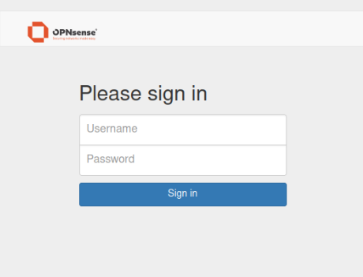
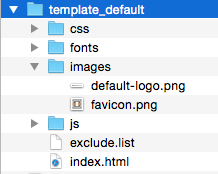

=========================
Captive portal & GuestNET
=========================
A **Captive Portal** allows you to force authentication, or redirection to a click
through page for network access. This is commonly used on hotspot networks,
but is also widely used in corporate networks for an additional layer of security
on wireless or Internet access.

--------------------
Typical Applications
--------------------
* Guest Network
* Hotel & Camping Wifi Access
* Bring Your Own Device (BOYD)

-------------------
Template Management
-------------------
OPNsense’s unique template manager makes setting up your own login page an easy
task. At the same time it offers additional functionalities, such as:

* URL redirection
* Option for your own Pop-up
* Custom Splash page

---------------
Zone Management
---------------
Different zones can be setup on each interface or multiple interfaces can share
one zone setup. Each Zone can use a different Captive Portal Template or share it
with another zone.

--------------
Authentication
--------------
Secure authentication via HTTPS or splash-only portal with URL redirection to a
given page Different sources can be used to authenticate a user in a zone:

* LDAP [Microsoft Active Directory]
* Radius
* Local user manager
* Vouchers / Tickets
* No authentication (Splash Screen Only)
* Multiple (a combination of above)

---------------
Voucher Manager
---------------
OPNsense's Captive Portal has an easy voucher creation system that exports the
vouchers to a csv file for use with you favorite application. The export allows
you to print vouchers by merging them with your word or open office template and
create a good looking handout with your logo and company style.

-----------------------
Timeouts & Welcome Back
-----------------------
Connection can be terminated after the user has been idle for a certain amount
of time (idle timeout) and/or force a disconnect when a number of minutes
have passed even if the user is still active (hard timeout). In case a user
reconnect within the idle timeout and/or hard timeout no login is required and
the user can resume its active session.

--------------------
Bandwidth Management
--------------------
The Build-in traffic shaper can be utilized to:

* Share bandwidth evenly
* Give priority to protocols port numbers and/or ip addresses

See also: :doc:`/manual/shaping`

-------------
Portal bypass
-------------
MAC and IP addresses can be white listed to bypass
the portal.

-------------------
Real Time Reporting
-------------------
Basic Real Time Reporting is Integrated

* Live top IP bandwidth usage (Traffic Graph)
* Active Sessions
* Time left on Vouchers

----------------------------
Category based Web Filtering
----------------------------
By combining the Captive Portal with the caching proxy it is possible to utilize
category web filtering and block certain content for the users and by enabling the
cache reduce bandwidth and improve response times. See also: :doc:`/manual/proxy`

--------------------
Platform Integration
--------------------
Through the integrated REST API the captive portal application can be integrated
with other services. See: :doc:`/development/how-tos/api`

--------------------
Configure the Portal
--------------------
To setup a hotspot controller for business or hotel usage see:
:doc:`how-tos/guestnet`
