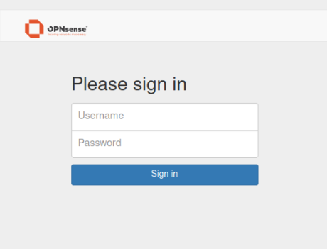
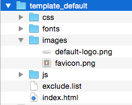

=========================
Captive portal & GuestNET
=========================
A **Captive Portal** allows you to force authentication, or redirection to a click
through page for network access. This is commonly used on hotspot networks,
but is also widely used in corporate networks for an additional layer of security
on wireless or Internet access.

Overview and terminology
.........................

-----------------------------
Typical Applications
-----------------------------

* Guest Network
* Hotel & Camping Wi-Fi Access
* Bring Your Own Device (BYOD)

-------------------
Template Management
-------------------
OPNsense’s unique template manager makes setting up your own login page an easy
task. At the same time it offers additional functionalities, such as:

* URL redirection
* Option for your own Pop-up
* Custom Splash page

---------------
Zone Management
---------------
Different zones can be setup on each interface or multiple interfaces can share
one zone setup. Each Zone can use a different Captive Portal Template or share it
with another zone.

--------------
Authentication
--------------
Secure authentication via HTTPS or splash-only portal with URL redirection to a
given page Different sources can be used to authenticate a user in a zone:

* LDAP [Microsoft Active Directory]
* Radius, including accounting updates
* Local user manager
* Vouchers / Tickets
* No authentication (Splash Screen Only)
* Multiple (a combination of above)

---------------
Voucher Manager
---------------
OPNsense's Captive Portal has an easy voucher creation system that exports the
vouchers to a csv file for use with your favorite application. The export allows
you to print vouchers by merging them with your Microsoft Word or LibreOffice template and
create a good looking handout with your logo and company style.

-----------------------
Timeouts & Welcome Back
-----------------------
Connection can be terminated after the user has been idle for a certain amount
of time (idle timeout) and/or force a disconnect when a number of minutes
have passed even if the user is still active (hard timeout). In case a user
reconnects within the idle timeout and/or a hard timeout, no login is required and
the user can resume its active session.

--------------------
Bandwidth Management
--------------------
The Built-in traffic shaper can be utilized to:

* Share bandwidth evenly
* Give priority to protocols port numbers and/or IP addresses

See also: :doc:`/manual/shaping`

-------------
Portal bypass
-------------
MAC addresses and IP addresses/network ranges can be white listed to bypass
the portal.

--------------------
Platform Integration
--------------------
Through the integrated REST API the captive portal application can be integrated
with other services. See: :doc:`/development/how-tos/api`

------------
IPv6 support
------------
The OPNsense Captive Portal fully supports IPv6-only and dual-stack networks.
To facilitate this, the [Roaming] option is available and set by default in each
zone. The IPv6 protocol commonly uses multiple IPv6 addresses on the same network
interface of a client. These can be Link-local addressess, GUAs, ULAs, temporary/
privacy addresses or stable addresses.

Roaming allows the portal to register any IP alias a client is using, including IPv4
addresses. Once a client is connected, these IP addresses are collected in the
background and are granted access.

Furthermore, the following criteria must be met for IPv6 to fully function:

- Hostwatch (:menuselection:`Interfaces --> Neighbours --> Automatic Discovery`) must
  be enabled for the collection of IPv6 addresses to function.
- You must set a [Hostname] in the zone configuration and make sure a DNS record
  exists for this hostname pointing to the correct IPv6 address. If you're using Unbound,
  DNS records for the configured interfaces can be synthesized with the [DNS64] option in
  :menuselection:`Services --> Unbound DNS --> General`.

.. Note::

    The background process collecting these IP addresses does this in a fixed interval.
    There may be a slight delay before all addresses are collected and granted access.

---------------------
Modern Portal support
---------------------

OPNsense implements the Captive Portal by redirecting all HTTP traffic
to a local web server before authentication, hinting to the device that it is behind a portal.
However, `RFC 8910 <https://www.rfc-editor.org/rfc/rfc8910>`__
introduces a new standardized method for networks to inform clients about the presence
of a portal using DHCP. Furthermore, `RFC 8908 <https://www.rfc-editor.org/rfc/rfc8908>`__
describes an API standard implemented by the webserver pointed to by DHCP, where the client can
fetch the current portal status. Apple has published a
`document <https://developer.apple.com/news/?id=q78sq5rv>`__ going into more details.

Modern clients (especially iOS) moving towards this standardized API may experience redirection
issues when connecting to a network only supporting forced redirection, which is often
solved by utilizing this new standard instead.

To configure this, a few steps are required:

- You must install a valid, publicly trusted certificate on the Captive Portal zone.
  For example, you can use ACME client to automate this process. Doing so is best
  practice regardless of redirection method.
- The DHCPv4 server running in your Captive Portal zone must present option 114, of which
  the value must be set to the OPNsense webserver running the portal:
  :code:`https://<opnsense-hostname>/api/captiveportal/access/api`.
  Alternatively, a client can also be pointed to the redirected webserver directly:
  :code:`https://<opnsense-hostname>:<8000 + captive portal zone id>/api/captiveportal/access/api`.
  For example, :code:`https://opnsense.localdomain:8001/api/captiveportal/access/api` for zone 1.
  See the attention block below for more details.
  To set this DHCP option, refer to the documentation for the respective DHCP server.

If a device in the captive portal zone supports this API, they will automatically use
the DHCP option to determine that they are in a captive state. Keep in mind that forced
redirection is still used for maximum compatibility. If you would like to excusively
use this API standard instead, you can override the firewall rules for each zone and
leave out the redirection rules, see `rules`_.

.. Attention::

    Once a client has logged in through the portal, your firewall policies define what
    this client can and cannot access. Unless you have configured the DHCP option to point
    to the portal webserver directly by specifying the port, the
    :code:`/api/captiveportal/access/api` endpoint now points to the regular OPNsense WebGUI
    on port 443, because authenticated clients are not redirected. This also means that
    clients cannot determine captivity state anymore.

    If you would like to restrict client access to this endpoint only, you must configure
    the proper forwarding rule as shown below. Note that this means clients cannot access the
    OPNsense WebGUI anymore, which is often desirable.

    ============================ ===============================
    **Type**                     Destination NAT (Port Forward)
    **Interface**                <Zone interface>
    **Version**                  IPv4+IPv6
    **Protocol**                 TCP
    **Source**                   __captiveportal_zone_<zone id>
    **Destination**              This Firewall
    **Destination port range**   443
    **Redirect Target IP**       127.0.0.1
    **Redirect Target Port**     8000 + <zone id>
    **NAT Reflection**           Disable (advanced)
    **Firewall rule**            Pass
    ============================ ===============================

.. Note::

    The OPNsense :code:`/api/captiveportal/access/api` endpoint returns the following information:

    - Whether a client is 'captive' at this point in time.
    - The URL of the portal.
    - If the client is authenticated and a hard timeout is set, how many seconds are remaining
      for this session.

Administration
.........................

The Administration menu offers access to zone configuration and template management.

When creating a zone, a couple of options are available which we will try to explain briefly in the grid below:

========================================================================================================================================================

====================================  ==================================================================================================================
Enabled                               Enable the zone, which will install a network trap on the interfaces specified
Zone number                           Read-only sequence of the configured zone. This number is useful to determine the alias containing authenticated
                                      clients. For example, zone 0 will have an associated internal alias called :code:`__captiveportal_zone_0`.
                                      This alias can be inspected in :menuselection:`Firewall --> Diagnostics --> Aliases`. This zone id is also
                                      used if you are configuring the firewall rules yourself.
Interfaces                            Interfaces which should be guarded by this captive portal.
Client Roaming                        Allow a connecting client to use multiple IPs (bound to the same MAC) over the course of its session.
                                      This option is needed for maximum IPv6 compatibility and also affects IPv4 clients.
Disable firewall rules                If this option is set, no automatic firewall rules for portal redirection and traffic blocking will be generated.
                                      This option allows you to override the default portal behavior for advanced use cases, such as redirections
                                      for DNS on a non-standard port. See :ref:`rules` for an overview of required firewall rules.
Authenticate using                    Select an authenticator specified in :menuselection:`System --> Access --> Servers`
Always send accounting requests       [RADIUS only] This will make the captive portal always send accounting requests,
                                      rather than just when there is a need for accounting (e.g. when there is a daily session limit).
Enforce local group                   Restrict access to users in the selected (local)group, to validate group membership,
                                      see :menuselection:`System --> Access --> Groups`
Idle timeout (minutes)                Clients will be disconnected after this amount of inactivity. They may log in again immediately, though.
Hard timeout (minutes)                Clients will be disconnected after this amount of time, regardless of activity.
                                      They may log in again immediately, though.
Concurrent user logins                If this option is set, users can login on multiple machines at once.
                                      If disabled subsequent logins will cause machines previously logged in with the same username to be disconnected.
SSL certificate                       Certificate to use on the captive portal login system. Leave empty for HTTP only.
Hostname                              Hostname (of this machine) to redirect login page to, leave blank to use this interface IP address,
                                      otherwise make sure the client can access DNS to resolve this location.
                                      When using a SSL certificate, make sure both this name and the cert name are equal.
Allowed addresses                     Avoid authentication for addresses and subnets specified in this list
Allowed MAC addresses                 Avoid authentication for MAC addresses specified in this list
Extended pre auth data                Offer extended data to the login template before authentication (mac addresses for upstream use).
Custom template                       Template to use for the login page, specified in the templates tab.
====================================  ==================================================================================================================

.. raw:: html

    In the templates tab you can manage your templates, the default template can be fetched using the <i class="fa fa-fw fa-download"></i> button
    in the bottom right corner.
      
    The file offered is a standard zip file, which can be unpacked locally and modified to your needs, the new contents can be saved into a new
    zip file and uploaded in a new template (<i class="fa fa-fw fa-plus"></i>)

Sessions
.........................

Basic real time reporting is integrated using the sessions menu, this shows the following information for each zone.

* Live top IP bandwidth usage
* Active Sessions
* Time left on Vouchers

Vouchers
.........................

Here you can create new vouchers for all voucher servers configured in :menuselection:`System --> Access --> Servers`

Examples
.........................

.. toctree::
    :maxdepth: 2
    :titlesonly:

    how-tos/guestnet

Migration notes & technical details
...................................

.. Important::

    Starting from OPNsense Community edition 25.1.4 or Business edition 25.10, the underlying captive portal implementation
    has moved from IPFW to PF. While in most cases this has no practical impact, a more detailed description
    of what this means, as well as any incompatibilities are described here.

Previously, our Captive Portal implementation was split up into two components, IPFW and PF. Packets would enter an interface,
where IPFW was the first to handle them and redirect traffic to the portal. After authentication, a rule to allow all traffic
to and from this client would be inserted. Any traffic passed by IPFW would then be handled by PF. The reverse was true for
outbound traffic. This process has been simplified by moving the redirection and accounting logic to PF.

This has multiple benefits:

- The generated rules are now visible in the WebGUI and are logged by default, easing troubleshooting.
- The list of clients that have been authenticated is now an alias and is visible, as well as usable in rules.
  The alias is called :code:`__captiveportal_zone_<zoneid>`.
- Unless custom shaper rules are used, IPFW does not need to be loaded anymore, significantly
  reducing implementation complexity.

The following are the only functional/behavioral changes:

- If you have forwarding rules defined on your captive portal zone that redirect a client for services other than HTTP/HTTPS, the
  "Filter Rule Association" option on this rule must be set to "Pass" so that this traffic is allowed after redirection; otherwise,
  this traffic will hit the default captive portal block rule. An example of such a scenario would be client DNS
  traffic redirected to a DNS service running on localhost.
- The "Allow Inbound" option has been dropped. This option only affected IPFW rules and controlled
  whether traffic from another network going to the captive portal zone would be allowed. This behavior
  is now determined by the ruleset of the network where the traffic is originating from. As an example,
  if some network on a non-captive interface is allowed everywhere according to the ruleset, this traffic
  is also allowed into the captive portal zone. If this is not desired, an explicit block rule must
  be configured on said interface.
- Unless you are overriding the (newly) automatically generated firewall rules, you don't need an explicit
  pass rule for DNS (port 53) on the firewall, nor an allow rule for the captive portal zones (ports 8000-10000) anymore.
  These are now installed by default.

.. _rules:

-----------------------------
Captive Portal Firewall rules
-----------------------------

When running a default Captive Portal zone, the necessary rules for redirection are automatically installed in the zone.
These rules have a higher priority than any user-defined rules. Therefore, to allow for flexibility, these rules may be
overridden using the "Disable firewall rules" option in the zone administration. The automatically generated
rules are listed here so they may be recreated for proper portal functionality.

Redirect traffic to the zone webserver
--------------------------------------
All HTTP traffic going to port 80 is redirected to localhost port 9000 + <zone id>.

All HTTPS traffic going to the firewall on port 443 is redirected to localhost port 8000 + <zone id>.

============================ ===============================
 **Type**                     Destination NAT (Port Forward)
 **Interface**                <Zone interface>
 **Protocol**                 TCP
 **Source Invert**            Yes
 **Source**                   __captiveportal_zone_<zone id>
 **Destination Invert**       Yes
 **Destination**              __captiveportal_zone_<zone id>
 **Destination port range**   80
 **Redirect Target IP**       127.0.0.1
 **Redirect Target Port**     9000 + <zone id>
 **NAT Reflection**           Disable (advanced)
============================ ===============================

============================ ===============================
 **Type**                     Destination NAT (Port Forward)
 **Interface**                <Zone interface>
 **Protocol**                 TCP
 **Source Invert**            Yes
 **Source**                   __captiveportal_zone_<zone id>
 **Destination**              This Firewall
 **Destination port range**   443
 **Redirect Target IP**       127.0.0.1
 **Redirect Target Port**     8000 + <zone id>
 **NAT Reflection**           Disable
============================ ===============================

For IPv6, the same rules as above must be created, but the Destination must be set
to the "<Zone interface> address".

The destination for HTTP traffic is the inverted zone alias, so that traffic from unauthenticated clients going to
authenticated or explicitly allowed clients/servers (allowed addresses in the zone administration)
is not redirected. This is useful if unauthenticated clients should be able to access servers
in the same zone.

.. Attention::

    If you use :doc:`OIDC </vendor/deciso/oidc>` for authentication, the HTTPS requests would also be redirected before authentication is possible.
    To solve this, create an additional "No RDR (NOT)" rule **before** the other NAT rules with the identity provider IP addresses as destination.

    ============================ ===============================
    **Type**                     Destination NAT (Port Forward)
    **No RDR (NOT)**             Yes
    **Interface**                <Zone interface>
    **Protocol**                 TCP
    **Source**                   any
    **Destination**              identity_provider_ip_addresses
    **Destination port range**   443
    ============================ ===============================

Allow DNS
---------
In order to allow the client to resolve at least the OPNsense hostname, DNS must be allowed.

============================ =====================
 **Type**                     Firewall rule
 **Action**                   Pass
 **Interface**                <Zone interface>
 **Protocol**                 TCP/UDP
 **Direction**                In
 **Source**                   <Zone net>
 **Destination**              This Firewall
 **Destination port range**   DNS/DNS
============================ =====================

We define "This Firewall" as the destination since the default DNS service, Unbound, may return multiple
IP addresses identifying the firewall.

Allow access to Captive Portal
-------------------------------------
The redirection rules still need associated pass rules. These rules are also used for clients directly
accessing the captive portal webserver, e.g. using port 8000 in the URL.

============================ =====================
 **Type**                     Firewall rule
 **Action**                   Pass
 **Interface**                <Zone interface>
 **Version**                  IPv4+IPv6
 **Protocol**                 TCP
 **Direction**                In
 **Source**                   <Zone net>
 **Destination**              This Firewall
 **Destination port range**   8000 + zone id
============================ =====================

============================ =====================
 **Type**                     Firewall rule
 **Action**                   Pass
 **Interface**                <Zone interface>
 **Version**                  IPv4+IPv6
 **Protocol**                 TCP
 **Direction**                In
 **Source**                   <Zone net>
 **Destination**              This Firewall
 **Destination port range**   9000 + zone id
============================ =====================

Default block rule for non-authenticated users
----------------------------------------------

Any traffic originating from a client that is not DNS or access to the portal web page,
is blocked according to the rule below.

============================ ===============================
 **Type**                     Firewall rule
 **Action**                   Block
 **Interface**                <Zone interface>
 **Protocol**                 Any
 **Direction**                In
 **Source Invert**            Yes
 **Source**                   __captiveportal_zone_<zone id>
 **Destination Invert**       Yes
 **Destination**              __captiveportal_zone_<zone id>
============================ ===============================

After the above rules, an explicit pass rule is still required to allow clients to
go to the internet, as would normally be the case on any interface that has no firewall
rules defined.
