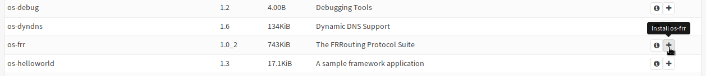

===============
Dynamic Routing
===============

.. Warning::
    With OPNsense version 18.7 the FRR package was updated to version 5. It's strongly advised to increase
    the kern.ipc.maxsockbuf value via **Tunables**. Go to **System->Settings->Tunables** and check if there
    is already a tunable for maxsockbuf and set it to 16777216 if it's lower. Otherwise add a new one with 
    name above and the specified value.

.. Warning::
    Disabling a running routing daemon can be dangerous as it can lead to an inaccessible machine.
    If you want to disable a running routing daemon, make sure, you don't lose routes which are
    required by your connection to this machine (for example when using SSH).

Dynamic Routing (using routing protocols) is supported via an external plugin. Routing protocols are used to make your network equipment find the best path where your packets should be sent to.

Routing protocols are used to

* improve fault tolerance (if a connection breaks, a new route will be found if possible)
* simplify administration (you have to add fewer routes manually)

You should not use routing protocols if

* your network is small (so it would be better to use static routes)
* you are working in a highly isolated environment, where you have to be in control of everything happening in your network

Routing Protocols supported by the plugin include:

* OSPFv2 and v3
* RIPv1 and RIPv2
* BGPv4

.. Warning::
    Not all routing protocols will work in any setup because they may have to be direct neighbors.
    Consider the limitations of a routing protocol before using it.

------------
Installation
------------

First of all, select Plugins in the menu:

.. image:: images/menu_plugins.png

On this page, you can install the frr plugin by clicking the `+` icon:

-------------
Configuration
-------------

* :doc:`how-tos/dynamicrouting_zebra`
* :doc:`how-tos/dynamicrouting_ospf`
* :doc:`how-tos/dynamicrouting_rip`

------
How To
------

* :doc:`how-tos/dynamicrouting_howto`

