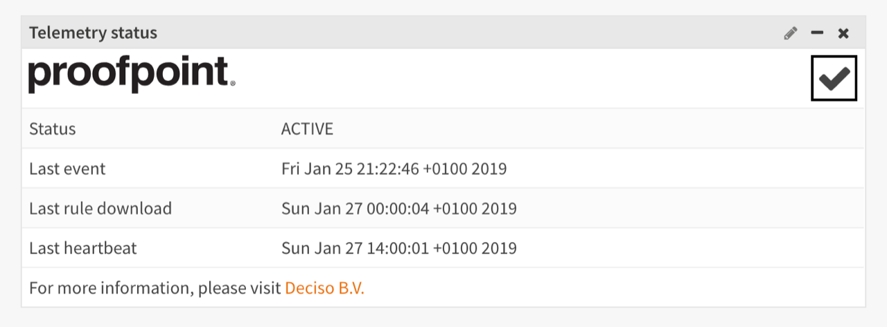
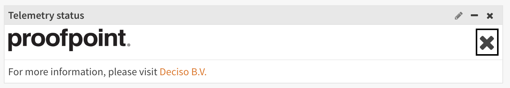

=========================
ET Pro Telemetry edition
=========================

Todays cybersecurity engineers need timely and accurate data about eminent threats and how they spread around the globe.
With this data cybersecurity researchers and analysts can improve the detection of malicious network traffic.
The times when we could rely on just firewall rules for our protection are long gone.
Additional layers of security are desperately needed to guard against these attacks.

With growing risks the need to fortify our security is growing for both big enterprises as for SMEs alike, but often
out of reach for the latter.
An important extra security addition is an Intrusion Detection and Prevention System (IDS/IPS).

The IDS/IPS available in OPNsense is based on Suricata.
This open source IDS/IPS engine has proven its value in OPNsense, especially in combination with the free Proofpoint ETOpen ruleset.

The need for valuable threat detection data and the increasing importance of additional network security
has brought Proofpoint and OPNsense together.
Our joined efforts resulted in the ET Pro Telemetry edition.

The ET Pro Telemetry edition embraces our vision that sharing knowledge leads to better products.

When you allow your OPNsense system to share anonymized information about detected threats - the alerts -
you are able to use the ET Pro ruleset free of charge.

..

    *The ET Pro ruleset is updated daily and covers more than 40 different categories of network behaviors,
    malware command and control, DoS attacks, botnets, informational events, exploits, vulnerabilities,
    SCADA network protocols, exploit kit activity, and more. If offers a great improvement over the ET open ruleset.*

--------------------------------------
Product information
--------------------------------------

For more information about emerging threats ETPro including the Telemetry edition, please visit their discord available at https://community.emergingthreats.net/.
The following links are likely of interest:

*   `Announcements/Updates <https://community.emergingthreats.net/c/announcements/5>`__
*   `Feedback/Support <https://community.emergingthreats.net/c/feedback-support/8>`__
*   `Tutorials/Tips/Tricks <https://community.emergingthreats.net/c/tutorials-tips-tricks/13>`__

--------------------------------------
Registration
--------------------------------------

When you register for this (free) service, you will share your basic (company) details with us, Deciso Sales B.V..
We will register your sensor(s) anonymized at Proofpoint.

.. Note::

    When ET Pro Telemetry is activated, your OPNsense system sends data to Proofpoint. Proofpoint does not know who you are, they
    only know how many sensors an account owns. Your network statistics received by Proofpoint won’t be shared with us.

Sign up for ET Pro Telemetry edition `here <https://shop.opnsense.com/>`__

--------------------------------------
Installation
--------------------------------------

After registration, we can proceed to the installation steps, which are described below.

.. Note::

    To use ET Pro Telemetry, you will need to have OPNsense 19.1 or higher installed. When using an older version,
    please upgrade to the latest first.

....................
plugin
....................

First we need to install the required plugin, which is responsible for collecting the telemetry data and provides access
to the ET Pro ruleset.

1.  Go to :menuselection:`System --> Firmware --> Updates`
2.  press "Check for updates" in the upper right corner.
3.  open the tab "Plugins" and search for `os-etpro-telemetry`
4.  when found, click on the [+] sign on the right to install the plugin

A screen containing the installation status should appear now and the plugin is ready for use.

....................
register token
....................

Next step is to register your token in OPNsense and enable rulesets.

1.  Go to :menuselection:`Services --> Intrusion Detection --> Administration`
2.  Click on the "Download" tab, which should show you a list of available rules.
3.  Enable all categories you would like to monitor in the "ET telemetry" section,
    if in doubt enable all and monitor the alerts later (select on the right and use the enable selected button on top)
4.  At the bottom of the page there’s a block containing settings, paste the token code you received via email in **et_telemetry.token**
5.  Press **save** to persist your token code
6.  Press **Download & Update rules** to fetch the current ruleset

....................
Schedule updates
....................

To download the rulesets automatically on a daily bases, you can add a schedule for this task.

1.  Go to :menuselection:`Services --> Intrusion Detection --> Administration`
2.  Click on the "Schedule" tab
3.  A popup for the update task appears, enable it using the checkbox on top, and click "save changes"

....................
Subscription status
....................

To validate your subscription, we recommend to add the widget to the dashboard.

1.  Go to the dashboard :menuselection:`Lobby --> Dashboard`
2.  Click on "Add widget" in the top right corner, click "Telemetry status" in the list
3.  Close dialog and click "Save settings" on the right top of the dashboard
4.  Open :menuselection:`Lobby --> Dashboard` again to refresh the content

When everything is setup properly and the plugin can reach Proofpoint, it will show something like:

The status determines which ruleset your sensor will receive, **ACTIVE** or **DORMANT** your sensor will receive ET Pro ruleset,
when **DISABLED** the license conditions are not met and the ET Open ruleset will be served.

All timestamps underneath the status provide you with information when data was send or received from Proofpoint.

.. Note::

    If your sensor will start sending events and heartbeats, it should switch to active after a certain amount of time.

In case your sensor can't communicate to the outside world, the widget shows an error.

.. Note::

    The system log (:menuselection:`System --> Log Files --> General`) might contain more information, search for *emergingthreats*

.. Tip::

    Always check the token code first, a common mistake is adding leading or trailing spaces to the code, which will
    show an error in the log (http_code starting with a 4 usually).

--------------------------------------
Information sent to Proofpoint ©
--------------------------------------

When the intrusion detection system logs events, they will be (partially) sent to Proofpoint in return for using the
ET Pro Telemetry edition.

This paragraph describes the attributes from the
`eve.json <https://suricata.readthedocs.io/en/suricata-4.1.0/output/eve/eve-json-format.html>`__ log file
that are collected to improve threat detection and the sensor health data to evaluate if the data is usable.

An example of an event is detailed below.

.. code-block:: json

    {
      "event_type": "alert",
      "proto": "IPV6-ICMP",
      "timestamp": "2018-04-17T18:38:04.498109+0200",
      "in_iface": "em1",
      "alert": {
        "category": "Generic Protocol Command Decode",
        "severity": 3,
        "rev": 2,
        "gid": 1,
        "signature": "SURICATA zero length padN option",
        "action": "allowed",
        "signature_id": 2200094
      },
      "src_ip": "xxxx:xxxx:fec0:d65f",
      "flow_id": 982154378249516,
      "dest_ip": "ff01:fe00:1200:8900:0000:f000:0000:0016"
    }

Network addresses are needed to identify hosts which pose a higher risk to your and other peoples network, but your internal
addresses are kept secret.

For this reason we mask the addresses found in the log file and only send the last number(s) to identify the host.
In the example above the *src_ip* is an internal IPv6 address, for IPv4 we only collect the last number (e.g. 0-255).

Fields collected (unmodified):

=====================================================================

============== ======================================================
timestamp      Timestamp of the event
flow_id        Internal identifier for this communication flow
in_iface       Interface where the event was captured
event_type     Type of event
vlan           Vlan tag
src_port       Source port number
dest_port      Destination port number
proto          Protocol
alert          Alert details, such as the signature_id, action taken
               and associated message.
tls            TLS details, such as certificate subject and serial.
http           HTTP detail information such as the host, but omitting
               sensitive details such as path and user-agent.
app_proto      Application protocol (if known)
============== ======================================================

*Threats change often, to keep statistics valuable, the list of fields is subject to change*

.. Note::

    The plugin comes with a small script to print eve output yourself, it's called **dump_data.py**, when used with the **-p**
    parameter, it will output the data as it will be sent to Proofpoint.
    All script code can be found in the following directory */usr/local/opnsense/scripts/ids_telemetry/*

Sensor health status collected and send as keep-alive:

=======================================================================================================================

======================================== ===========================================================================================
Unique Sensor ID                         Unique sensor identification, helps identifying messages from the same system,
                                         without knowing who is the operator.
OPNSense Version                         Current installed software version.  This will help both for troubleshooting purposes
                                         (if a bad update is pushed and Proofpoint notices that deployments running version
                                         X have an issue) as well for planning, to understand how new features and
                                         functionality would be adopted.
Suricata Version                         Suricata version installed.
Suricata status                          Reports if the sensor is active, when not active, no detection/telemetry can be provided.
System Time                              If the system time is not correct, it will impact the timestamps of messages,
                                         so knowing what time the system thinks it has will help reconcile the actual time.
Active Ruleset Version                   The active ruleset version should match what is published.
                                         If sensors do not have the active version then they either haven’t configured
                                         scheduled updates or there is another issue.
                                         This will help Proofpoint to identify if there are widespread issues with updates.
Number of rules enabled                  Helps to gain a better understanding about the number of rules people use on top of
                                         the ones provided by Proofpoint.
Number of ETPro Telemetry Rules enabled  Because users can control what rules they enable,
                                         they may not want to enable all ETPro Telemetry rules,
                                         if this is the case it would help Proofpoint understand how the rules are being
                                         leveraged so they can better write / tune rules
Mode (IDS or IPS)                        This is helpful to understand how the system is deployed and is useful to
                                         development purposes to determine what rules we should be focusing on based
                                         on how our customers are using them.
Suricata Log Stats                       For QA purposes, some fields with general stats are collected
                                         from /var/log/suricata/stats.log (capture.kernel_packets, decoder.pkts, decoder.bytes,
                                         decoder.ipv4, decoder.ipv6, flow.tcp, flow.udp, detect.alert)
======================================== ===========================================================================================
