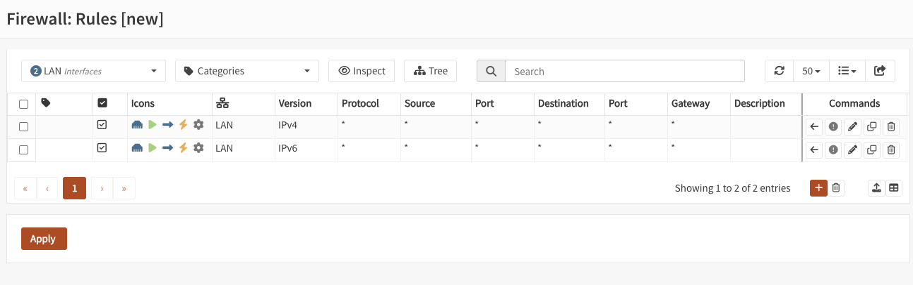
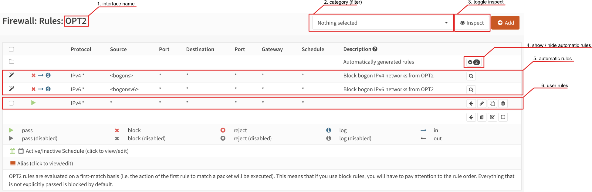

===========================
Rules
===========================

.. contents:: Index

--------------------
Overview
--------------------

OPNsense contains a stateful packet filter, which can be used to restrict or allow traffic from and/or to specific networks
as well as influence how traffic should be forwarded (see also policy based routing in ":doc:`/manual/how-tos/multiwan`").

The rules section shows all policies that apply on your network, grouped by interface.

There are two implementations to choose from:

- **Rules [new]**: a modern MVC implementation with API support and improved rule management
- **Rules**: a static PHP page with no API support

.. Tip::

    **Rules [new]** will replace **Rules** over time, you can already migrate your existing rules
    with a helper in :menuselection:`Firewall --> Rules --> Migration`.

--------------------
The basics
--------------------

Before creating rules, it's good to know about some basics which apply to all rules.

States
--------------------

By default rules are set to stateful (you can change this, but it has consequences), which means that the state of
a connection is saved into a local dictionary which will be resolved when the next packet comes in.
The consequence of this is that when a state exists, the firewall doesn't need to process all its rules again to determine
the action to apply, which has huge performance advantages.

Another advantage of stateful packet filtering is that you only need to allow traffic in one direction to automatically
allow related packets for the same flow back in. Below diagram shows a tcp connection from a client to a server for https
traffic, when not using stateful rules, both the client should be permitted to send traffic to the server at port 443
as the server back to the client (usually a port >=1024).

.. _Firewall_States:

.. blockdiag::
   :desctable:

   blockdiag {
        group {
            color = "#eee";
            label = "Client [tcp:1024]";
            client_req [label="request"];
            client_res [label=""];
        }

        group {
            color = "#eee";
            label = "Firewall";
            firewall_req [label=""];
            firewall_res [label=""];
        }

        group {
            color = "#eee";
            label = "Server [tcp:443]";
            server_req [label=""];
            server_res [label="reply"];
        }
        client_req -> firewall_req -> server_req [color=green];
        client_res <- firewall_res <- server_res [color=red];
    }

The use of states can also improve security particularly in case of tcp type traffic, since packet sequence numbers and timestamps are also checked in order
to pass traffic, it's much harder to spoof traffic.

.. Note::
    When changing rules, sometimes its necessary to reset states to assure the new policies are used for existing traffic.
    You can do this in :menuselection:`Firewall --> Diagnostics --> States`.

.. Note::
    In order to keep states, the system need to reserve memory. By default 10% of the system memory is reserved for states,
    this can be configured in :menuselection:`Firewall --> Settings --> Firewall Maximum States`.
    (The help text shows the default number of states on your platform)

States can also be quite convenient to find the active top users on your firewall at any time, we added
an easy to use "session" browser for this purpose. You can find it under :menuselection:`Firewall --> Diagnostics --> Sessions`.

.. Tip::

    States also play an important rule into protecting services against (distributed) denial of service attacks (DDOS).
    Relevant topics available in our documentation are "synproxy" states, connection limits and `syncookies <firewall_settings.html#enable-syncookies>`__

Action
--------------------

.. _Firewall_Rule_Action:

Rules can be set to three different action types:

* Pass --> allow traffic
* Block --> deny traffic and don't let the client know it has been dropped (which is usually advisable for untrusted networks)
* Reject --> deny traffic and let the client know about it. (only tcp and udp support rejecting packets, which in case of TCP means a :code:`RST` is returned, for UDP :code:`ICMP UNREACHABLE` is returned).

For internal networks it can be practical to use reject, so the client does not have to wait for a time-out when access is not allowed.
When receiving packets from untrusted networks, you usually don't want to communicate back if traffic is not allowed.

Processing order
--------------------

.. _Firewall_Rule_Processing_Order:

Firewall rules are processed in sequence per section, first evaluating the **Floating** rules section followed by all rules which
belong to **interface groups** and finally all **interface** rules.

Internal (automatic) rules are usually registered first.

.. blockdiag::
   :desctable:

   blockdiag {
      System [label="System defined", style = dotted];
      Floating [label="Floating rules"];
      Groups [label="Interface groups"];
      Interfaces [label="Interfaces"];
      System -> Floating -> Groups -> Interfaces;
   }

Rules can either be set to :code:`quick` or not set to quick, the default is to use quick. When set to quick, the rule is
handled on "first match" basis, which means that the first rule matching the packet will take precedence over rules following in sequence.

When :code:`quick` is not set, last match wins. This can be useful for rules which define standard behaviour.
Our default deny rule uses this property for example (if no rule applies, drop traffic).

.. Note::
    Internally rules are registered using a priority, floating uses :code:`200000`,
    groups use :code:`300000` and interface rules land on :code:`400000` combined with the order in which they appear.
    Automatic rules are usually registered at a higher priority (lower number).

.. Warning::

    **NAT rules are always processed before filter rules!**
    So for example, if you define a `NAT : Destination NAT (Port Forwarding) rules <nat.html#port-forwarding>`__  *without a associated rule*, i.e. **Filter rule association** set to **Pass**, this has the consequence, that no other rules will apply!

.. Tip::

    The interface should show all rules that are used, when in doubt, you can always inspect the raw output of the ruleset in :code:`/tmp/rules.debug`

Since :menuselection:`Firewall --> Rules [new]` and :menuselection:`Firewall --> Rules` implementations exist side by side,
there are some additional considerations regarding the processing order of rules.

If a :menuselection:`Firewall --> Rules [new]` filter rule has:

    - a single interface defined, it is an **Interface Rule**
    - a group interface defined, it is a **Group Rule**
    - any number of interfaces or one inverted interface defined, it is a **Floating Rule**

Processing order:

    1. System defined rules at the beginning of the ruleset
    2. :menuselection:`Firewall --> Rules [new]` and :menuselection:`Firewall --> Rules` floating rules
    3. :menuselection:`Firewall --> Rules [new]` and :menuselection:`Firewall --> Rules` group rules
    4. :menuselection:`Firewall --> Rules [new]` single interface rules
    5. :menuselection:`Firewall --> Rules` single interface rules
    6. System defined rules at the end of the ruleset

Rule sequence
--------------------

.. _Firewall_Rule_Sequence:

The sequence in which the rules are displayed and processed can be customized per section:

* Select one or more rules using the checkbox on the left side of the rule.
* Use the arrow button in the action menu on the right side of a rule in order to move selected rules before the rule where the action button is pressed.
* Or you can use the arrow button on the top in the heading row to move the selected rules to the end.

.. Tip::

    In :menuselection:`Firewall --> Rules [new]`, you can reveal a sequence number by toggling the advanced mode. This number influences the processing order
    of rules in the same priority group (displayed as *Sort order*). When using the arrow buttons to move rules, the sequence number is changed.

Direction
--------------------

.. _Firewall_Rule_Direction:

.. blockdiag::
   :desctable:

   blockdiag {
      source [label="Source"];
      firewall [label="Firewall"];
      destination [label="Destination"];
      source -> firewall [label="in"]
      firewall -> destination [label="out"];
   }

Traffic can be matched on :code:`in[coming]` or :code:`out[going]`  direction, our default is to filter on incoming direction.
In which case you would set the policy on the interface where the traffic originates from.

For example, if you want to allow :code:`https` traffic coming from any host on the internet,
you would usually set a policy on the WAN interface allowing port :code:`443` to the host in question.

.. Note::
    Traffic leaving the firewall is accepted by default (using a non-quick rule), when **Disable force gateway** in
    :menuselection:`Firewall --> Settings --> Advanced` is not checked, the connected gateway would be enforced as well.

--------------------
Implementations
--------------------

Rules [new]
--------------------

*Rules [new]* started out as *Firewall Automation* with a limited GUI to offer API support, since the static php implementation of *Rules* lacked automation requirements.
Over time, more features have been added, and the GUI has been completely reworked. Long requested features like advanced search functionality, category folders
improved performance and better visibility are the result.

You can find it in :menuselection:`Firewall --> Rules [new]` or :menuselection:`Firewall --> Automation --> Filter`.

User Interface
~~~~~~~~~~~~~~~~~~~~~~~~~~~~~~~

Our overview shows all the rules that apply to the selected interface, group or floating section.
For every rule, some details are provided and when applicable you can perform actions such as move, edit, copy, delete.

API access is described in more detail in the :doc:`firewall <../development/api/core/firewall>` API reference manual.

Interface filter
...............................

Choose an interface to filter the current view. Floating, group and single interfaces can be selected.

If you choose the "LAN" interface, you will be presented with all floating, group and single interface
rules that influence packet decisions of the LAN interface.

If you create a new rule while having an interface selected, it will be automatically added to dialog.

Categories filter
...............................

Choose one or multiple categories to filter the current view. This combines with the selection of the interface filter.

Categories can be created in :menuselection:`Firewall --> Categories` and can enable grouping different logic constructs.

If you create a category for mailservers and tag rules with it, you can simply filter for this tag and only see your mailservers.
As with the interface filter, selecting one or multiple tags will add them automatically to a new rule.

Tree button
...............................

Group all firewall rules in a tree, based on their category. The groups act like folders, but always honor the sort order and sequence.
The group folders are not saved inside the configuration, they are an alternative view based on categories.

Whenever a rule in sequence changes category, a new folder copying the category of the first rule will be created.
To move similiar rules into the same folder, change their sequence and category. But keep in mind that the sequence of rules
will always be the same as without the tree view.

Inspect button
...............................

The inspect button will reveal all system defined (automatic) firewall rules and show rule statistics. It can be enabled at any time
to get a complete view of the current active ruleset.

While in inspect mode the search can find IP addresses inside aliases.

Rule statistics are cached. To pull the latest statistics, press the refresh button in the statistics column.

Settings
~~~~~~~~~~~~~~~~~~~~~~~~~~~~~~~

.. tabs::

    .. tab:: Organisation

        ================== ====================================================================================================
        **Option**         **Description**
        ================== ====================================================================================================
        **Enabled**        Enable this rule
        **Sort order**     The order in which rules are being processed.
        **Sequence**       The order in which rules are being processed. Please note that this is not a unique identifier, the
                           system will automatically recalculate the ruleset when rule positions are changed with the available
                           "Move rule before this rule" button.
        **Categories**     For grouping purposes you may select multiple groups here to organize items.
        **No XMLRPC Sync** Exclude this item from the HA synchronization process. An already existing item with the same UUID
                           on the synchronization target will not be altered or deleted as long as this is active.
        **Description**    You may enter a description here for your reference (not parsed).
        ================== ====================================================================================================

    .. tab:: Interface

        ==================== ====================================================================================================
        **Option**           **Description**
        ==================== ====================================================================================================
        **Invert Interface** Use all but selected interfaces
        **Interface**        Select the interfaces that should match this rule.
        ==================== ====================================================================================================

    .. tab:: Filter

        ====================== ====================================================================================================
        **Option**             **Description**
        ====================== ====================================================================================================
        **Quick**              If a packet matches a rule specifying quick, then that rule is considered the last matching rule and
                               the specified action is taken. When a rule does not have quick enabled, the last matching rule wins.
        **Action**             Choose what to do with packets that match the criteria specified below. Hint: the
                               difference between block and reject is that with reject, a packet (TCP RST or ICMP port unreachable
                               for UDP) is returned to the sender, whereas with block the packet is dropped silently. In either
                               case, the original packet is discarded.
        **Allow options**      This allows packets with IP options to pass. Otherwise they are blocked by default.
        **Direction**          Direction of the traffic. The default policy is to filter inbound traffic, which sets the policy to
                               the interface originally receiving the traffic.
        **Version**            The IP protocol version that should match, e.g., IPv4 or IPv6.
        **Protocol**           The transport protocol that should match, e.g., TCP or UDP.
        **ICMP type**          If the transport protocol is ICMP, this option allows you to specify the ICMP types.
        **ICMPv6 type**        If the transport protocol is IPV6-ICMP, this option allows you to specify the ICMP types.
        **Invert Source**      Use this option to invert the sense of the match.
        **Source**             The source IP address or alias that should match.
        **Source Port**        Source port number or well known name (imap, imaps, http, https, ...), for ranges use a dash
        **Invert Destination** Use this option to invert the sense of the match.
        **Destination**        The destination IP address or alias that should match.
        **Destination Port**   Destination port number or well known name (imap, imaps, http, https, ...), for ranges use a dash
        **Log**                Log packets that are handled by this rule
        **TCP flags**          Use this to choose TCP flags that must be set this rule to match.
        **TCP flags [out of]** Use this to choose TCP flags that must be cleared for this rule to match.
        **Schedule**           Rules can also be scheduled to be active at specific days or time ranges, you can create schedules in
                               :menuselection:`Firewall --> Advanced --> Schedules` and select one in the rule. If the rule times out
                               the states will be removed and the rule will be skipped. This means, if there is still a matching rule
                               after the scheduled rule that allows the traffic, it will be used instead. Keep this in mind when
                               using scheduled rules, and carefully build the ruleset around them, e.g., with additional block rules.
        ====================== ====================================================================================================

    .. tab:: Stateful firewall

        ============================= ====================================================================================================
        **Option**                    **Description**
        ============================= ====================================================================================================
        **State type**                State tracking mechanism to use, default is full stateful tracking, sloppy ignores sequence numbers,
                                      use none for stateless rules.
        **State policy**              Choose how states created by this rule are treated, default (as defined in advanced),
                                      floating in which case states are valid on all interfaces or interface bound.
                                      Interface bound states are more secure, floating more flexible.
        **NO pfsync**                 This prevents states created by this rule to be synced with pfsync.
        **TCP established**           State Timeout in seconds (TCP only)
        **UDP first**                 The state timeout in seconds after the first UDP packet.
        **UDP single**                The state timeout in seconds if both hosts have sent UDP packets.
        **UDP multiple**              The state timeout in seconds if the source host sends more than one UDP packet but the destination
                                      host has never sent one back.
        **Adaptive Timeouts [start]** When the number of state entries exceeds this value, adaptive scaling begins. All timeout values are
                                      scaled linearly with factor (adaptive.end - number of states) / (adaptive.end - adaptive.start).
        **Adaptive Timeouts [end]**   When reaching this number of state entries, all timeout values become zero, effectively purging all
                                      state entries immediately. This value is used to define the scale factor, it should not actually be
                                      reached (set a lower state limit).
        **Max states**                Limits the number of concurrent states the rule may create. When this limit is reached,
                                      further packets that would create state are dropped until existing states time out.
        **Max source nodes**          Limits the maximum number of source addresses which can simultaneously have state table entries.
        **Max source states**         Limits the maximum number of simultaneous state entries that a single source address can create with
                                      this rule.
        **Max source connections**    Limit the maximum number of simultaneous TCP connections which have completed the 3-way handshake
                                      that a single host can make.
        **Max new connections [c]**   Maximum new connections per host, measured over time.
        **Max new connections [s]**   Time interval (seconds) to measure the number of connections
        **Overload table**            Overload table used when max new connections per time interval has been reached. The
                                      default virusprot table comes with a default block rule in floating rules, alternatively
                                      specify your own table here.
        ============================= ====================================================================================================

    .. tab:: Traffic shaping [experimental]

        ============================ ====================================================================================================
        **Option**                   **Description**
        ============================ ====================================================================================================
        **Traffic shaper**           Shape packets using the selected pipe or queue in the rule direction.
        **Traffic shaper [reverse]** Shape packets using the selected pipe or queue in the reverse rule direction.
        ============================ ====================================================================================================

    .. tab:: Source Routing

        ==================== ====================================================================================================
        **Option**           **Description**
        ==================== ====================================================================================================
        **Gateway**          Leave as 'default' to use the system routing table. Or choose a gateway to utilize policy based
                             routing.
        **Disable reply-to** Explicit disable reply-to for this rule
        **Reply-to**         Determines how packets route back in the opposite direction (replies), when set to default, packets
                             on WAN type interfaces reply to their connected gateway on the interface (unless globally disabled).
                             A specific gateway may be chosen as well here. This setting is only relevant in the context of a
                             state, for stateless rules there is no defined opposite direction.
        ==================== ====================================================================================================

    .. tab:: Priority

        ============================ ====================================================================================================
        **Option**                   **Description**
        ============================ ====================================================================================================
        **Match priority**           Only match packets which have the given queueing priority assigned.
        **Set priority**             Packets matching this rule will be assigned a specific queueing priority. If the packet
                                     is transmitted on a vlan(4) interface, the queueing priority will be written as the
                                     priority code point in the 802.1Q VLAN header
        **Set priority [low-delay]** Used in combination with set priority, packets which have a TOS of lowdelay and TCP ACKs with no
                                     data payload will be assigned this priority when offered.
        **Match TOS / DSCP**         Only match packets which have the given TOS/DSCP marker.
        ============================ ====================================================================================================

    .. tab:: Internal tagging

        =================== ====================================================================================================
        **Option**          **Description**
        =================== ====================================================================================================
        **Set local tag**   Packets matching this rule will be tagged with the specified string. The tag acts as an
                            internal marker that can be used to identify these packets later on. This can be used,
                            for example, to provide trust between interfaces and to determine if packets have been
                            processed by translation rules. Tags are "sticky", meaning that the packet will be tagged even
                            if the rule is not the last matching rule. Further matching rules can replace the tag with a
                            new one but will not remove a previously applied tag. A packet is only ever assigned one tag at a
                            time.
        **Match local tag** Used to specify that packets must already be tagged with the given tag in order to match the rule.
        =================== ====================================================================================================

Rules
--------------------

*Rules* is the implementation that has been around since day one. Since it consists of static php pages, there is no API support,
Over time, it will be replaced by *Rules [new]* and a Migration assistant can be found in :menuselection:`Firewall --> Rules --> Migration`.

User Interface
~~~~~~~~~~~~~~~~~~~~~~~~~~~~~~~

Our overview shows all the rules that apply to the selected interface (group) or floating section.
For every rule some details are provided and when applicable you can perform actions, such as move, edit, copy, delete.

Below you will find some highlights about this screen.

1.  Interface name
      The name of the interface is part of the normal menu breadcrumb
2.  Category
      If categories are used in the rules, you can select which one you will show here.
3.  Toggle inspection
      You can toggle between inspection and rule view here, when in inspection mode, statistics of the rule are shown.
      (such as packet counters, number of active states, ...)
4.  Show / hide automatic rules
      Some rules are automatically generated, you can toggle here to show the details. If a magnifying glass
      is shown you can also browse to its origin (The setting controlling this rule).
5.  Automatic rules
      The contents of the automatic rules
6.  User rules
      All user defined rules

Settings
~~~~~~~~~~~~~~~~~~~~~~~~~~~~~~~

Traffic that is flowing through your firewall can be allowed or denied using rules, which define policies.
This section of the documentation describe the different settings, grouped by usage.

.. tabs::

    .. tab:: Organisation

        Some settings help to identify rules, without influencing traffic flow.

        =====================================================================================================================

        ====================================  ===============================================================================
        Category                              The category this rule belongs to, can be used as a filter in the overview
        Description                           Descriptive text
        ====================================  ===============================================================================

    .. tab:: Basic settings

        Below are the settings most commonly used:

        =====================================================================================================================

        ====================================  ===============================================================================
        Action                                The :ref:`action <Firewall_Rule_Action>` to perform.
        Disabled                              Disable a rule without removing it, can be practical for testing purposes and
                                              to support easy enablement of less frequently used policies.
        Interface                             Interface[s] this rule applies on. You can easily copy rules between interfaces
                                              and change this field to the new target interface.
                                              (remember to check the order before applying)
        TCP/IP Version                        Does this rule apply on IPv4, IPv6 or both.
        Protocol                              Protocol to use, most common are TCP and UDP
        Source                                Source network or address, when combining IPv4 and IPv6 in one rule, you can use
                                              aliases which contain both address families.
                                              You can select multiple sources per rule.
        Source / Invert                       Invert source selection (for example not 192.168.0.0/24)
                                              You can only invert single sources.
        Destination                           Destination network or address, like source you can use aliases here as well.
                                              You can select multiple destinations per rule.
        Destination / Invert                  When the filter should be inverted, you can mark this checkbox.
                                              You can only invert single destinations.
        Destination port range                For TCP and/or UDP you can select a service by name (http, https)
                                              or number (range), you can also use aliases here to simplify management.
        Log                                   Create a log entry when this rule applies, you can use
                                              :menuselection:`Firewall --> Log Files --> Live View` to monitor if your rule
                                              applies.
        ====================================  ===============================================================================

        .. Tip::

            The use of descriptive names help identify traffic in the live log view easily.

        .. Tip::

        .. raw:: html

            <i class="fa fa-eye"></i>
            With the use of the eye button in the right top corner of the screen you can find statistics about the rule in
            question (number of evaluations, number of active states and traffic counters).

        .. Tip::

            You can select multiple sources or destinations per rule, yet keep in mind that a nested alias might be the better choice.
            This feature is most useful if you plan to create `security zones </manual/how-tos/security-zones.html>`_.

    .. tab:: Traffic shaping (QoS)

        When a firewall rule needs to be constrained in terms of the number of packets it may process over time,
        it's possible to combine the rule with the traffic shaper.

        The process of shaping is explained in the :doc:`/manual/shaping` section of our documentation. Below you will find the
        relevant properties for the firewall rule.

        =====================================================================================================================

        ====================================  ===============================================================================
        Traffic shaping/rule direction        Force packets being matched by this rule into the configured queue or pipe
        Traffic shaping/reverse direction     Force packets being matched in the opposite direction
                                              into the configured queue or pipe
        ====================================  ===============================================================================

        .. Tip::

            Filter rules are more flexible than the ones specified in the shaper section itself as these can be combined with
            aliases as well. Although this feature is quite new, it's certainly worth looking at when in need of a traffic shaper.

    .. tab:: Less commonly used

        Some settings are usually best left default, but can also be set in the normal rule configuration.

        =====================================================================================================================

        ====================================  ===============================================================================
        Source port range                     In case of TCP and/or UDP, you can also filter on the source port (range) that is
                                              used by the client. Since in most cases you can't influence the source port,
                                              this setting is usually kept default (:code:`any`).
        Quick                                 If a packet matches a rule specifying quick, the first matching rule wins.
                                              When not set to quick the last matching rule wins. When not sure, best use
                                              quick rules and interpret the ruleset from top to bottom.
        Direction                             Direction of the traffic,
                                              see also :ref:`Direction <Firewall_Rule_Direction>`.
        ====================================  ===============================================================================

    .. tab:: High Availability

        The following options are specifically used for HA setups.

        =====================================================================================================================

        ====================================  ===============================================================================
        No XMLRPC Sync                        Disable configuration sync for this rule, when **Firewall Rules** sync is
                                              enabled in :menuselection:`System --> High Availability --> Settings`
        State Type / NO pfsync                Prevent states created by this rule to be synced to the other node
        ====================================  ===============================================================================

    .. tab:: Schedule

        Rules can also be scheduled to be active at specific days or time ranges, you can create schedules in
        :menuselection:`Firewall --> Advanced --> Schedules` and select one in the rule.

    .. tab:: Policy based routing

        This feature can be used to forward traffic to another gateway based on more fine grained filters than static routes
        could (`OSI layer 4 verses OSI layer 3 <https://en.wikipedia.org/wiki/OSI_model>`__) and can be used to build multi-wan scenario's using gateway groups.

        More information about Multi-Wan can be found in the ":doc:`/manual/how-tos/multiwan`" chapter.

        =====================================================================================================================

        ====================================  ===============================================================================
        Gateway                               When a gateway is specified, packets will use policy based routing using
                                              the specified gateway or gateway group. Usually this option is set on the
                                              receiving interface (LAN for example), which then chooses the gateway
                                              specified here. (This ignores default routing rules). Only packets flowing in
                                              the same direction of the rule are affected by this parameter, the opposite
                                              direction (replies) are not affected by this option.
        reply-to                              By default traffic is always send to the connected gateway on the interface.
                                              If for some reason you don't want to force traffic to that gateway, you
                                              can disable this behaviour or enforce an alternative target here.
        ====================================  ===============================================================================

        .. Note::

            When using policy based routing, don't forget to exclude local traffic which shouldn't be forwarded.
            You can do so by creating a rule with a higher priority, using a :code:`default` gateway.

        .. Tip::

            In our experience the packet capture function (:menuselection:`Interfaces --> Diagnostics --> Packet capture`) can
            be a valuable tool to inspect if traffic is really heading the direction you would expect it to go, just
            choose a host to monitor and try to exchange some packets. When selecting all interfaces, it's easy to see
            where traffic headed.

    .. tab:: Connection limits

        The advanced options contains some settings to limit the use of a rule or specify specific timeouts for
        the it. Most generic (default) settings for these options can be found under :menuselection:`Firewall --> Settings --> Advanced`

        =====================================================================================================================

        ====================================  ===============================================================================
        Max states                            Limits the number of concurrent states the rule may create.
                                              When this limit is reached, further packets that would create state will
                                              not match this rule until existing states time out.
        Max source nodes                      Limits the maximum number of source addresses which can simultaneously
                                              have state table entries.
        Max established                       Limits the maximum number of simultaneous TCP connections which have
                                              completed the 3-way handshake that a single host can make.
        Max source states                     Limits the maximum number of simultaneous state entries that
                                              a single source address can create with this rule.
        Max new connections                   Limit the rate of new connections over a time interval.  The
                                              connection rate is an approximation calculated as a moving average.
                                              (number of connections / seconds) Only applies on TCP connections
        State timeout                         State Timeout in seconds (applies to TCP only)
        ====================================  ===============================================================================

    .. tab:: Advanced

        Some less common used options are defined below.

        =====================================================================================================================

        ====================================  ===============================================================================
        Source OS                             Operating systems can be fingerprinted based on some tcp fields from
                                              the originating connection. These fingerprints can be used as well
                                              to match traffic on. (more detailed information can be found in the
                                              `pf.os <https://www.freebsd.org/cgi/man.cgi?query=pf.os>`__ man page)
        allow options                         By default the firewall blocks IPv4 packets with IP options or IPv6
                                              packets with routing extension headers set.
                                              If you have an application that requires such packets
                                              (such as multicast or IGMP)
                                              you can enable this option.
        TCP flags                             If specific TCP flags need to be set or unset, you can specify those here.
        Set priority                          Packets matching this rule will be assigned a specific queueing priority.
                                              If the packet is transmitted on a VLAN interface, the queueing priority
                                              will be written as the priority code point in the 802.1Q VLAN
                                              header.  If two priorities are given, packets which have a TOS of
                                              lowdelay and TCP ACKs with no data payload will be assigned to the second one.
        Match priority                        Only match packets which have the given queueing priority assigned.
        Set local tag                         Packets matching this rule will be tagged with the specified string.
                                              The tag acts as an internal marker that can be used to identify these
                                              packets later on. This can be used, for example, to provide trust between
                                              interfaces and to determine if packets have been processed by translation rules.
                                              Tags are “sticky”, meaning that the packet will be tagged even
                                              if the rule is not the last matching rule.
                                              Further matching rules can replace the tag with a new one but will not
                                              remove a previously applied tag. A packet is only ever assigned
                                              one tag at a time.
        Match local tag                       Match packets that are tagged earlier (using set local tag)
        State Type                            Influence the state tracking mechanism used, the following options are available.
                                              When in doubt, it's usually best to preserve the default :code:`keep state`

                                              * Keep state :menuselection:`-->` is used for stateful connection tracking.
                                              * Sloppy state :menuselection:`-->` works like keep state,
                                                but it does not check sequence numbers.
                                                Use it when the firewall does not see all packets.
                                              * Synproxy state :menuselection:`-->` proxies incoming TCP connections to help
                                                protect servers from spoofed TCP SYN floods.
                                                This option includes the functionality of keep state
                                                and modulate state combined.
                                              * None :menuselection:`-->` Do not use state mechanisms to keep track.
        ====================================  ===============================================================================

--------------------
Troubleshooting
--------------------

While building your ruleset things can go wrong, it's always good to know where to look for signs of an issue.
One of the most common mistakes is traffic doesn't match the rule and/or the order of the rule doesn't make sense
for whatever reason.

With the use of the "inspect" button, one can easily see if a rule is being evaluated and traffic did pass using
this rule. It's also possible to jump directly into the attached states to see if your host is in the list
as expected.

Another valuable tool is the live log viewer, in order to use it, make sure to provide your rule with an easy to
read description and enable the "log" option.

If your using source routing (policy based routing), debugging can sometimes get a bit more complicated. Since the normal
system routing table may not apply, it helps to know which flow the traffic actually followed. The packet capture is a useful
tool in that case.

Common issues in this area include return traffic using a different interface than the one it came into, since traffic
follows the normal routing table on it's way out (reply-to issue), or traffic leaving the wrong interface due to overselection
(matching internal traffic and forcing a gateway).

Inspecting used netmasks is also a good idea, intending to match a host but providing a subnet is a mistake easily made
(e.g. :code:`192.168.1.1/32` vs :code:`192.168.1.1/24` is in reality all of :code:`192.168.1.x`).

Last but not least, remember rules are matched in order and the default (inbound) policy is :code:`block` if nothing else
is specified, since we match traffic on :code:`inbound`, make sure to add rules where traffic originates from
(e.g. :code:`lan` for traffic leaving your network, the return should normally be allowed by state).

