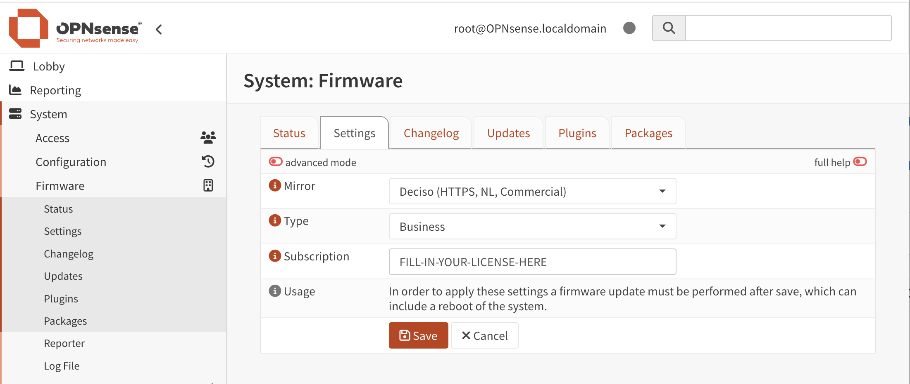

==========================
Firmware
==========================

In the firmware section you can keep your OPNsense up to date and have the ability to install additional software.

--------------------------------
Updates
--------------------------------

How to install updates and information about our versioning can be found in the Installation and setup section, which
can be found in the  :doc:`/manual/updates` document

--------------------------------
Plugins
--------------------------------

Plugins are additional software packages that are available for OPNsense, usually they come with their own
frontend components to setup the software underneath.
Here you can find community support plugins, such as  **bind**, **c-icap**, **freeradius** and others. Usually there is also
a **-devel** version available, which contains features still under development (master branch on GitHub versus release).

.. Note::

    .. raw:: html

          You can use the <i class="fa fa-plus fa-fw"></i> symbol to install the package.

.. Tip::

  .. raw:: html

        Use the info <i class="fa fa-info-circle fa-fw"></i> button to display information about the package and to find the active maintainer of this piece of software.

--------------------------------
Packages
--------------------------------

The packages tab contains the installed ports packages, here you can check licenses, force reinstalls or lock
versions.

--------------------------------
Changelog
--------------------------------

If you would like to read about the changes in (past) releases, you can do so in the **Changelog** tab.

--------------------------------
Settings
--------------------------------

The settings menu contains all available mirrors and options which you can choose for your installation.
Usually the default options are good enough here, but if you want to choose a mirror more close to home you can do so here.

.. Tip::

    The settings menu also provides the option to test development versions, which can be practical when testing features that
    are planned for release. Just change the release type to **Development**.

.. Note::

    Although OPNsense does not support the configuration of a proxy server, for services like the firmware updater it is possible
    to add these settings manually in our :code:`configd` service.
    For more information we refer to :doc:`the envronment section in our development docs </development/backend/configd>`.

Activate the Business Edition
...........................................

When you have purchased a license for the Business Edition or received it pre-installed on an appliance, you will
have to enable the license first.

In order to do so, please choose the following settings:

============== ==================================================================================
Mirror:        Deciso (HTTPS,NL,Commercial)
Flavour:       OpenSSL
Type:          Business
Subscription:  XXXXXXXX-XXXX-XXXX-XXXX-XXXXXXXXXXXX (the activation key for the product)
============== ==================================================================================

After save, go back to the status tab and click **Check for updates**

.. Note::

    Upgrading to OPNsense BE is only possible when the installed community version number is lower than the
    last available business edition. E.g. you can upgrade **22.7.x** to **22.10.x**, but you can not upgrade
    **23.1** to **22.10**. You can always re-install using the installer found on the `business mirror <https://opnsense-update.deciso.com/>`__

