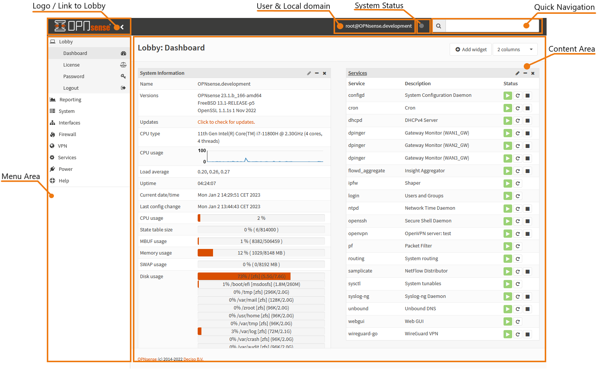
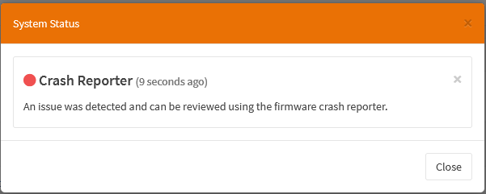

===========================
General User Interface
===========================

This article explains the basics of the OPNsense Graphical User Interface or GUI
for short.

----------
User Login
----------
Before we can take a look at the GUI options we need to login.
The default user is root and the password is opnsense.

.. image:: images/login.png

----------------------------
GUI Layout & Main Components
----------------------------

The GUI consists out of the following main components:

Logo & Link to Lobby
---------------------
Click on the OPNsense logo wherever you are in the interface and you will be
directed to the lobby and dashboard.

In the Lobby you can:

* Look at the dashboard with widgets
* View the 2-clause BSD license
* Change your password
* Logout

Menu Area
---------
The Menu area holds all the primary menus and submenus.
Here you can select what part of the system you want to watch or change.

You can see the layering on the menu. There are three levels:

#. Category level
#. Function level
#. Configuration level *(may not exist if the function is simple)*

In the following sample you see a screenshot of the Category **System**, with:

* Function: **Settings**
* Selected Configuration item: **General**

.. image:: images/submenu.png

Quick Navigation
----------------
A faster way to navigate trough the GUI is by using the quick navigation/search box
on the upper right corner of the screen. Either click on it or hit tab to select it.

The search field is a type-ahead field, meaning that it will guess what you are
looking for and fill up while typing. Hit Enter or click on an option to select
and navigate directly to the right page.

.. image:: images/quick-navigation.png

System Status
-------------
In the upper right corner of the screen is also a small indication of the system status.
In a normal situation this will be greyed out, but it will display a color if something is
wrong. You can click on it to review any of the pending messages, if any:

The colors indicate the severity of the issue. They are:

* Red. Indicates that an error has occured during system operation. Click it to go to the
  relevant page. In most cases this will be the crash reporter, which you can use
  to send us information about the crash.

* Yellow. Indicates a warning.
* Blue. Indicates an informational message.
* Grey. Everything is working as normal.

User & Local domain
-------------------
In the right corner just to the left of the system status you will see your
username and the full domain name the firewall is configured with
(to change firewall name, go to :menuselection:`System --> Setting --> General`).

Content Area
------------
The content area is used to display:

* Input forms
* Popup Forms
* Buttons
* General forms of data output graphical and text based

----------
Form View
----------
Let's take a look at how an advanced form may look like:

.. image:: images/proxy_form.png

Full Help
---------
Many forms are equipped with built-in help. In the upper right corner of the form
you can select to view all help messages at once. The toggle will color green when
enabled and show the help messages beneath the input items.

.. image:: images/help_msg.png

Advanced Mode
-------------
Some forms have hidden advanced features, to view them toggle the **advanced mode** in
the left corner of the form. Doing so will reveal all advanced options.

.. image:: images/advanced.png

Single Item Help
----------------
Show a single line help by pressing the **(i)** left of a form item.
Like this:

.. image:: images/info.png

Standard Tabs
-------------
A standard tab can be clicked upon to open the corresponding form.

A sample can be seen here:

.. image:: images/tab.png

Dropdown Tabs
-------------
A dropdown tab can be clicked upon to open the first menu item or you can click on
the arrow next to it to show all options, like so:

.. image:: images/dropdown_tab.png

------------------
Data grids
------------------

Many components within OPNsense use grid views to navigate through content, below is an example of a simple table view
supporting the most relevant actions.

.. image:: images/gui_grid.png

Fields
-------------------

.. raw:: html

    The available fields vary between components, the <i class="fa fa-list-ul"></i> icon can be used to select which fields should
    be visible or hidden.
      

Filter and limit
-------------------

.. raw:: html

    The top area of the grid contains a search input combined with a reload button <i class="fa fa-reload"></i> and
    a selection for the number of rows to show at once on a page. Often the search input will be instantly applied, but
    in some cases a reload is needed if the action can't be processed fast enough.
      
    When using the filter in log files, you will find a <i class="fa fa-arrow-right"></i> <b>Go to page</b> action
    behind every record. This will jump to the corresponding page and show you all surrounding records so you can see
    the context of a log message.
      

The search input tokenizes space-delimited words, causing the filter to return records matching all of the
clauses included in the search phrase.

Actions
-------------------

.. raw:: html

    Different actions could be supported on a (set of) records:
      <ul class="simple">
        <li> <i class="fa fa-square-o"></i> / <i class="fa fa-check-square-o"> </i> Enable / disable a record  </li>
        <li> <i class="fa fa-pencil"></i> Edit a record  </li>
        <li> <i class="fa fa-clone"></i> Copy a record and edit </li>
        <li> <i class="fa fa-trash"></i> Delete a record, usually this will ask for a confirmation </li>
        <li> <i class="fa fa-plus"></i> Add a new record and open edit dialog  </li>
      </ul>
        

Page Navigation
-------------------

The navigation buttons :code:`« ‹ [1,2,..] › »` help scroll through the different pages that are available for the
selected data.

.. Note::

    Although the page numbers and last page button (:code:`»`) are always visible, they can only be used when the size
    of the dataset is known upfront. In case of large datasets, such as intrusion alerts and log views the number of records
    is not known upfront, since there's no relation between the size of the underlaying data and the number of records.

    The record count in these cases is more or less a guestimate based on the number of records already shown.
