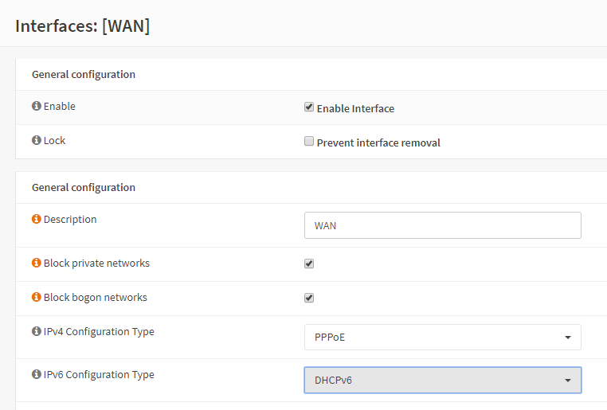
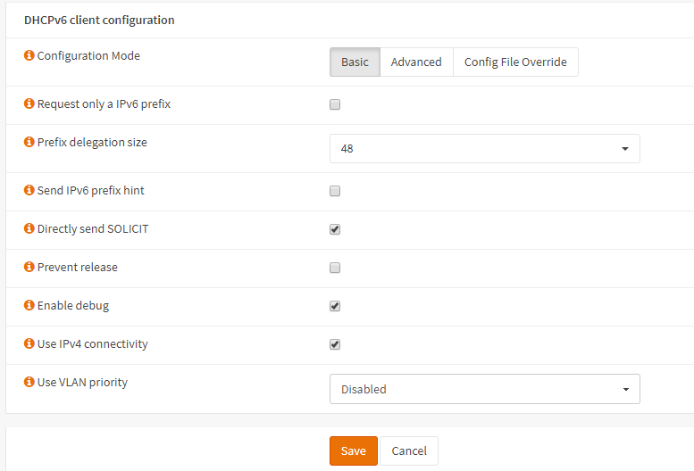
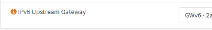
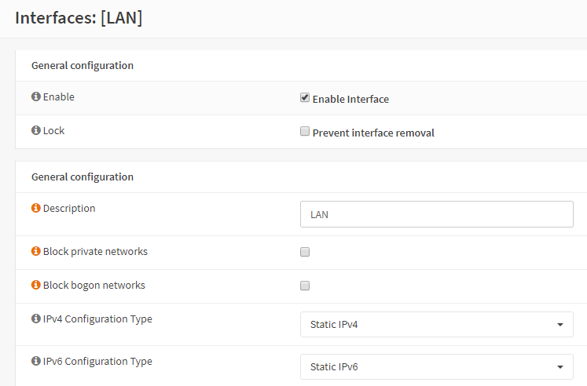
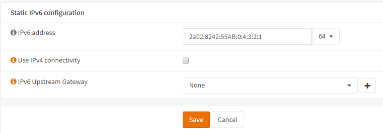

**IPv6 For Zen UK**
===================

**Original Author:** Martin Wasley

**Introduction**
-----------------
Zen provide two methods of setting up IPv6.

The first method is a simple DHCP method which should suffice most
users, the second allows you to set up static IPv6 on both WAN and LAN.
In either case the addresses and prefixes are constant and even under
DHCP will not change. Currently Zen provide a /64 WAN address and a /48
prefix allocation. These will have been given to you by Zen when you
request IPv6.

**Setting up IPv6 using DHCPv6**
--------------------------------

**WAN Interface**
-----------------

Zen use PPPoE in the initial V4 connection, so enter PPPoE as the V4
connection type and set the username and password for the PPPoE
connection, for IPv6 using DHCP, select DHCPv6 in the IPv6 connection as
shown below.

The next step is to configure the parameters required for DHCPv6, these
are located in the DHCPv6 client configuration section of the WAN
interface shown below.

As stated before, Zen provide a /48 prefix, so select the prefix size
accordingly. We directly send the solicit as in this case we do not wish
to wait for an RA from the Zen gateway.

The only other requirement in this section is to select ‘Use IPv4
connectivity’, this is because the IPv6 traffic is routed over the PPPoE
link.

In the example above, ‘Enable debug’ is selected, this adds extra dhcp6c
logging information to the DHCP logs, this is optional.

Click ‘Save’ and then ‘Apply’.

**LAN Interface**
-----------------

All that is required now is to set the LAN interface to use assigned
IPv6 prefix.

Select Interfaces->LAN and set the IPv6 Configuration Type to ‘Track
Interface’

.. image:: images/ZenUK_image3.png
	:width: 100%

Finally, set the Track IPv6 Interface to WAN, unless there is a special
requirement which this document does not cover, set the IPv6 Prefix ID
to 0.

.. image:: images/ZenUK_image4.png
	:width: 100%

Click ‘Save’ and then ‘Apply’.

It is advisable at this point to reboot the system.

**Setting up IPv6 using Static Assignment**
-------------------------------------------

Although slightly more complex, this option gives you greater control
over LAN DHCP6 server, as this can be tailored to specific needs.

We can take advantage of the link-local that is automatically set up
between our router and the Zen BNG, we do not need to know specific
gateways at the Zen end, it all gets routed automagically, however we do
need to set up all of our static assignments, and our DHCPv6/RADVD
servers.

**Create Gateway**
------------------
Firstly, we do need to set up a gateway, this is for monitoring more
than anything else. Select Gateways->All then click ‘Add Gateway’.

Now, we know that Zen give us a /64 on our WAN interface, for example.

2a02:8231:d256:318::/66

Pick an address, we’ll use ‘1’, so our WAN address
2a02:8231:d256:318::1, it’s also going to be our gateway.

We will also add a target IP for our monitor, the target will be a
global WAN address of something. You can use the Google v6 DNS server
address if you wish. If no monitor is given the gateway address is used,
which can check gateway health status but may or may not indicate access
to the Internet.

Set up the gateway like this:

.. image:: images/ZenUK_image5.png
	:width: 100%

Click Save.

**WAN Interface**
-----------------
Once we have our gateway in place we can then set up the WAN interface.
Select Interfaces->WAN.

Go to IPv6 Configuration Type and Select Static IPv6.

.. image:: images/ZenUK_image6.png
	:width: 100%

Go to Static IPv6 Configuration and set the IPv6 Static address:

**Tip Use the same address as found when setting the system up to use
DHCPv6.**

.. image:: images/ZenUK_image7.png
	:width: 100%

Select Use IPv4 connectivity, all IPv6 traffic goes via the PPPoE link.

Finally, select the IPv6 Upstream Gateway, this is the gateway you
created earlier.

Click Save and Apply.

**LAN Interface**
-----------------

The LAN interface is very simple to set up, all we need to do is set the
IPv6 Configuration Type to Static, and enter our static address.

Zen give us a /48 prefix to use on the LAN, so pick an address from that
range. For example our prefix is:

2a02:8242:55AB:\:

So

2a02:8242:55AB:0:4:3:2:1 would suffice.

We want to use a /64 prefix on this interface.

**Tip Use the same address as found when setting the system up to use
DHCPv6.**

Click Save and Apply.

**DHCPv6 Server**
-----------------

When using DHCPv6 on the WAN, our DHCPv6 LAN server is set
automatically, however when using statics, we need to set it up. Goto
Services->DHCPv6[LAN]

Firstly, enable the server.

.. image:: images/ZenUK_image11.png
	:width: 100%

You will notice that the subnet already has a range, and the subnet mask
is the /64 we set on the LAN. There is also a range we must use, the
available range tells us what that can be.

Enter the lower – start range that the server will use

2a02:8231:d256::eeee:0000:0000:0001

Enter the upper – end range that the server will use.

2a02:8231:d256::eeee:ffff:ffff:ffff

.. image:: images/ZenUK_image12.png
	:width: 100%

This should cover most LAN subnets, the range given here gives
281,474.976.710,655 addresses.

We can also set up a prefix delegation range, this is used where we have
sub routers or VLAN’s that need their own range. In the case of
prefixes, we are only interested in the upper 64 bits, as in this
example we will only be giving out 64 bit prefixes. We know we have been
given a /48 prefix by Zen, so we enter our prefix range like this:

.. image:: images/ZenUK_image13.png
	:width: 100%

Our prefix range is the upper 48 bits, plus some of the next 16 bits,
but we must not cross into the range we have used for our LAN addresses.
In the example above I have allowed for up to 254 /64 subnets.

Once these details have been entered, click save.
