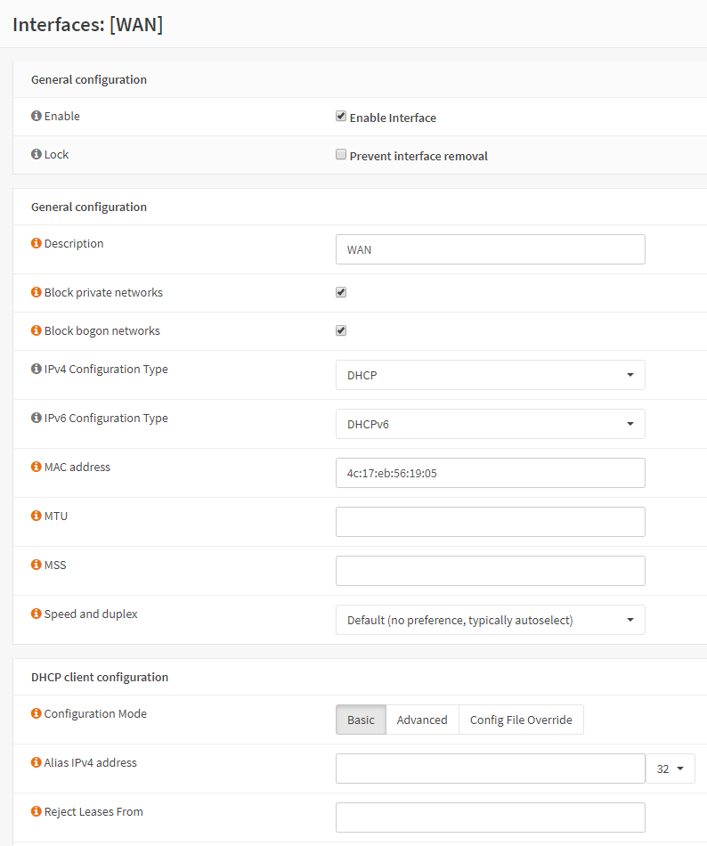
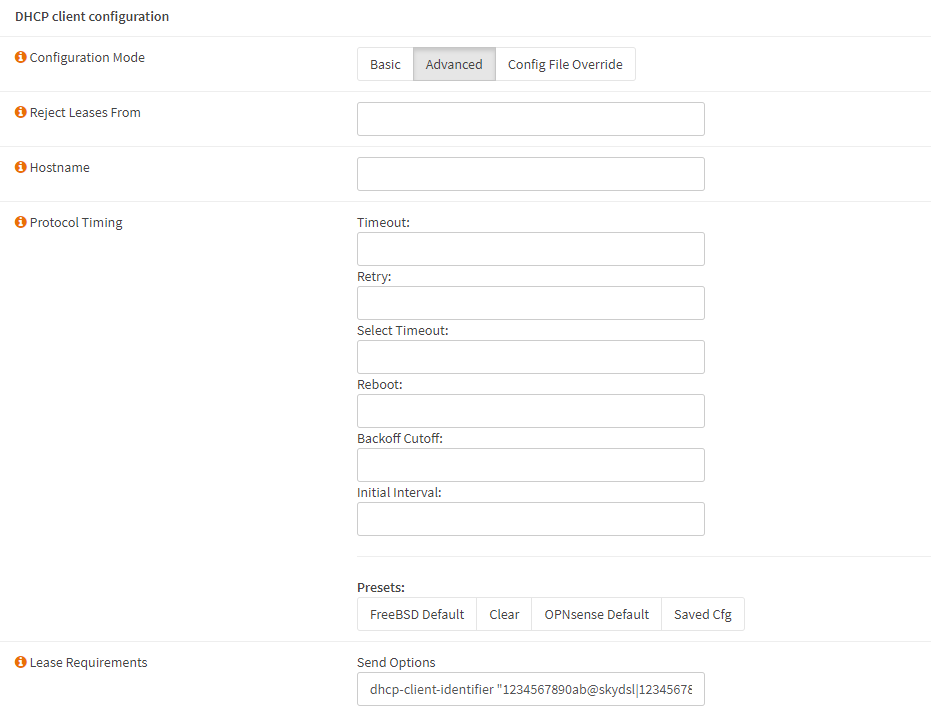
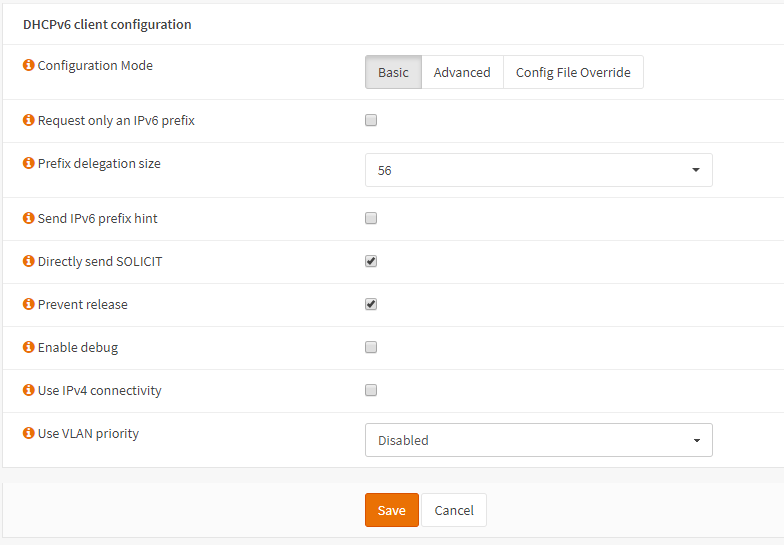
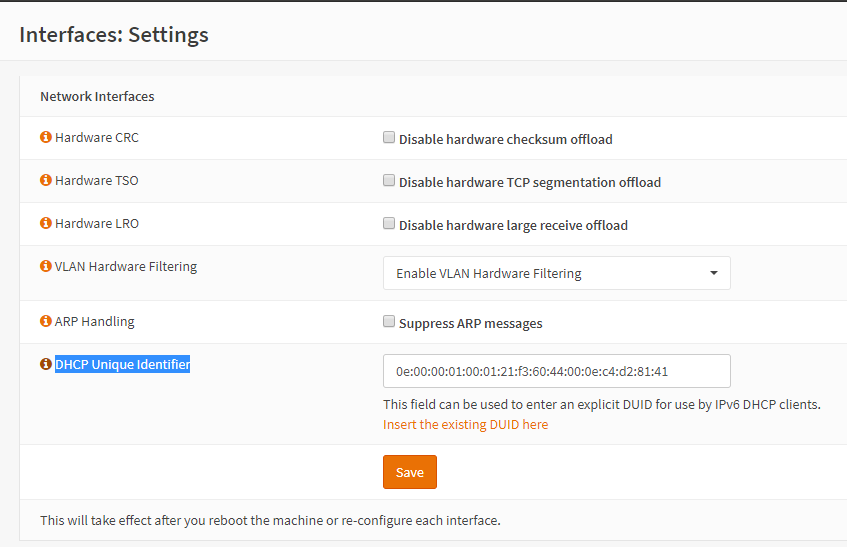
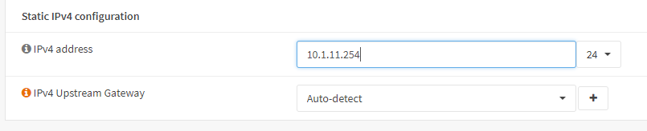

Setup for Sky UK ISP
====================

**Original Author:** Martin Wasley

**Introduction**
-----------------
This doc covers the setup of OPNsense on a Sky UK VDSL connection.

Sky uses a simple IPoE connection, all that is required is a suitable modem
in bridge mode. If using a standard OpenReach modem then no setting is required
in the modem itself.

**WAN Interface**
-----------------

Set both IPv4 and IPv6 configuration type to DHCP and DHCPv6 respectively.

**Option61 - dhcp-client-identifier**
-------------------------------------

We now need to send the Sky login credentials. When using VDSL we do not
need to use specific credentials, as long as they are correctly formatted
anything will do.

Under DHCP Client Configuration select the Advanced button.

There is an entry 'Send Options', enter the UserID & Password here in the
format:

dhcp-client-identifier "user_ID@skydsl|password"

It is said that it doesn't matter what is sent in the option61 string, which
is what this is, as long as something is sent, I prefer to play it safe so
stick with the format as shown. For example, the following will work quite
happily.

dhcp-client-identifier "12345678@skydsl|12345678"

The other part of the ID is called Option60, there are varying thoughts on
whether this is needed anymore, it does no harm to include it so we'll do so.

dhcp-class-identifier "7.16a4N_UNI|PCBAFAST2504Nv1.0"

So the full entry for the 'Lease Requirements' Send Options would be:

*dhcp-client-identifier \"12345678@skydsl|12345678\",dhcp-class-identifier \"7.16a4N_UNI|PCBAFAST2504Nv1.0\"*

The next step is to configure the parameters required for DHCPv6, these
are located in the DHCPv6 client configuration section of the WAN
interface shown below.

Sky provide a /56 IPv6 delegation, they do not provide a global IPv6 address
on the WAN interface, this is link local only. Prefix delegation size should
be set to 56.

Click 'Save' and 'Apply'

The only other requirement is found in the Interfaces:Settings menu under
IPV6 DHCP. The ‘Prevent Release' option.

.. image:: images/skyuk_dhcp6c_interface_settings.png
	:width: 100%

This is there as the Sky DHCPv6 servers use a 'sticky' address. If the
OPNsense dhcp6 client sends a release signal to the server it's more than
likely that the allocated prefix will change, thus this setting, along with
the 'DHCP Unique Identifier' setting will attempt to mitigate this risk.

Once these settings have been entered, click on 'Save' then 'Apply'.

**DHCP Unique Identifier**
--------------------------

Although OPNsense stores the IPv6 DUID it is possible this can be lost, this
again would probably result in a new prefix being given, therefore an option
to enter and store a DUID is given in the Interface:Settings menu.

The Identifier can either be entered manually or if the user clicks on the 'i'
icon, the existing DUID can be automatically entered into the field by clicking
on the 'Insert the existing DUID here' legend.

Click ‘Save’.

**LAN Interface**
-----------------
The LAN interface Ipv4 address should have been setup during initial system
installation, if they were not, then the LAN settings can be adjusted in the
Interfaces:[LAN] menu.

It is my recommendation not to use the private subnet range 192.168.*.0, as
this range is often used by hotels and other public networks for access, this
can cause issues when using a VPN. My preferred address method is using the
10.*.*.0 subnet where the second and third quartet are birth dates or some
other easily memorable number. i.e. 10.1.11.0 would be the first of November.
This is more random and the chances of the same range on a public network is
greatly reduced, however the address range is easily memorable.

.. image:: images/ZenUK_image3.png
	:width: 100%

Once the LAN IPv4 address is set then all that remains in the LAN interface
is to set the interface to use the assigned IPv6 prefix.

Set the Track IPv6 Interface to WAN, unless there is a special
requirement which this document does not cover, set the IPv6 Prefix ID
to 0.

.. image:: images/ZenUK_image4.png
	:width: 100%

Click ‘Save’ and then ‘Apply’.

Setting up the IPv4 DHCP server is not covered in this document, but is
required.

It is advisable at this point to reboot the system.
