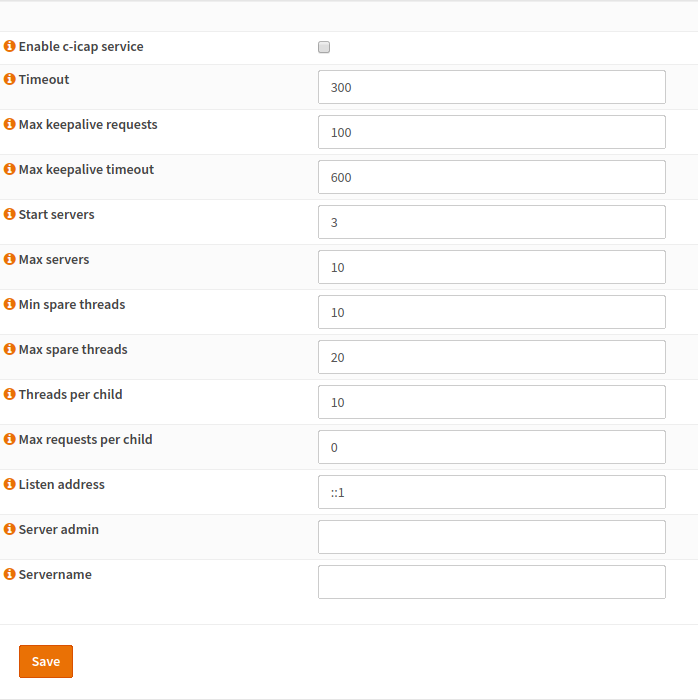
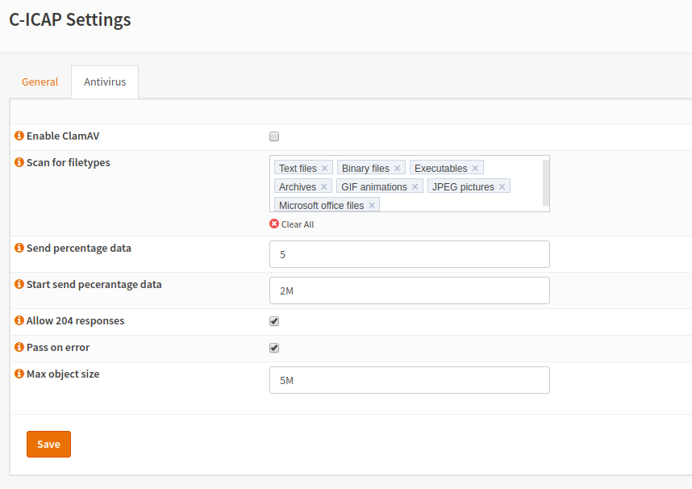

======
c-icap
======

------------
Installation
------------

First of all, you have to install the c-icap plugin (os-cicap) from the plugins view.

.. image:: ../images/menu_plugins.png

After a page reload you will get a new menu entry under services for C-ICAP.
Select it and you will get to the following screen:

----------------
General Settings
----------------

:Enable c-icap service:
    Enable the C-ICAP service to handle ICAP requests.
:Timeout:
    The time after which the socket will be closed.
:Max keepalive timeout:
    The time after which the socket will be closed if it stays inactive.
:Start servers:
    The count of the server processes which will be spawned.
:Max servers:
    Limit the count of processes
:Listen address:
    The address in which the server should be bound.
    This address is usually the loopback address (\:\:1 for IPv6 or
    127.0.0.1 for IPv4). The default value is \:\:1.
:Server admin:
    This field should be set to an email address which acts as a contact
    for users, who are having issues with the server.
    A good idea would be an address, which converts the mails to your internal
    ticket system.
:Servername:
    If you want to override the server name (displayed on error pages),
    you can enter it here.

    
---------
Antivirus
---------

:Enable ClamAV:
    Enables the virus
    -scan plugin of c-icap-modules using ClamAV
:Scan for filetypes:
    The type of files which should be analyzed.
    You should scan as many file types as possible but keep in mind that
    scanning requires resources which have to be available.
:Send percentage data:
    Amount of Data of the original file which should be included in the preview.
    More Data will have better scanning results and is better for security while
    a lower value improves performance.
:Allow 204 response:
    A 204 response has the advantage, that the data don't have
    to be sent over the wire again. In case of a preview, no more data
    will be sent to the ICAP server and the data will be forwarded to
    the client. In case of all data has been received by the ICAP server,
    the data does not need to be sent back. Please note, that the ICAP client
    has to support 204 responses.
:Pass on error:
    In case the scan fails, the file can be passed through.
    This is less secure but keeps the business running in case of failure.
    Keep in mind that this may put your network at risk.

