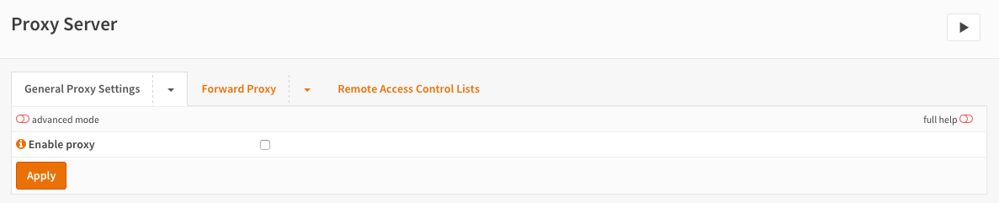
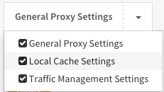
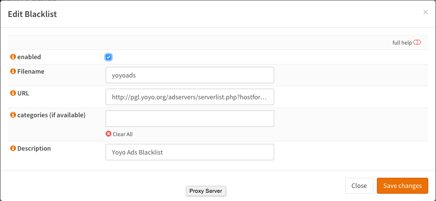
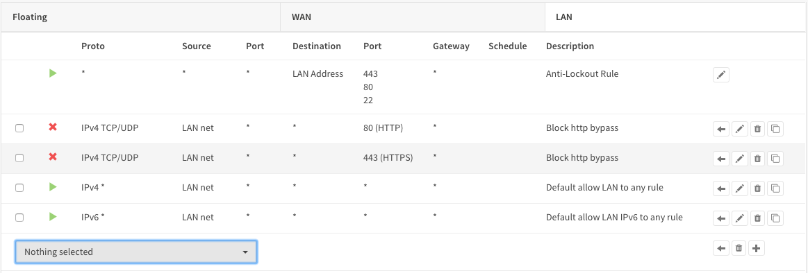
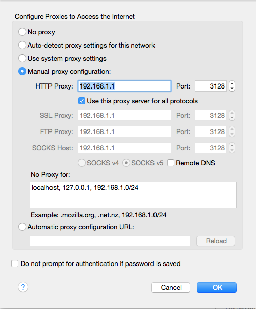

===================
Setup Caching Proxy
===================

----------------
Enable / Disable
----------------
The proxy is delivered with sane default settings for easy setup.
To enable the proxy just go to :menuselection:`Services --> Web Proxy --> Administration` and
check **Enable proxy** then click on **Apply**. The default will enable the proxy
with User Authentication based on the local user database and runs on port 3128
of the lan interface.

-----------------------
Change Proxy Interfaces
-----------------------
If you want to change the interfaces (subnets) the proxy will bind to then click
on the tab **Forward Proxy**. Now add/remove the interfaces in the **Proxy interfaces**
field.

---------------------------
Change Proxy Listening Port
---------------------------
By default the proxy will listen at port 3128, you can change this by clicking
on the tab **Forward Proxy** and fill in the port in the **Proxy port** field.
Don't forget to **Apply** your changes.

------------
Enable Cache
------------
To enable caching click on the arrow next to the **General Proxy Settings** to
see the dropdown menu and click on **Local Cache Settings**.

Check the **Enable local cache** and click **Apply**.

.. Important::

  As the cache is not created by default you will need to stop and start the service
  under :menuselection:`System --> Diagnostics --> Services`, this will ensure correct creation of the cache.

Advanced
--------
Under the advanced settings (see mode switch on left top of the form) you can
change the cache size, directory structure and max object size to keep in cache.
Again defaults are fine for normal browsing and creates a 100 MB cache with max 4 MB
object size.

----------------------------
Change Authentication Method
----------------------------
Click on the arrow next to the **Forward Proxy** tab to show the drop down menu.
Now select **Authentication Settings** and select the desired Authenticator(s) in
the field **Authentication method**. Click on **Clear All** if you do not want to
use any authentication.

Depending on the Authentication Servers you have setup under :menuselection:`System --> Access --> Servers`
You can select one or more of the following:

* No Authentication (leave field blank)
* Local User Database
* LDAP
* Radius

---------
FTP Proxy
---------
To enable the FTP Proxy click on the arrow next to the **Forward Proxy** tab to
show the drop down menu. Now select **FTP Proxy Settings** and select one or more
interfaces in the **FTP proxy interfaces** field and **Apply**.

.. Note::
    The FTP proxy will only function if the Proxy Server itself is enabled.
    And the proxy only works for non encrypted ftp traffic.

-------------------
Access Control List
-------------------
You can setup ACLs by clicking on the arrow next to **Forward Proxy**  and select
**Access Control List**. Here you can:

* Setup Allowed Subnets (By default the proxy interfaces will be allowed)
* Add Unrestricted IP addresses (Unrestricted means just that, no authentication and no blacklisting for those IPs)
* Add Banned hosts IP address (A ban will stop this client from being able to use the proxy)
* Whitelist (Click on the (i) to see examples, whitelist prevail above blacklists)
* Blacklist (If not allowed by a whitelist, this will block traffic based upon a regular expression)

.. Warning::
    Don't forget to press Enter or a comma after filling in a tag field as otherwise
    the value will not be applied. It should look similar to:

    .. image:: images/proxy_tag.png

-------------------------------
Remote Black List / Ad Blocking
-------------------------------
Use simple flat files to block ads.
For this sample we will use the ad list found here:

http://pgl.yoyo.org/adservers/serverlist.php?hostformat=nohtml

This list is a simple flat list that looks like this:

.. code-block:: 

    101com.com
    101order.com
    123found.com
    180hits.de
    180searchassistant.com
    1x1rank.com
    207.net
    247media.com

Go to :menuselection:`Services --> Web Proxy --> Administration` and click on the tab **Remote
Access Control Lists**

Now click on the **+** at the bottom right corner of the form to add a new list.

Fill in:

================= ======================= ===========================================
 **Enabled**       Checked                 *Enable/Disable*
 **Filename**      yoyoads                 *Choose a unique filename*
 **URL**           (copy/paste the URL)    *The URL of the blacklist*
 **categories**    (Leave blank)           *Used for Category based web filtering*
 **Description**   Yoyo Ads Blacklist      *Your description*
================= ======================= ===========================================

Looks like (screenshots of version 16.1.4):

**Save changes**

Now click on **Download ACLSs & Apply** to enable the blacklist/ad blocker.

-----------------------------
Firewall Rule No Proxy Bypass
-----------------------------
To make sure no-one can bypass the proxy you need to add a firewall rule.
Go to :menuselection:`Firewall --> Rules` and add the following to the top of the list rule on the
LAN interface (if LAN is where your clients and proxy are on).

============================ =====================
 **Action**                   Block
 **Interface**                LAN
 **Protocol**                 TCP/UDP
 **Source**                   LAN net
 **Destination Port Range**   HTTP
 **Category**                 Block Proxy Bypass
 **Description**              Block HTTP bypass
============================ =====================

**Save**

And one more rule to block HTTPS access:

============================ =====================
 **Action**                   Block
 **Interface**                LAN
 **Protocol**                 TCP/UDP
 **Source**                   LAN net
 **Destination Port Range**   HTTPS
 **Category**                 Block Proxy Bypass
 **Description**              Block HTTPS bypass
============================ =====================

**Save** & **Apply changes**

-------------------------
Configure Browser/Firefox
-------------------------
To configure you browser for use with the proxy, just go to your network settings
and configure a proxy like this in firefox:

For a set-for-step guide on full category based web filtering see :doc:`proxywebfilter`.
