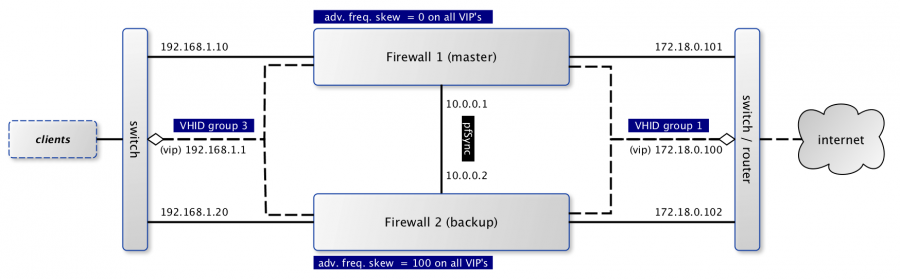

==============
Configure CARP
==============

--------
Overview
--------

One of the more powerful features of OPNsense is to set-up a redundant
firewall with automatic fail-over option. This chapter describes step by
step how to create a set-up based on two networks. The 192.168.1.0/24
will be used for the internal network and 172.8.0.0/24 will be used to
route our traffic to the internet.

When using CARP ( `FreeBSD handbook on CARP <https://www.freebsd.org/doc/handbook/carp.html>`__ ), all
fail-safe interfaces should have a dedicated ip address which will be
combined with one shared virtual ip address to communicate to both
networks. In the picture above the dashed lines are used to mark the
virtual addresses.

The configuration file (xml) for both firewalls can be downloaded from
the wiki.

-----------
Terminology
-----------

There is some terminology involved in setting up a CARP cluster, which
we will explain briefly first:

.. rubric:: CARP
    :name: carp

Common Address Redundancy Protocol uses IP protocol 112, is derived from
OpenBSD and uses multicast packets to signal it's neighbours about it's
status. Always make sure that each interface can receive carp packets.
Every virtual interface must have a unique Virtual Host ID (vhid), which
is shared across the physical machines. To determine which physical
machine has a higher priority, the advertised skew is used. A lower skew
means a higher score. (our master firewall uses 0).

.. rubric:: pfSync
    :name: pfsync

Together with CARP, we can use pfSync to replicate our firewalls state.
When failing over you need to make sure both machines know about all
connections to make the migration seamless. It's highly advisable to use
a dedicated interface for pfSync packets between the hosts, both for
security reasons (state injection) as for performance.

.. rubric:: XMLRPC sync
    :name: xmlrpc-sync

OPNsense includes a mechanism to keep the configuration of the backup
server in sync with the master. This mechanism is called xmlrpc sync and
can be found under System -> High Availability.

-----------------------------------------
Setup interfaces & basic firewall rules
-----------------------------------------

Our example uses three interfaces, which all have a rather basic setup.

.. rubric:: Master
    :name: master

Go to interfaces, make sure you have all three interfaces assigned and
setup the following addresses and subnets:

+-----------------------+
| LAN 192.168.1.10/24   |
+-----------------------+
| WAN 172.18.0.101/24   |
+-----------------------+
| PFSYNC 10.0.0.1       |
+-----------------------+

Next we need to make sure the appropriate protocols can be used on the
different interfaces, go to firewall -> rules and make sure both LAN and
WAN accept at least carp packets (see protocol selection). Because we're
connecting both firewalls using a direct cable connection, we will add a
single rule to accept all traffic on all protocols for that specific
interface. Another option is to only accept traffic to the GUI port and
pfSync protocol.

.. rubric:: Backup
    :name: backup

The backup server needs it's own dedicated addresses, we will use these:

+----------+-------------------+
| LAN      | 192.168.1.20/24   |
+----------+-------------------+
| WAN      | 172.18.0.102/24   |
+----------+-------------------+
| PFSYNC   | 10.0.0.2          |
+----------+-------------------+

Because we are going to synchronize firewall settings between both
hosts, we only need to make sure that the pfsync interface can accept
data from the master for the initial setup. Use the same rule as used
for the master on this interface.

-----------------
Setup Virtual IPs
-----------------

On the master node we are going to setup our Virtual IP addresses, which
will also be used for the backup node after synchronisation. Go to
Firewall -> Virtual IPs and add a new one with the following
characteristics:

+-------------------------+------------------------------------+
| Type                    | Carp                               |
+-------------------------+------------------------------------+
| Interface               | WAN                                |
+-------------------------+------------------------------------+
| IP addresses            | 172.18.0.100 / 24                  |
+-------------------------+------------------------------------+
| Virtual password        | opnsense (the example uses this)   |
+-------------------------+------------------------------------+
| VHID Group              | 1                                  |
+-------------------------+------------------------------------+
| Advertising Frequency   | Base 1 / Skew 0                    |
+-------------------------+------------------------------------+
| Description             | VIP WAN                            |
+-------------------------+------------------------------------+

And another using the following:

+-------------------------+------------------------------------+
| Type                    | Carp                               |
+-------------------------+------------------------------------+
| Interface               | LAN                                |
+-------------------------+------------------------------------+
| IP addresses            | 192.168.1.1 / 24                   |
+-------------------------+------------------------------------+
| Virtual password        | opnsense (the example uses this)   |
+-------------------------+------------------------------------+
| VHID Group              | 3                                  |
+-------------------------+------------------------------------+
| Advertising Frequency   | Base 1 / Skew 0                    |
+-------------------------+------------------------------------+
| Description             | VIP LAN                            |
+-------------------------+------------------------------------+

------------------
Setup outbound NAT
------------------

When traffic is going out of the firewall it should also use the virtual
IP address to make a seamless migration possible. The default for
OPNsense is to use the interfaces IP address, which is in our case the
wrong one.

Go to Firewall -> NAT and select outbound nat. Choose manual outbound
nat on this page and change the rules originating from the
192.168.1.0/24 network to use the CARP virtual interface (172.18.0.100).

----------------------------
(optional) Setup DHCP server
----------------------------

When using dhcp for the local area network, there are some things to
consider. All clients should use the virtual address in stead of the
physical address it's normally propagating. Next thing to consider is
there will be two servers active at the same time, which should know of
each others pools. If dns requests are also forwarded by OPNsense, make
sure the dhcp server sends the right ip address. These are settings used
in our example (on the master server):

+--------------------+----------------+
| DNS servers        | 192.168.1.1    |
+--------------------+----------------+
| Gateway            | 192.168.1.1    |
+--------------------+----------------+
| Failover peer IP   | 192.168.1.20   |
+--------------------+----------------+

---------------------------------
Setup HA sync (xmlrpc) and pfSync
---------------------------------

First we should enable pfSync using our dedicated interface using the
master firewall. Go to System -> High Availability, enable pfsync and
select the interface used for pfSync. Next setup the peer ip to the
other hosts address (10.0.0.2).

Now we need to configure the settings we want to duplicating to the
backup server using the xmlrpc sync option. For our setup we will enable
the following:

+---------------------------+
| Synchronize rules         |
+---------------------------+
| Synchronize NAT           |
+---------------------------+
| Synchronize DHCPD         |
+---------------------------+
| Synchronize Virtual IPs   |
+---------------------------+

--------------
Finalize setup
--------------

Just to make sure all settings are properly applied, reboot both
firewalls before testing.

-------------
Testing setup
-------------

First go to Status -> Carp in the OPNsense webinterface and check if
both machines are properly initialized.

To test our setup, we will connect a client to the local area network
and open a ssh connection to a host behind both firewalls. Now when
connected you should be able to look at the state table on both OPNsense
firewalls (Diagnostics -> States) and they should both display the same
connection. Next try to pull the network plug from the master firewall
and it should move over to the backup without loosing (or freezing) the
ssh connection.

---------
Resources
---------

#. Configuration for master server ( :download:`Carp_example_master.xml <resources/Carp_example_master.xml>` )
#. Configuration for backup server ( :download:`Carp_example_backup.xml <resources/Carp_example_backup.xml>` )
