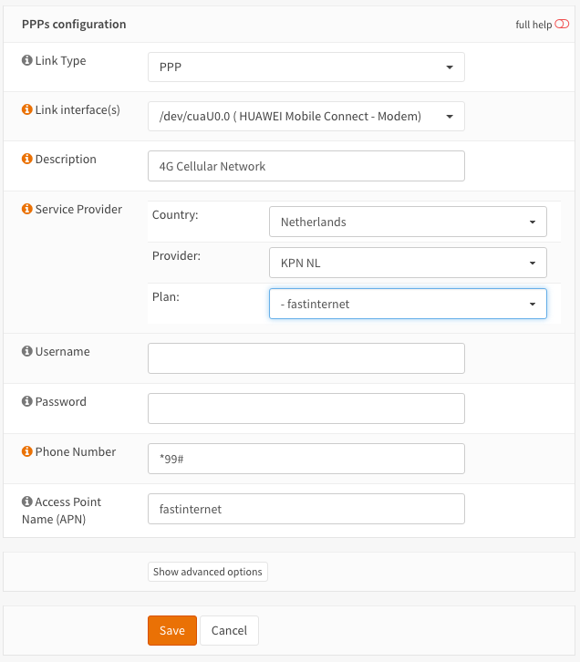
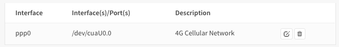
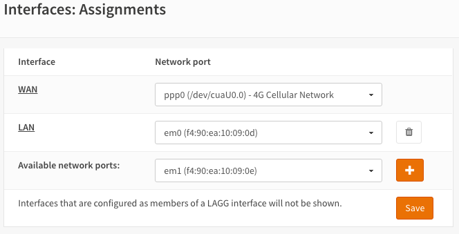

===========================
Configuring Cellular Modems
===========================
OPNsense supports a wide range of USB and miniPCIe cellular modems that can be used
as primary internet (WAN) connection or as failover for a fixed/ethernet connection.

With this guide we show you how to easily add a new modem and configure it to be
used as primary WAN connection.

-----------------
Supported devices
-----------------

In general, OPNsense should support all cellular modems that are supported by the
respective FreeBSD kernel (`see latest <https://cgit.freebsd.org/src/tree/sys/dev/usb/serial/u3g.c#n197>`).
However, not all devices behave the same way, you might have to tweak your card 
with specific AT commands, for example in the init string.

The screenshots in this guide are for a Huawei ME909u-521 miniPCIe cellular modem.

---------------------------
Choosing the right hardware
---------------------------

Depending on the country you want to use the modem in, you might need a different
cellular modem. mPCIe cards are rather expensive so make sure you get a device
that supports the LTE bands of the country and provider you want to work with.
Use websites like `FrequencyCheck <https://www.frequencycheck.com/>`_ to find the
frequency band(s) used and get a cellular modem that supports these frequencies.

You should also buy an appropriate pigtail antenna cable and LTE antenna. Note
that LTE antennas often have different connectors than Wi-Fi antennas, chose your
equipment accordingly. Getting the right antenna has a big impact on the quality
of your signal. For LTE, MIMO (multiple input, multiple output) antennas should
be considered, see for example `this guide <https://www.specialistantennas.co.uk/news/lte-antenna-choices-considerations>`_.

.. Note::

  Make sure to connect the antenna to the cellular modem once you start
  configuring the modem in OPNsense. There is little chance that you
  get any signal without antenna.

--------------------------------------
Step 1 - Talking to the cellular modem
--------------------------------------

First, we need to figure out what device is accepting AT commands on your modem. For
the Huawei modem used in this example the device is ``/dev/cuaU0.0``, other modems
might provide the AT interface on another device.

On FreeBSD, ``/dev/cuauN`` devices are call-out ports that are used for modems instead
of terminals, see section `26.2.1 <https://www.freebsd.org/doc/handbook/serial.html>`_ in the FreeBSD manual.

The best way to locate the correct port is to send AT commands to it. This can be
tested using the utility ``cu``:

.. code::

   cu -l /dev/cuaU0.2
   Connected
   AT (<-type that)
   OK

Once you see ``Connected`` type ``AT``. If you do not get an ``OK``
back, enter ``~.`` to quit and try the next device. In this particular example, a
Sierra Wireless MC7430 card was used and ``/dev/cuaU0.2`` is the only device where
we get ``OK`` back.

Now, check if a SIM card is available and can be accessed:

.. code::

   cu -l /dev/cuaU0.2
   Connected
   AT+CPIN?
   +CPIN: READY

There are multiple things that can go wrong here, the SIM card might not
have been detected or you might have a pin on the SIM.

Once the SIM card is ready, quit ``cu`` with ``~.``.

.. Note::

  To get rid of the pin, first check if it is valid with ``AT+CPIN="1234"``
  where ``1234`` is the pin of your SIM card. To get rid of the pin, enter
  ``AT+CLCK="SC",0,"1234"``. The pin should now be gone.

.. Note::

  If you never get a ``READY`` after ``AT+CPIN?`` you might want to play with
  the different mPCIe slots on your system. In my case on a PC Engines APU
  board and a Sierra Wireless card I had to switch slots until the SIM card
  was detected properly. The middle one did the trick for me, if someone
  understands how or why this is happening, please add your findings to this
  documentation. Also, APU boards have more than one SIM slot, try both slots
  in case the first option did not work.

----------------------------------------
Step 2 - Configure Point to Point device
----------------------------------------

Go to :menuselection:`Interfaces --> Point-to-Point --> Devices` and click on **Add** in the upper
right corner of the form.

Fill in the form like this (Example is for Dutch Mobile 4G KPN Subscription):

============================ =======================================================
 **Link Type**                PPP
 **Link interface(s)**        /dev/cuaU0.0 ( HUAWEI Mobile Connect - Modem)
 **Description**              4G Cellular Network
 **Service Provider**         Select Country, Provider & Plan for auto configuration
 **Username**                 Leave Empty (for NL KPN)
 **Password**                 Leave Empty (for NL KPN)
 **Phone Number**             \*99# (for NL KPN)
 **Access Point Name (APN)**  fastinternet (for NL KPN 4G)
============================ =======================================================

If you need to enter a PIN number, then click on **Advanced Options**

Click **Save** to apply the settings.

---------------------------------
Step 3 - Assign the WAN interface
---------------------------------
To assign the interface go to :menuselection:`Interfaces --> Assignments` in our case we will make
this our primary internet connection and change the WAN assignment accordingly.

To do so just change the **Network port** for **WAN** to **ppp0 (/dev/cuaU0.0) - 4G Cellular Network**.

No click **Save** below the form.

If everything went fine, then you are all set, and the default gateway will be
the one of you cellular connection.

------------------------
Step 4 - Troubleshooting
------------------------
In case it still does not work, first look at the log of the cellular device's PPP connection, to do so go to:
:menuselection:`System --> Log Files --> General`. If you are
lucky you can see what went wrong directly in the log. Unfortunately, the PPP log is
not very informative so it might not help at all.

If you can't figure out what is wrong, then a reboot to reinitialize the device can
sometimes help. This seems particularly true on embedded devices, better reboot
once too much and if you got lost in the options, a factory reset to start from
scratch is a good idea too. In our experience playing with SIM cards from different
providers required factory resets (for whatever reason) to get them to work properly.

.. Note::

  As mentioned above, the SIM card needs to be available. See the hints
  in the first step of this tutorial to make sure everything is prepared properly.

.. Note::

  Some Sierra Wireless modems still seem to need a specific init string to work
  properly. One that seems to work for multiple users and LTE cards is ``&F0E1Q0 +CMEE=2``. In any case you should first try without init string and only give it
  a try if you could not get any connection without. You can add this in
  :menuselection:`Interfaces --> Point-to-Point --> Devices --> Your particular device --> Advanced Options --> Init String`.

When the device seems to work properly then checkout if the interface was assigned
an IP address, go to :menuselection:`Interfaces --> Overview` and click on the WAN interface to
see the details.

You should see an IP address, Gateway IP and ISP DNS server(s).
If all is filled in, then either your firewall is blocking the traffic or the
network connection is not working well.

In case you were not successful, you might have to check manually what is going
on. Read the `Troubleshooting PPP Connections <https://www.freebsd.org/doc/handbook/ppp-troubleshoot.html>`_ section in the FreeBSD manual for more information and
consult the OPNsense support forum.
