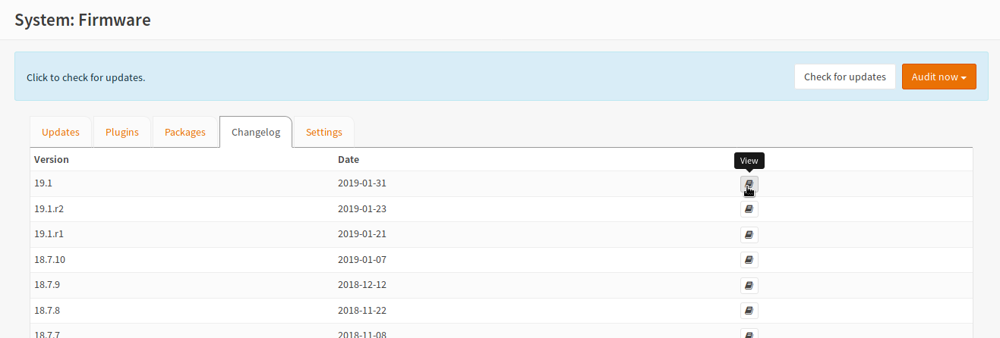
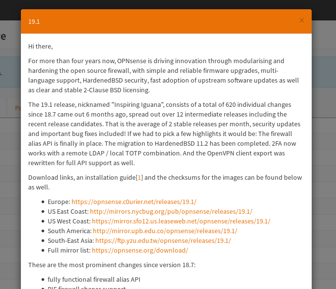
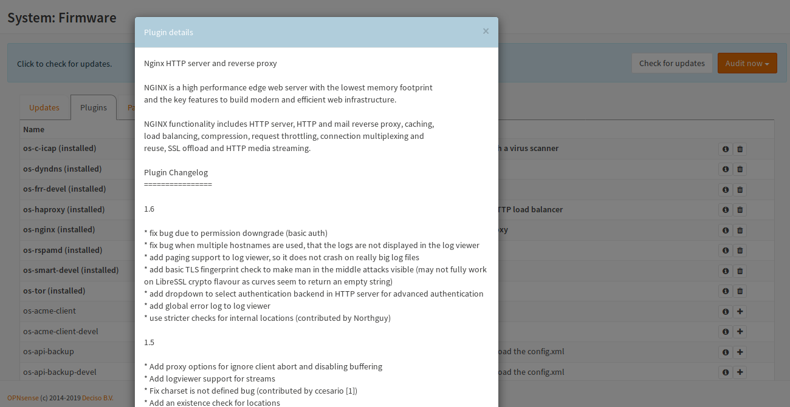

==========
Changelogs
==========

OPNsense core offers a changelog of the core and the plugins may offer their own changelog,
if they are growing rapidly so the changelog does not fit into core anymore.

Core
====

Core offers a changelog section in the area :menuselection:`System --> Firmware` as an own menu or the dialog will
automatically open in case of an available update.

To open a changelog manually, you can open the Changelog tab, and click the book:

After opening the changelog, you will get an entry like this one:

The changelog entries can be found at different places:

* Forum: https://forum.opnsense.org/index.php?board=11.0
* GitHub: https://github.com/opnsense/changelog/tree/master/doc
* Blog: https://opnsense.org/blog/
* Reddit: https://www.reddit.com/r/OPNsenseFirewall/

Plugins
=======

The plugins changelogs can be found in the plugins section after clicking the info button of the plugin
(Plugins tab in Firmware).

After the description of the software behind the plugin or the plugin itsef, the changelog follows.
