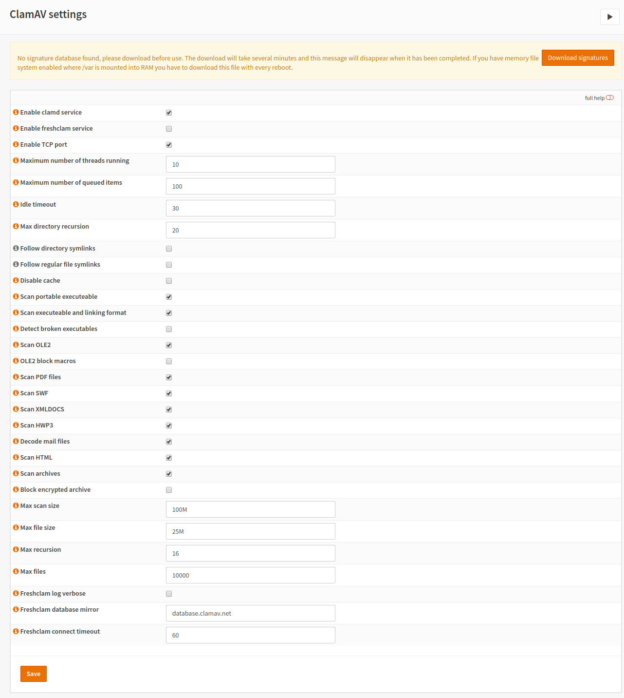

======
ClamAV
======

The ClamAV plugin can be used with other plugins, like c-icap and rspamd, to scan for viruses.

.. Warning::
    Your machine needs at least 1.5 GB RAM. Otherwise the machine will run out of
    memory and crash because of out of memory kills. Using a machine with at least
    2 GB RAM is recommended.

.. Warning::
    There are some techniques to avoid detection and scanning using AV software and not
    every malware is known by AV products.
    Signature based AV software can decrease the risk of getting hit by a known malware
    but it does never guarantee that your computers don't get infected.
    It is **important** to teach the users how to handle files from the internet
    and untrusted devices safely. Also plan a regular Backup of important files, make sure,
    that ACLs are used correctly and apply patches asap to keep the attack surface and
    damage as small as possible.

.. Note::
    To make ClamAV working, you need to download signatures.
    Please note that those files need to be fetched after a reboot again if they
    are stored on a ram disk.

------------
Installation
------------

First of all, you have to install the ClamAV plugin (os-clamav) from the plugins view.

.. image:: ../images/menu_plugins.png

After a page reload you will get a new menu entry under services for ClamAV.
Select it and you will get to the following screen:

---------------------
Configuration Options
---------------------

:Enable clamd service:
    Selecting this checkbox enables clamd so you can use it to scan files.
:Enable freshclam service:
    Freshclam is a service to update your malware signatures.
    If you use ClamAV, it is recommended to update the signatures on a regular basis.
:Enable TCP Port:
    This checkbox needs to be checked, if you want to use clamd over the network or
    for local services, which use a TCP connection.
:Maximum number of threads running:
    Thread limit is used to avoid a denial of service of the daemon and your machine.
    Usually a number next or equal to the number of cores would be good.
:Maximum number of queued items:
    This is the maximum of files which can be in the queued for scanning.
    The reason is the same as for the threads. 
:Idle Timeout:
    The connection will be dropped if it is inactive for this amount of time.
    If the other socket endpoint is a machine, this value can be low but if you
    plan to use it for develpoment reasons, you may set it to a higher value.
:Max directory recursion:
    Limit the depth of the directory tree.
    In the worst case there is a loop which causes the scanner to run endlessly and
    this setting should prevent it.
:Follow directory symlinks:
    If this is checked, clamav will follow directory symlinks which may lead to a loop.
    If you want to check this, make sure the recursion limit is set to a useful value.
:Follow regular file symlinks:
    If this is checked, clamav will follow symlinks to regular files.
    This may expose information about the filesystem, the user should not have access to.
:Disable cache:
    If you check this, the results are not cached. This is only useful in develpoment
    environments as it slows down the response time.
:Scan portable executable:
    Check this box, if you want to scan PE files.
    If you are using PE-files (\*.exe, \*.dll etc.) files in your network,
    checking this box is recommended.
:Scan executeable and linking format:
    Check this box, if you want to scan ELF-files.
    ELF is for example used on Linux based operating systems and on \*BSD.
:Detect broken executables:
    This setting will mark an executable as broken if it does not match the spec.
    A executable may be broken because of a download issue or manipulation.
    In any case, there should not be any legit case to pass a broken executable.
:Scan OLE2:
    If this is checked, OLE2 files (for example Microsoft Office files) will be analyzed.
    Such files should be analyzed as they may contain macros which have been used to download
    and install malware (usually ransomware).
:OLE2 block macros:
    Check this box, if documents containing macros should be blocked. If you don't use macros and
    you don't expect them from your business partners or friends, this setting is recommended.
:Scan PDF files:
    If this checkbox is checked, PDF files will be scanned.
    PDF files can carry other files or multimedia as well as javascript and fonts.
    Scanning PDF files is recommended.
:Scan SWF:
    If you check this box, Flash files will be scanned.
    Flash is used to provide video players or interactive content.
    Nowadays it should have been replaced by HTML5.
:Scan XMLDOCS:
    Scan XML Documents
:Scan HWP3:
    HWP seems to be a korean document format. If you don't use them, 
    it is better to block them in the proxy than scanning them.
    If you have them in use, you should scan them.
:Decode mail files:
    If you select this option, the sections of emails will be read and therefore
    it will be possible to scan email attachments.
    Mail attachments are important to scan as an attached file may contain malware.
    For example, some malware campaigns used a JScript file which has been packed
    in a ZIP file which was attached to an email.
:Scan HTML:
    Scans HTML files which may have dangerous embedded JavaScript.
:Scan archives:
    Scan files inside archives.
    This is very important as archives can contain malware.
    Please note that archive nesting is used to bypass scans,
    so scanners detect such archives as dangerous at a specific recursion level.
    Also keep in mind that zip bombs may be possible to DoS a scanner.
:Block encrypted archive:
    Encrypted archives are usually used to transfer files encrypted which don't support encryption
    on their own or the sender is not aware how to encrypt those files.
    A tool like 7z can derive a key from a password given by the creator of the file,
    which will be used to encrypt the compressed data.
    The ClamAV cannot scan this data as it is missing the key/password. Some malware authors used
    encrypted archives to avoid scanning and told the victim in the email text how to unpack it.

