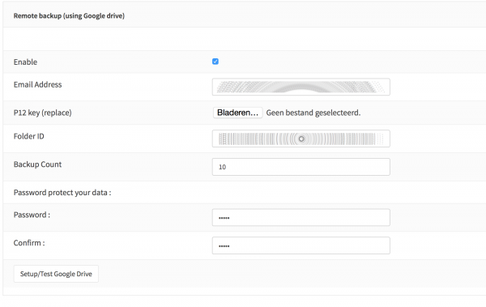

==========================
Configuration Cloud Backup
==========================

--------------------------
Google Drive and Nextcloud
--------------------------

**Google Drive** is a digital file storage and management service by the
information technology company Google. Amongst other features, like
collaborative editing of documents, spreadsheets, and presentations, it
allows signed up users with an account to store and share files in the
digital cloud.

**Nextcloud** is also an online storage but in contrast to Google Drive
it is intended for self hosting. You can download it freely from their
`website <https://nextcloud.com/>`__ and install it on your webserver.

The OPNsense configuration can be stored as a backup file in XML format,
to your PC on an USB stick or remotely in the digital Google Drive
cloud.

-------------------
Free online storage
-------------------

Because Google officially offers a free storage of 15 GB and nearly
unlimited traffic, a remote backup of an OPNsense configuration file is
free of charge, the only thing you need is an account at Google
(`Google Drive Signup <https://accounts.google.com/signup?hl=en>`__) .

--------
Easy API
--------

An application programming interfaces (API) for Google Drive was
released in 2013. This API empowers third-party developers to easily
write apps for Google Drive.

Nextcloud is using WebDAV which works without a special library
so data can be sent directly to the server without a special client
library (for example, a file upload is just a HTTP PUT call).

-------------
Remote backup
-------------
In OPNsense\ :sup:`1` you can **backup** your configuration directly and
automatically to **Google Drive** and **Nextcloud**, using the new backup
feature. Every backup to **Google Drive** will be encrypted with the same
algorithm used in the manual backup so it's quite easy to restore to a new
installed machine.

After set-up, the backup feature will do first store of the OPNsense
config file and subsequently a daily new backup of changed config
content.

----------------------
Setup Google API usage
----------------------

First we need to have a project in the google developer console:

-  Go to https://console.developers.google.com/project
-  Create a project and give it a name, you may leave it default it
   doesn't really matter for this.
-  Enable the Drive API

   -  In the left menu APIs -> "Drive API" -> Enable

-  Open the project and start to create an api key

   -  In the left menu : APIs & auth -> Credentials
   -  Click on the button "Create new Client ID"
   -  Choose "Service account", followed by "Create Client ID"

      -  Download the key and save it (for your own use)
      -  Click "Generate new P12 key" and download the key (for your own
         use, you need this one later)
      -  Copy Email Address, you need it later.

.. rubric:: Create a Google Drive folder
   :name: create-a-google-drive-folder

Next thing is to create a folder in Google Drive and share it to the
"service user" you've just created.

-  Go to https://drive.google.com
-  Choose "NEW" and the folder to create a new folder, the name doesn't
   really matter (for example type OPNsense).
-  right click the newly created folder and choose share

   -  paste the email address from the service account and "send"

-  Now open the folder and copy the folder ID ( in the url, the last
   piece after #/folders/, it's quite long)

.. rubric:: Setup the account in OPNsense
   :name: setup-the-account-in-opnsense

Now we can put it all together, login to your OPNsense firewall and go
to the backup feature (default : https://192.168.1.1/diag_backup.php )

On the bottom of the page are the options for the Google Drive backup,
enable the feature and fill in the parameters. Email address is acquired
in step 2, the key in step 1. Choose a strong password to protect your
data and fill in a number of backups you want to keep.

When you click Setup/Test Google Drive, the firewall will automatically
save and test your settings and you will receive either an error
(connectivity issues) or a list of config files currently in the backup.

The moment the feature is enabled, it will do a daily compare of the
last file in backup and the current configuration and creates a new
backup when something has changed.

-------------------------
Setup Nextcloud API usage
-------------------------

1. Step Create a new user
=========================

Click on the user icon top right and click "Users".
In the new page, enter an username and a password into the boxes and click
create to create a new user.

2. Step Create an Access Token
==============================

Close the modal dialog and remove the default files.
Then open the Settings menu (also in the menu top right).
Switch to security and generate a App password.

.. image:: images/nextcloud_create_token.png

Copy and store the generated password.

3. Step Connect OPNsense with Nextcloud
=======================================

.. image:: images/nextcloud_config.png

Scroll to the Nextcloud Section in System -> Config -> Backup and enter the
following values:

================ ======================================================================
Enable           checked
URL              Base URL of your Nextcloud installation like https://cloud.example.com
User             your choosen username
Password         paste your app password from step 2
Backup Directory a name consisting of alphanumeric characters (keep default)
================ ======================================================================

4. Step Verify the Configuration Upload
=======================================

When everything worked, you will see the newly created directory after saving
the settings:

.. image:: images/nextcloud_directory.png

If you open it, you will see at lease a single backed up configuration file:

.. image:: images/nextcloud_backups.png

.. rubric:: References
   :name: references

-  `Official website of Google Drive <https://www.google.com/drive/>`__

.. rubric:: Notes
   :name: notes

:sup:`1` As of OPNsense version 1.15.8 .2 (25 March 2015)
