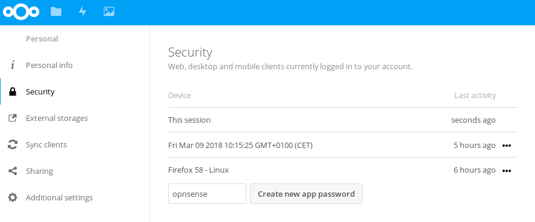
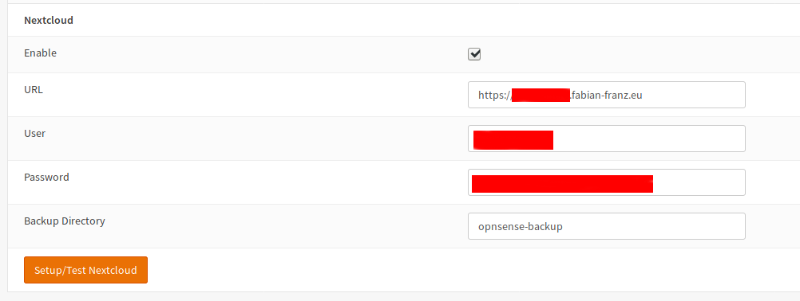
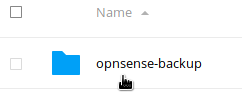
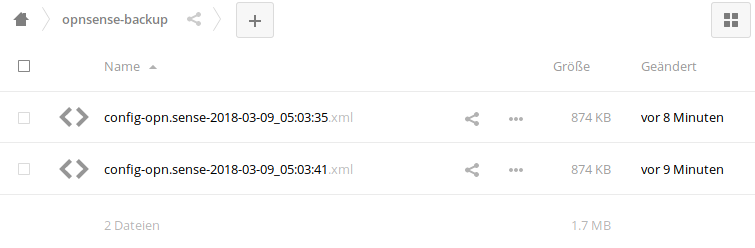

==========================
Cloud Backup
==========================

--------------------------
Google Drive and Nextcloud
--------------------------

**Google Drive** is a digital file storage and management service by the
information technology company Google. Amongst other features, like
collaborative editing of documents, spreadsheets, and presentations, it
allows signed up users with an account to store and share files in the
digital cloud.

**Nextcloud** is also an online storage but in contrast to Google Drive
it is intended for self hosting. You can download it freely from their
`website <https://nextcloud.com/>`__ and install it on your webserver.

The OPNsense configuration can be stored as a backup file in XML format,
to your PC on an USB stick or remotely in the digital Google Drive
cloud.

-------------------
Free online storage
-------------------

Because Google officially offers a free storage of 15 GB and nearly
unlimited traffic, a remote backup of an OPNsense configuration file is
free of charge, the only thing you need is an account at Google
(`Google Drive Signup <https://accounts.google.com/signup?hl=en>`__) .

--------
Easy API
--------

An application programming interfaces (API) for Google Drive was
released in 2013. This API empowers third-party developers to easily
write apps for Google Drive.

Nextcloud is using WebDAV which works without a special library
so data can be sent directly to the server without a special client
library (for example, a file upload is just a HTTP PUT call).

-------------
Remote backup
-------------
In OPNsense\ :sup:`1` you can **backup** your configuration directly and
automatically to **Google Drive** and **Nextcloud**, using the new backup
feature. Every backup to **Google Drive** will be encrypted with the same
algorithm used in the manual backup so it's quite easy to restore to a new
installed machine.

After set-up, the backup feature will run a first backup of the OPNsense
configuration file. Then, if the configuration is subsequently changed, a new backup will be run once per day early in the morning.

You may consider specifying additional Cronjobs when more frequent remote backups or remote backups at different times of the day would be required.

----------------------
Setup Google API usage
----------------------

The instructions below apply to a standard Google account. Some of the settings appear slightly differently for Google Workspace (formerly G Suite) accounts.

A standard Google account can be created `here <https://accounts.google.com/signup?hl=en>`__.

1. Set up a Google Project
==========================

First you need to set up a project in the Google developer console.

-  Go to the `developer console <https://console.developers.google.com/project>`__ and log into your Google account.
-  On the "Manage resources" page that appears, click on the **+ CREATE PROJECT** button:

    .. image:: ./images/google_manage_resources.png

-  On the next page enter a name for your project, for example "OPNsense Backups". You may leave it as the default name ("My Project #####"), as it does not really matter. Then click on the **CREATE** button:

    .. image:: ./images/google_create_project.png

-  Now enable the Google Drive API for your project. In the search bar at the top of the page, search for "Google Drive API" and click on the corresponding search result:

    .. image:: ./images/google_drive_api.png

-  On the next page, make sure your project name (for example "OPNsense Backups") is displayed at the top of the page - if not, select it in the dropdown. Then click the **ENABLE** button:

    .. image:: ./images/google_drive_enable.png

- Now create a service account for your project. In the search bar at the top of the page, search for “service accounts" and click on the corresponding search result:

    .. image:: ./images/google_select_service_account.png

-  Click on the **+ CREATE SERVICE ACCOUNT** button:

    .. image:: ./images/google_create_service_account_button.png

-  Enter an account name (for example "OPNsense") and a description (for example "OPNsense Backups service account"), then click the **CREATE** button:

    .. image:: ./images/google_create_service_account.png

-  Click the **CONTINUE** button on the next page:

    .. image:: ./images/google_service_account_continue.png

-  Then click the **DONE** button:

    .. image:: ./images/google_service_account_done.png

-  On the next page, take a note of the email address for your new service account - you will need it later. Then click on the three vertical dots under the **Actions** heading for your service account, then click on **Create key**:

    .. image:: ./images/google_service_account_actions.png

-  In the popup screen, select **P12**, and click **CREATE**:

    .. image:: ./images/google_service_account_create_key.png

-  You will be prompted to download the key. Do so, and then click **CLOSE** in the popup screen.

-  Now **click** on the newly created Service Account:

    .. image:: ./images/google_service_account.png

-  Write down the **Unique ID** of the Service Account. This ID will be your **Client-ID** in the OPNSense Google Drive backup:

    .. image:: ./images/google_service_account_details.png

2. Set up a Google Drive folder
===============================

The next thing is to create a folder in Google Drive and share it to the service account you've just created.

-  Go to https://drive.google.com. You should be still logged into your Google account, otherwise log in.
-  Click **+ New** (upper left of the screen) and select **Folder** in the dropdown menu that appears:

    .. image:: ./images/google_drive_new.png

-  Enter a name for the folder (for example "OPNsense Backups", it doesn't really matter) and then click the **CREATE** button:

    .. image:: ./images/google_drive_folder.png

-  Right-click the newly created folder and click **Share** in the dropdown menu that appears:

    .. image:: ./images/google_drive_share.png

-  Paste the email address for the service account into the "Add people and groups" box, press Enter and then click the **Send** button that appears:

    .. image:: ./images/google_drive_send.png

-  Now double-click on the folder to open it and take a note of the folder ID from the URL - you will need it later. The folder ID is the last piece of the URL after ``/folders/``:

    .. image:: ./images/google_drive_folder_id.png

3. Set up the account in OPNsense
=================================

Now put it all together in OPNsense.

-  Log into your OPNsense firewall and go to the backup feature. It is located at :menuselection:`System --> Configuration --> Backups`.
-  Scroll down to the Google Drive section and and enter the following values:

    ===============================  ===================================================================================
    Enable                           checked
    Email Address                    enter the Unique ID number of the service account you created
    P12 key                          click the **Choose file** button and select the P12 key you saved earlier to upload it
    Folder ID                        paste the Google Drive folder ID that you copied earlier
    Prefix hostname to backupfile    checked or unchecked as desired (useful if you have multiple OPNsenses)
    Backup Count                     enter the number of backups you want to keep
    Password                         choose a strong password to encrypt the backup
    Confirm                          re-enter the strong password
    ===============================  ===================================================================================

-  Then click the **Setup/Test Google Drive** button. OPNsense will automatically save and test your settings and you will receive either an error (connectivity issues) or a message saying "Backup successful" with a list of files currently in the backup.

The moment the feature is enabled, it will do a daily compare of the last file in backup and the current configuration and create a new backup when something has changed.

-------------------------
Setup Nextcloud API usage
-------------------------

1. Step Create a new user
=========================

Click on the user icon top right and click "Users".
In the new page, enter an username and a password into the boxes and click
create to create a new user.

2. Step Create an Access Token
==============================

Close the modal dialog and remove the default files.
Then open the Settings menu (also in the menu top right).
Switch to security and generate a App password.

Copy and store the generated password.

3. Step Connect OPNsense with Nextcloud
=======================================

Scroll to the Nextcloud Section in :menuselection:`System --> Config --> Backup` and enter the
following values:

================ ======================================================================
Enable           checked
URL              Base URL of your Nextcloud installation like https://cloud.example.com
User             your choosen username
Password         paste your app password from step 2
Backup Directory a name consisting of alphanumeric characters (keep default)
================ ======================================================================

4. Step Verify the Configuration Upload
=======================================

When everything worked, you will see the newly created directory after saving
the settings:

If you open it, you will see at lease a single backed up configuration file:

.. rubric:: References
   :name: references

-  `Official website of Google Drive <https://www.google.com/drive/>`__

.. rubric:: Notes
   :name: notes

:sup:`1` As of OPNsense version 15.1.8.2 (25 March 2015)
