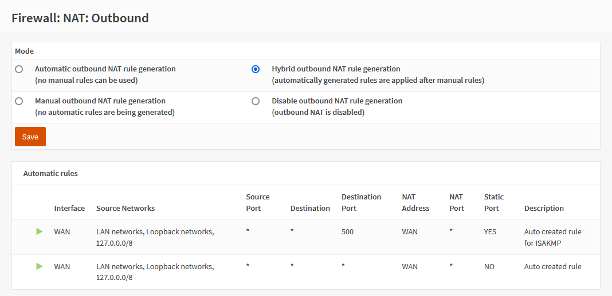

**Deutsche Telekom Germany IPTV (Magenta TV) setup**
========================================================

**Original Author:** Jascha Kirchhoff

**Introduction**
-----------------
This guide is for setting up Deutsche Telekom Germany IPTV (Magenta TV) and assumes you already have a working internet connection and the
os-igmp-proxy plugin installed.

This is just a basic working setup. You can separate all IPTV traffic into a VLAN, if needed.

All network hardware between OPNsense and the Media Receiver or TV Box must support IGMP snooping. Without IGMP snooping enabled, the network
gets flooded with multicast traffic and live tv starts stuttering.

**IGMPproxy setup**
-------------------

Ensure you are running OPNsense 22.1 or later

Then configure IGMPproxy as follows

NOTE: downstream interface is LAN

**FIREWALL setup**
------------------

We need to add two new rules for the WAN interface and modify one (the default IPv4 rule) on the LAN to get Magenta TV working. The key is
to enable "allow options" in the Advanced Options for all three (!) rules, WAN and LAN.

NOTE the Source is "*"

And finally the outbound NAT

I switched to Hybrid mode but it should also work in Automatic mode, because none of the outbound rules need to be modified.

Make sure you have clicked Save & Apply

It is advisable at this point to reboot the system.

Plug in your Media Receiver to one LAN port, turn on the receiver and after a few minutes you should see live TV. Also software updates should
work out of the box. Update mode has been tested 2022-05, no additional settings are required.
