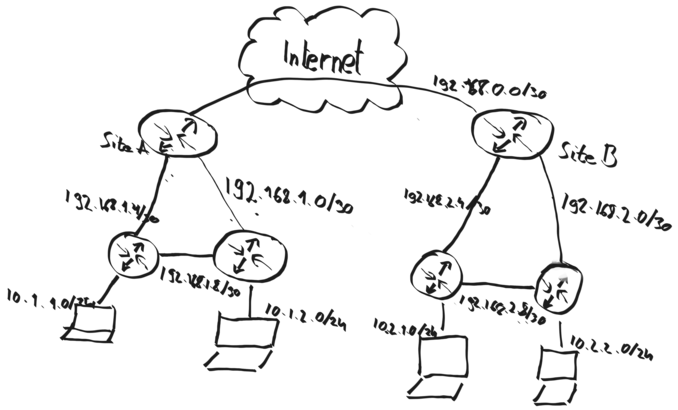

=======================
Dynamic Routing: How To
=======================

.. Note::
    To keep this tutorial short, a configuration is only added a single time.
    For example, the configuration of Site A and Site B are identical beside one
    octet in the IP addresses.
    Also both routers have the same configuration except the Network address of the
    uplink and the client network.

---------
Situation
---------

We have two sites (Site A and Site B) which are connected via a layer 2 VPN.
Each site has two additional routers,
which are connected to the edge router and with each oder.
On those routers, the clients are attached.

-------------
Configuration
-------------

In this setup, OSPF is used.
All routers belong to the area 0.0.0.0 and no prefix lists are used.

Core Router of Site A
---------------------

General Settings:

========================= ============
Setting                    Value
========================= ============
Enable                    Checked
Advertise Default Gateway Checked
Passive Interfaces        Empty
Route Redistribution      Empty
========================= ============

Networks:

============ ============
Network      Network Mask
============ ============
192.168.0.0  30
192.168.1.0  30
192.168.1.4  30
============ ============

Left Floor Router of Site A
---------------------------

General Settings:

========================= ===========================
Setting                    Value
========================= ===========================
Enable                    Checked
Advertise Default Gateway Unchecked
Passive Interfaces        Interface name of 10.1.1.0
Route Redistribution      Empty
========================= ===========================

Networks:

============ ============
Network      Network Mask
============ ============
10.1.1.0     24
192.168.1.4  30
192.168.1.8  30
============ ============

