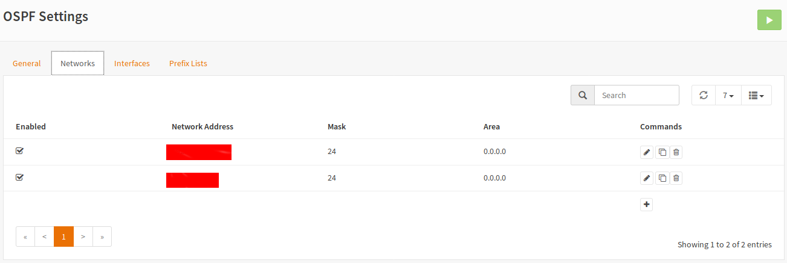
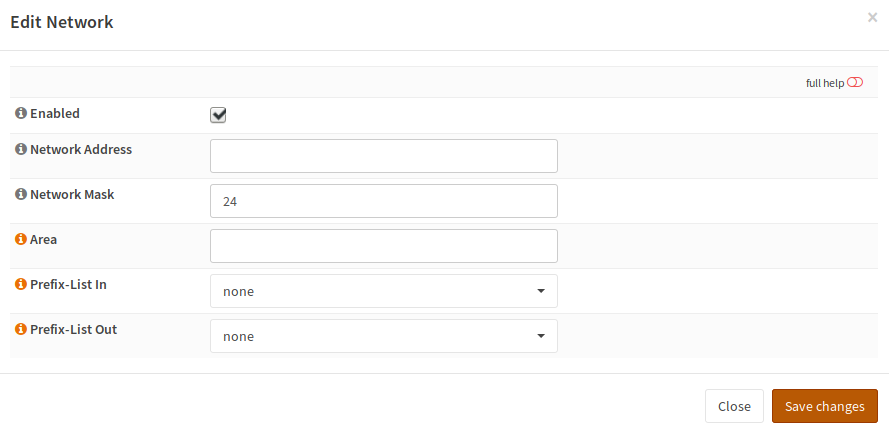
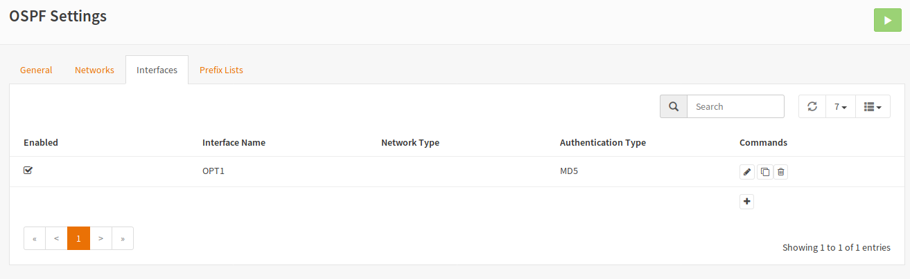
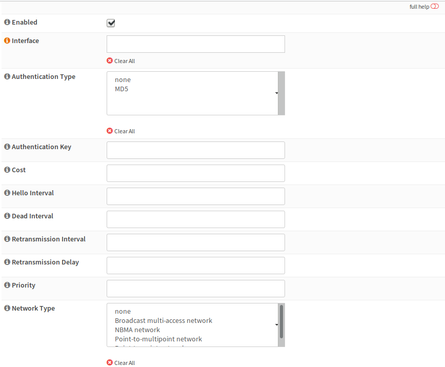

======================================
Dynamic Routing: Configuration: OSPFv2
======================================

-------
General
-------

.. Warning::
    Saving the settings will apply them and reload the daemon. This means you may lose the connection to your firewall for some seconds.
    
.. image:: images/dynamic_routes_ospf_general.png

Enable
------

Enables the OSPF routing daemon.
If this does not work, please check the settings of General.
Check this checkbox if you want to use OSPFv2 in your network.

Passive Interfaces
------------------

Passive Interfaces are interfaces,
which exist in OSPFv2 but where no routing updates should be sent to.
These are usually the Interfaces,
where your clients are connected to and no router should exist.
You don‘t need to add interfaces here, where no network is specified. 

Route Redistribution
--------------------

Route Redistribution is used,
if you want to send information this router has learned via another protocol
or routes from kernel (OPNsense static routes).

Advertise Default Gateway
-------------------------

Advertise Default Gateway should be checked,
if this machine has a default gateway to the internet.
Always Advertise means, that this route should be also broadcasted,
if it is not available. Be careful with this option in HA setups.

--------
Networks
--------

.. Note::
      You can add only the networks that OSPF should send and received routing updates and/or area range summarizations, Networks to be advertized can be configured as Interfaces.

Networks gives you a brief overview of the configured networks. The dialog looks like this:

Enabled
-------

Enabled means that this Network is going to be used.
You should only disable networks if you plan to do some changes in your topology or some routes get broken.
This will add Firewall Filtering rules for OSPF to work properly, you can add and enable only the networks where OSPF is going to send and receive updates.
Disabled networks still add the Area Range for a given Area to the OSPF config file, you can use this for route summarization.

Network Address
---------------

The Network Address of a local interface on which OSPFv2 should be enabled.

Network Mask
------------

A CIDR Mask for the Network Address.
For example, if your LAN IP is 192.168.0.1/24, the network address is 192.168.0.0 and Network Mask is 24.

Area
----

The area describes which routers belong to the same group (autonomous system). This value is a 32 bit integer, which is entered in dotted decimal notation (like an IPv4 address is usually written).

Area Range
----

This is the network or network summary you wish to send to the designated Area configured above or in other Networks with the same Area.

Prefix-List in and Out
----------------------

Only used for advanced route filtering using access lists.

----------
Interfaces
----------

.. Note::
      You can add the interfaces where OSPF shoud send and receive and updates along side with Networks.

.. Note::
      You can add the interfaces with local networks that OSPF should advertized, these interfaces need an Area and should be added has Passive Interfaces in order to work, this type of configuration reduces Firewall Filter Rules.

This tab shows an overview of the configured interfaces:

.. Note::
      Changes in this view do *NOT* apply the settings.

If you add or edit an entry, you will get this dialog:

Interface
---------
Choose a single interface, where this interface settings apply to.

Authentication Type and Authentication Key
------------------------------------------

This values can be set,
but they are not used as there is no area configuration which would make use of them.
You may want to set the password here if you add a custom area setting via vtysh.

Cost
----

A numeric value to set the cost on an interface.
The cost is used to calculate the route to the target.
A bigger value here means, the route is less likely used.

Hello and Dead Interval
-----------------------

Hello interval is the interval in which hello packets (detection of other OSPF routers) are sent out.
A bigger value means sower detection but less load on the interface.
Dead Interval is the time window, in which the router has to receive a hello packet from another router.
If it does not, it is removed.

Priority
--------

This field specifies the router priority which means a router with a good priority is more probably the designated router.
Network type usually does not need to be set.

