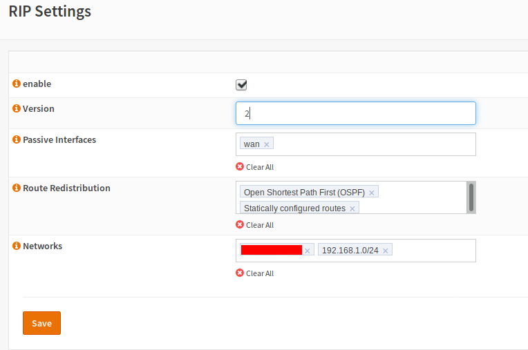

===================================
Dynamic Routing: Configuration: RIP
===================================

.. Note::
      RIP should not be used in larger networks due to the limited hop count. Cosider using OSPF in such cases.

.. Warning::
    Saving the settings will apply them and reload the daemon. This means you may lose the connection to your firewall for some seconds.

RIP is a well known distance vector protocol.
It may be preferred to be used in smaller networks,
where the topology is not too complex and the possibillity of loops is small.

Enable
------

enables the routing protocol if the support of routing protocols is enabled in general. If you check this box, RIP will be enabled.

Version
-------

Enter 1 or 2 here. 1 is “classful” which means, that this routing protocol does not support variable length routing.
If you choose version 2, variable length subnet masks are supported. In most cases, you want to choose version 2 here.

Passive Interfaces
------------------

Interfaces, which are known by the routing daemon, but no updates are sent.
You should add interfaces with networks here, which do not have any other routers.

Route Redistribution
--------------------

Also send routes from other sources to neighbors (if desired).

Networks
--------

Add the networks here which should be known by the router and which are subject to be sent to the neighbors.
Passive interfaces will not be used to look for another router.

