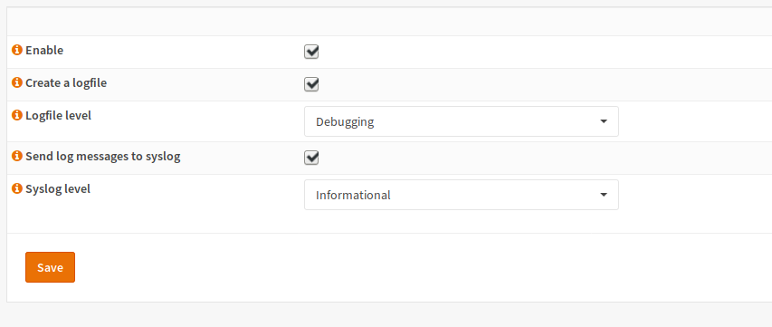

=====================================
Dynamic Routing: Configuration: Zebra
=====================================

Zebra is the core of quagga and needs to be enabled in any case. It can be enabled in the general view:

.. Note::
      If this service is disabled, all other routing protocols are disabled too.

.. Warning::
    Saving the settings will apply them and reload the daemon. This means you may lose the connection to your firewall for some seconds.

------
Enable
------

Checking „Enable“ means that zebra and all other enabled routing daemons will be started.
If you disable this checkbox, Quagga will be completely disabled.

----------------------------------
Create a logfile and Logfile level
----------------------------------

If you check this checkbox, messages with a higher or equal severity will be written
to a log file on this device. You can view this log file under diagnostics if you want
to debug errors in your network.

--------------------------------------------
Send log messages to syslog and Syslog level
--------------------------------------------

Settings are the same as for the log file but for syslog.
This is useful if you use an external logging server.

    

    
