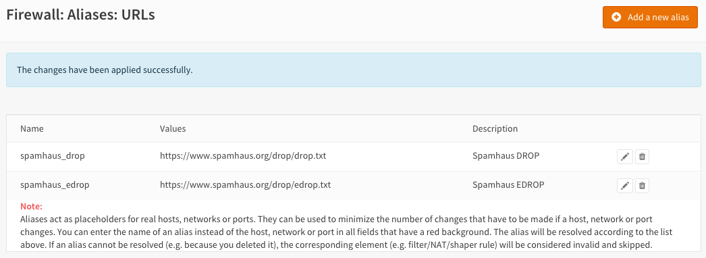
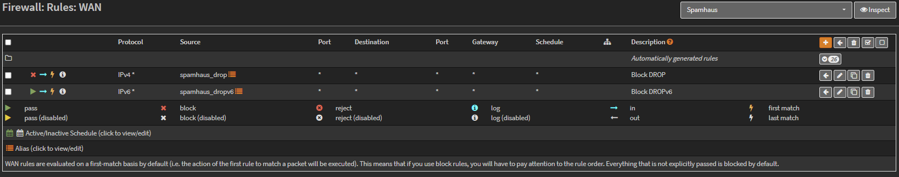
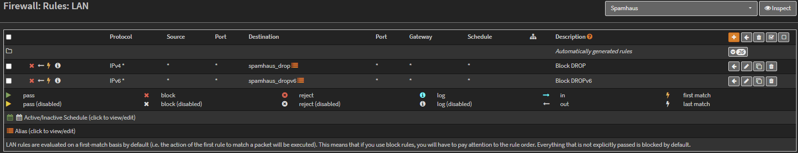
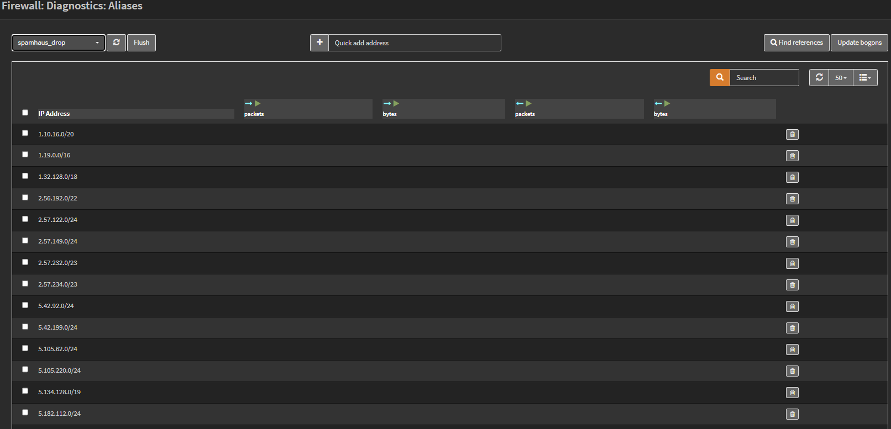

==========================
Configure Spamhaus (E)DROP
==========================
The Spamhaus Don't Route Or Peer Lists
  DROP (Don't Route Or Peer) and EDROP are advisory "drop all traffic" lists,
  consisting of netblocks that are "hijacked" or leased by professional spam or
  cyber-crime operations (used for dissemination of malware, trojan downloaders,
  botnet controllers). The DROP and EDROP lists are a tiny subset of the SBL,
  designed for use by firewalls and routing equipment to filter out the malicious
  traffic from these netblocks.

  *Source :* https://www.spamhaus.org/drop/

For this how to we will use the Alias feature and a firewall block rule.
The lists for this example are located here:

 * `DROP list <https://www.spamhaus.org/drop/drop.txt>`__
 * `EDROP list <https://www.spamhaus.org/drop/edrop.txt>`__

-------------------------------------
Step 1 - Create an Alias for Spamhaus
-------------------------------------
Go to :menuselection:`Firewall --> Aliases --> All` and press the **Add a new alias** button in the
top right corner of the form.

Enter the following data:

+-----------------+-----------------------------------------+-----------------------------+
| **Name**        | spamhaus_drop                           | *Name of our alias*         |
+-----------------+-----------------------------------------+-----------------------------+
| **Description** | Spamhaus DROP                           | *Freely chosen description* |
+-----------------+-----------------------------------------+-----------------------------+
| **Type**        | URL Table (IPs)                         | *URL type*                  |
+-----------------+-----------------------------------------+-----------------------------+
| **Host(s)**     | https://www.spamhaus.org/drop/drop.txt  | *Don't Route Or Peer List*  |
+-----------------+-----------------------------------------+-----------------------------+

Set the update frequency to 1 for each day.

Press **Save** and then **Add a new alias**.

+-----------------+-----------------------------------------+-------------------------------------+
| **Name**        | spamhaus_edrop                          |  *Name of our alias*                |
+-----------------+-----------------------------------------+-------------------------------------+
| **Description** | Spamhaus EDROP                          | *Freely chosen description*         |
+-----------------+-----------------------------------------+-------------------------------------+
| **Type**        | URL Table (IPs)                         | *URL type*                          |
+-----------------+-----------------------------------------+-------------------------------------+
| **Host(s)**     | https://www.spamhaus.org/drop/edrop.txt | *Extended Don't Route Or Peer List* |
+-----------------+-----------------------------------------+-------------------------------------+

Set the update frequency to 1 for each day.
Press **Save** and then **Apply changes**.

---------------------------------------
Step 2 - Firewall Rules Inbound Traffic
---------------------------------------
We will block incoming connections and outgoing connections for the drop and edrop lists.
To do so we will start with inbound traffic on the WAN interface.
Go to :menuselection:`Firewall --> Rules` Select the **WAN** tab and press the **+** icon in the
lower right corner.

Enter the following configuration and leave all other parameters on default values:

=================== ============== =============================================
 **Action**          Block          *Choose block to drop the incoming traffic*
 **Interface**       WAN            *Should be the default value*
 **TCP/IP Version**  IPv4           *For our example we use IPv4*
 **Source**          spamhaus_drop  *Our alias for the DROP list*
 **Category**        Spamhaus       *Freely chosen Category*
 **Description**     Block DROP     *Freely chosen description*
=================== ============== =============================================

**Save** and repeat this action for the EDROP list:

=================== =============== =============================================
 **Action**          Block           *Choose block to drop the incoming traffic*
 **Interface**       WAN             *Should be the default value*
 **TCP/IP Version**  IPv4            *For our example we use IPv4*
 **Source**          spamhaus_edrop  *Our alias for the DROP list*
 **Category**        Spamhaus        *Freely chosen Category*
 **Description**     Block EDROP     *Freely chosen description*
=================== =============== =============================================

**Save**

----------------------------------------
Step 3 - Firewall Rules Outbound Traffic
----------------------------------------

Now do the same for outbound traffic traffic on the LAN interface.
Go to :menuselection:`Firewall --> Rules` Select the **LAN** tab and press the **+** icon in the
lower right corner.

=================== ============== =============================================
 **Action**          Block          *Choose block to drop the incoming traffic*
 **Interface**       LAN            *Should be the default value*
 **TCP/IP Version**  IPv4           *For our example we use IPv4*
 **Destination**     spamhaus_drop  *Our alias for the DROP list*
 **Category**        Spamhaus       *Freely chosen Category*
 **Description**     Block DROP     *Freely chosen description*
=================== ============== =============================================

**Save** and add the EDROP list:

=================== =============== =============================================
 **Action**          Block           *Choose block to drop the incoming traffic*
 **Interface**       LAN             *Should be the default value*
 **TCP/IP Version**  IPv4            *For our example we use IPv4*
 **Destination**     spamhaus_edrop  *Our alias for the DROP list*
 **Category**        Spamhaus        *Freely chosen Category*
 **Description**     Block EDROP     *Freely chosen description*
=================== =============== =============================================

**Save** and **Apply changes**

**DONE**

---------------
Check pf Tables
---------------
To list the IP addresses that are currently in the DROP and EDROP lists go to
:menuselection:`Firewall --> Diagnostics --> Aliases` and select the list you want to see:

