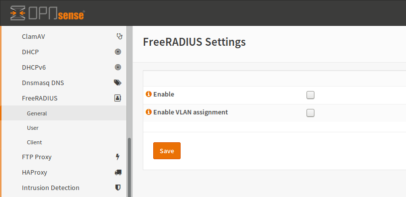
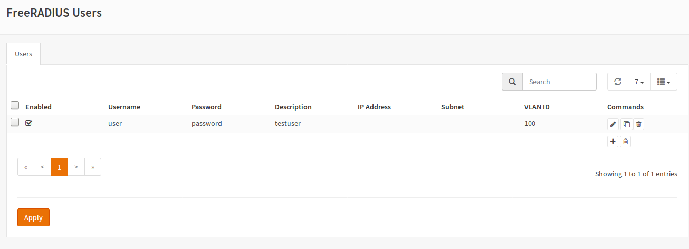
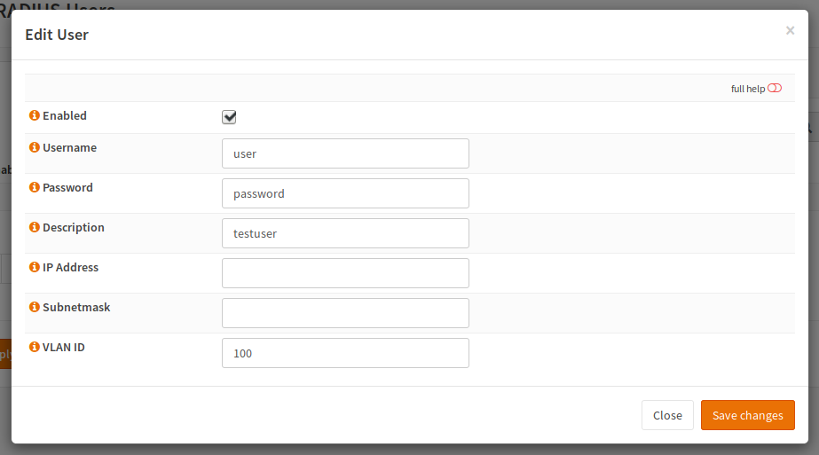
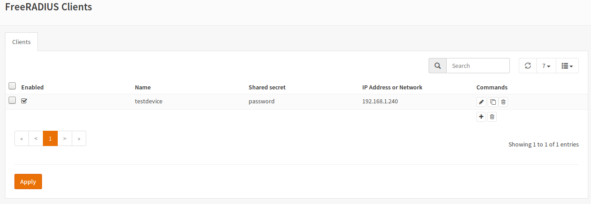
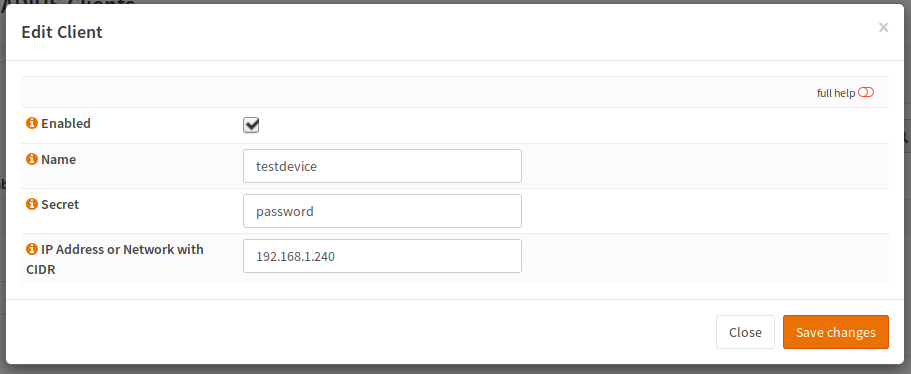

==========
FreeRADIUS
==========

------------
Installation
------------

First of all, you have to install the FreeRADIUS plugin (os-freeradius) from the plugins view.

.. image:: ../images/menu_plugins.png

After a page reload you will get a new menu entry under services for FreeRADIUS.
Select and a submenu will pop up with the entries **General, User** and **Client**:

----------------
General Settings
----------------

:Enable:
    To enable the service, you have to check this box.
:Enable VLAN assignment:
    If you check this box, the RADIUS packets will have some unencrypted tags
    for the network device to allow dynamic VLAN assignment.
    In this case, the authentication is still encrypted but some metadata will be readable.
    You need to enable this checkbox, if you want to set a VLAN on a switchport,
    which depends on the authenticated user.

-----
Users
-----

A user is an entity, which is meant to authenticate against the RADIUS server
(computer or human).

To create a user, click the `+` button.

:Enabled:
    This user will be written to disk and can be used.
    You can toggle this value to temporary disable users.
:Username:
    The name which the user will use to authenticate.
:Password:
    The password the user will use to authenticate.
:Description:
    Internal information for you to use to find the user.
    This setting can be used to add some infos like a department.
:IP Address and Subnetmask:
    If you want to use FreeRADIUS for point to point links,
    you can add an IP address here which will be assigned to the client.
    The same is valid for Subnetmask.
:VLAN ID:
    A layer 2 device like a switch, which supports 802.1X authentication
    can use this Field to dynamically assign an VLAN number to a switchport
    based on the authentication result. This is especially useful if you
    are having moving users (for example if an employee can attach his
    computer to a docking station at a desk and the switch will assign
    the VLAN ID of the employee to the switchport.
    Be aware that the Layer 2 device has to be able to read this information,
    which means that **you have to enable corresponding option in General**

-------
Clients
-------

A client in RADIUS is a intermediate device / network device like a VPN
gateway, a switch or an access point.

To create a new client, click the `+` button:

:Enabled:
    This client will be written to disk and can be used.
    You can toggle this value to temporary disable clients.
:Name:
    A name used for the client.
:Secret:
    The secret is used to provide a trust relationship between the
    client and the FreeRADIUS server. This password should be strong
    as you only have to type it twice (once in the FreeRADIUS configuration
    and once in your client configuration) or even copy it.
    If the passwords do not match, FreeRADIUS will reject all attempts to
    authenticate.
:IP Address or Network with CIDR:
    This is the IP address of the Client (not the authenticating device).
    For example this could be the IP address of your switch.

