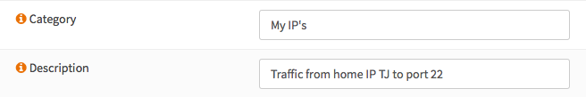
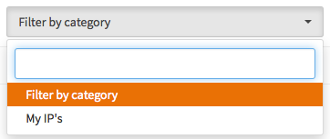
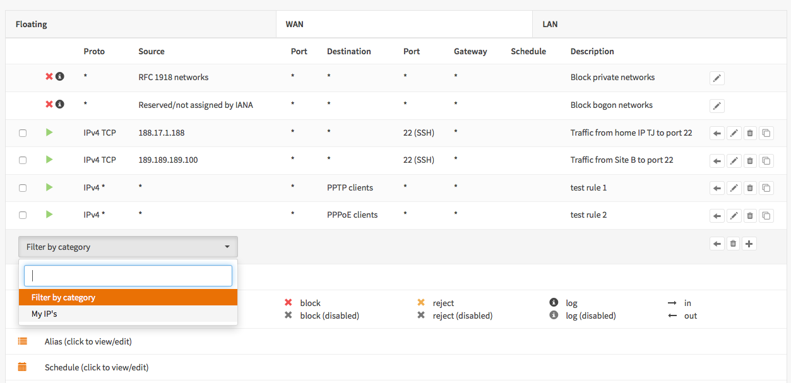
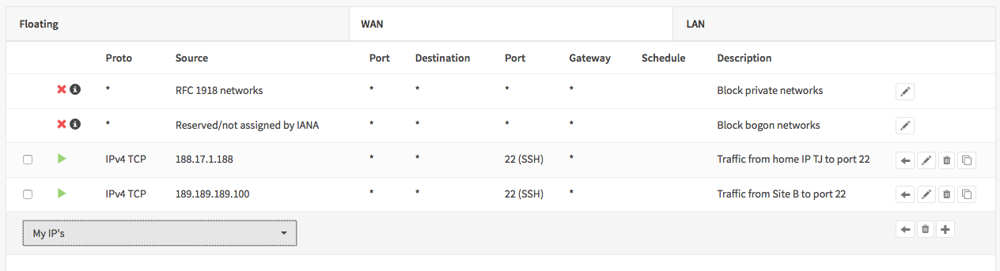
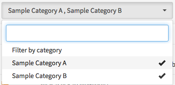

=============================
Organize PF Rules by Category
=============================
OPNsense firewall rules can be organized per category.
These categories can be freely chosen or selected.

.. Note::

  This feature was added in version 16.1.1. Always keep your system up to date.

---------------------------
Adding a category to a rule
---------------------------
To add a category to a rule, open or create a new rule and scroll to **Category**.
Then just add you category, if this is the first rule with a category no selection
options will be visible.

---------------------------------
Firewall Rules Filter by category
---------------------------------
Only when there are rules with a defined category, the **Filter by category**
becomes visible at the bottom of the table.

If you click it is will look like this:

If you have a large number of categories, then just start typing and in search
box to make a quick selection.

----------------
Before Selection
----------------
Take a look at this simple rule set before selecting our "My IP's" category.

--------------------
 And after selection
--------------------
Now when selecting our  test category it will look like this:

That is all there is to it to organize your rules without messing anything up.

------------
Multi Select
------------
In a later release of OPNsense 16.1 multi selection has been added.
This features makes it possible to select rules from more than one category.

Example:

