=====================
Setup a Guest Network
=====================
This how to will explain how to setup a guest network using the captive portal.
Guest Networks are widely used to allow guests controlled internet access at
hotels, RV Parks or businesses.

.. Note::
    For the example we expect the GUESTNET interface to be connected with your
    actual guest network switch or access point. This tutorial does not explain
    how to setup a wireless network.

----------
Businesses
----------
Businesses usually want to share internet access with their guest and show them
a landing page with a welcome message and some usage guidelines (policy). At the
same time it is important to make sure guests won't be able to access the company's
local network and limit the maximum internet usage.

-------------------
Hotels and RV Parks
-------------------
Hotels and RV parks usually utilize a captive portal to allow guests (paid) access
to internet for a limited duration. Guests need to login using a voucher they can
either buy or obtain for free at the reception. OPNsense has build-in support for
vouchers and can easily create them on the fly. With this example we will show
you how to setup the Guest Network for this purpose and setup a reception account
for creating new vouchers.

--------
Advanced
--------
The Captive portal can also be combined with the category based web filtering of
the proxy. This tutorial will explain how to combine both features.

-------------
Prerequisites
-------------
We will start configuration with a fresh OPNsense install, updated to the latest
patch level (16.1.5_1 in our example). You will need a system with a minimum of
3 ports (LAN/WAN/GUESTNET) for this tutorial.

------------
Good to know
------------
As the Hotel/RV Parks setup is almost identical to the business setup we will start
with that and after finishing add/change the specifics to match the Hotel Guest setup.

----------------------------
Step 1 - Configure Interface
----------------------------
For the Guest Network we will add a new interface.
Go to **Interfaces->Assignments** And use the **+** to add a new interface.
Press **Save**. The new interface will be called **OPT1**, click on [OPT1] in the
left menu to change its settings.

Select **Enable Interface** and fill in the following data for our example:

============================== ================= ==============================================
 **Description**                GUESTNET          *A descriptive name for the interface*
 **Block Private networks**     unselected
 **Block bogon networks**       unselected
 **IPv4 Configuration Type**    Static IPv4       *Set a static IPv4 address for the example*
 **IPv6 configuration Type**    None
 **MAC address**                (Leave Blank)
 **MTU**                        (Leave Blank)
 **MSS**                        (Leave Blank)
 **Speed and duplex**           Default           *You may also select the speed when known*
 **Static IPv4 address**        192.168.200.1/24  *We will use this segment for our guests*
 **IPv4 Upstream Gateway**      None
============================== ================= ==============================================

Press **Save** and then **Apply changes**.

------------------------------
Step 2 - Configure DHCP Server
------------------------------
Go to **Services->DHCP->Server** and click on the tab **GUESTNET**.

Fill in the following to setup the DHCP server for our guest net (leave everything
 else on its default setting):

================ ==================================== =======================================
 **Enable**       Checked                               *Enable the DCHP server on GUESTNET*
 **Range**        192.168.200.100 to 192.168.200.200    *Serve ip's from this range*
 **DNS servers**  192.168.200.1                         *Supply a DNS with the lease*
 **Gateway**      192.168.200.1                         *Supply a gateway with the lease*
================ ==================================== =======================================

Click **Save**.

---------------------------
Step 3 - Add Firewall Rules
---------------------------
Go to **Firewall->Rules** to add a new rule.

Now add the following rules (in order of prevalence):

Allow DNS
---------
Allow the guests access to the DNS forwarder.
Rule content (leave all other options default):

============================ ===================== =====================================
 **Action**                   Pass                  *Allow this traffic*
 **Interface**                GUESTNET              *The GuestNet Interface*
 **Protocol**                 TCP/UDP
 **Source**                   GUESTNET net
 **Destination**              GUESTNET address
 **Destination port range**   DNS/DNS               *from DNS to DNS*
 **Category**                 GuestNet Basic Rules  *Category used for grouping rules*
 **Description**              Allow DNS
============================ ===================== =====================================

Click **Save**.

Allow Captive Portal Login
--------------------------

============================ ============================ =====================================
 **Action**                   Pass                         *Allow this traffic*
 **Interface**                GUESTNET                     *The GuestNet Interface*
 **Protocol**                 TCP
 **Source**                   GUESTNET net
 **Destination**              GUESTNET address
 **Destination port range**   8000/10000                   *(other) used for the cp zones*
 **Category**                 GuestNet Basic Rules         *Category used for grouping rules*
 **Description**              Allow Captive Portal Login
============================ ============================ =====================================

Click **Save**.

Block Local Networks
--------------------

============================ ============================ =====================================
 **Action**                   Block                        *Block this traffic*
 **Interface**                GUESTNET                     *The GuestNet Interface*
 **Protocol**                 any
 **Source**                   GUESTNET net
 **Destination**              LAN net
 **Category**                 GuestNet Basic Rules         *Category used for grouping rules*
 **Description**              Block Local Networks
============================ ============================ =====================================

Click **Save**.

============================ ============================ =====================================
 **Action**                   Block                        *Block this traffic*
 **Interface**                GUESTNET                     *The GuestNet Interface*
 **Protocol**                 any
 **Source**                   GUESTNET net
 **Destination**              GUESTNET address
 **Category**                 GuestNet Basic Rules         *Category used for grouping rules*
 **Description**              Block Firewall Access
============================ ============================ =====================================

Click **Save**.

.. Note::
    These rules are used to block access to our local LAN network and firewall access
    from the Guests. If you have multiple local networks then you need to block
    each of them with multiple rules or use a bigger subnet to cover them  all.

Allow Guest Networks
--------------------

============================ ===================== =====================================
 **Action**                   Pass                  *Allow this traffic*
 **Interface**                GUESTNET              *The GuestNet Interface*
 **Protocol**                 any
 **Source**                   GUESTNET net
 **Destination**              any
 **Destination port range**   any
 **Category**                 GuestNet Basic Rules  *Category used for grouping rules*
 **Description**              Allow Guest Network
============================ ===================== =====================================

Click **Save** and then **Apply changes**

Your rules should look similar to the screenshot below:

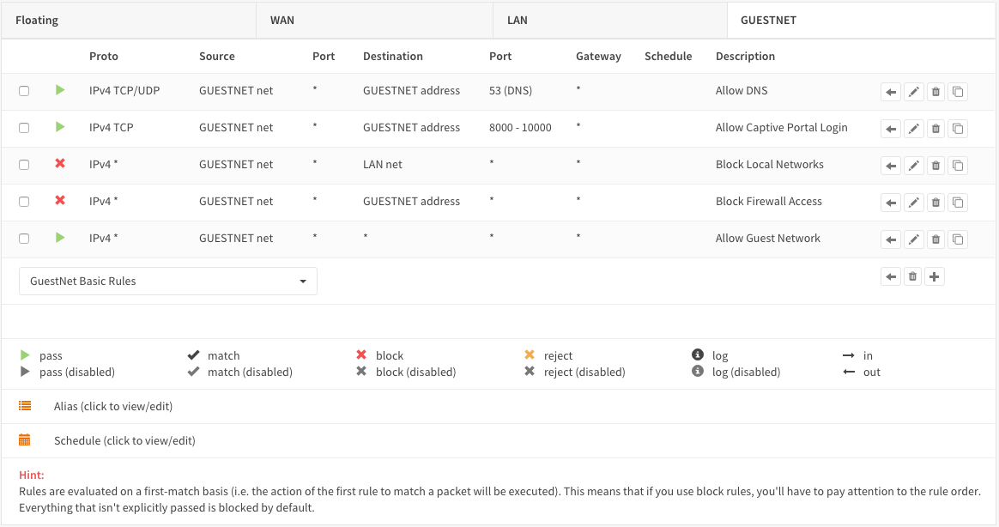

------------------------------
Step 4 - Create Captive Portal
------------------------------
Go to **Services->Captive Portal->Administration**

To add a new Zone press the **+** in the lower right corner of the form.

.. Note::
    When using multiple interfaces with the captive portal then each interface can
    have its own zone or multiple interfaces can share a zone.

For the *Business* setup we will start with the following settings:

============================ ================ =========================================
 **Enabled**                  Checked
 **Interfaces**               GUESTNET          *Remove the default and add GUESTNET*
 **Authenticate using**       (blank)           *Remove any default setting*
 **Idle timeout**             0                 *Disable Idle Timeout*
 **Hard timeout**             0                 *No hard timeout*
 **Concurrent user logins**   Unchecked         *A user may only login once*
 **SSL certificate**          none              *Use plain http*
 **Hostname**                 (leave blank)     *Used for redirecting login page*
 **Allowed addresses**        (leave blank)
 **Custom template**          none              *Use default template*
 **Description**              Guest Network     *Choose a description for the zone*
============================ ================ =========================================

**Save** and the **Apply**

------------------------
Step 5 - Create Template
------------------------
The template feature is one of the most powerful features of OPNsense's Captive
Portal solution and it's very easy to work with.

Lets create a custom landing page, to do so click on the tab **Templates** and
click on the download icon in the lower right corner ( |download| ).

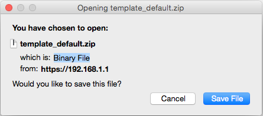

Now download the default template, we will use this to create our own.
Unpack the template zip file, you should have something similar to this:

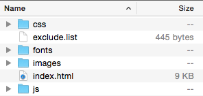

Most files of the template can be modified, but some are default and may not be
changes. Upon upload any changes to the files listed in **exclude.list** will be
ignored. Currently these include the bootstrap java scripting and some fonts.

With the captive portal enabled the default screen looks like:

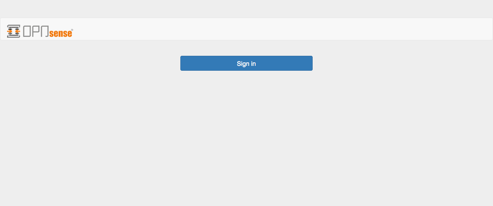

Lets change this default with a new logo and a welcome message, to this:

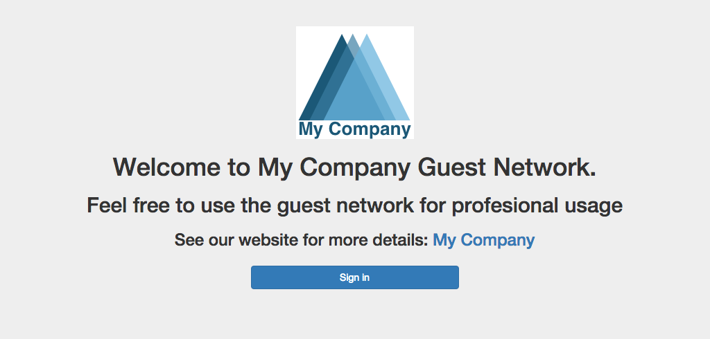

To do so use your favourite editor and open the **index.html** file to make the
changes.

Lets make the following changes to the template:

#. Change the logo to **company-logo.png**
#. Remove the navigation bar on the top
#. Remove the height and width from the **** tag
#. Add a welcome text
#. Make a link to the company website

Find the following part:

.. code-block:: guess

  <header class="page-head">
  <nav class="navbar navbar-default" >
      

          

              
          

      

  </nav>
  </header>

And change to:

.. code-block:: guess

    <header class="page-head">
        

          
          <h1>Welcome to My Company Guest Network.</h1>
          <h2>Feel free to use the guest network for profesional usage</h2>
          <h3>See our website for more details: <a href="https://www.opnsense.org">My Company</a></h3>
        

    </header>

Copy the company logo to the image directory.
Now zip the template directory and upload the new template by pressing the **+**
on the Template tab.

:download:`Download the example Template (full) <resources/mycompany_cptemplate.zip>`

Enter a **Template Name**, for this example we use **Company**.
Hit Upload ( |upload| )

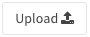

To enable the captive portal on the GUESTNET interface just click on **Apply**.

-------------------------------
Step 6 - Limit Guests Bandwidth
-------------------------------
For our example we will reserve 10Mbps down and 1Mbps Up for the Guest Network's
Internet Access. This bandwidth will be shared evenly between connected clients.

.. Note::
      With sharing evenly we mean that if 10 users at the same time try to use
      as much bandwidth as possible then everyone gets 1/10th. So in our example
      that would be 1Mbps down stream (download). It is also possible to limit
      the traffic per user see also :doc:`shaper`

Go to: **Firewall->Traffic Shaper->Settings**.

Create a pipe for the Download by pressing the **+** in the lower right corner of
the form and enter the following details:

====================== ===================
 **Enabled**            Checked
 **bandwidth**          10
 **bandwidth Metric**   Mbit/s
 **mask**               Destination
 **Description**        pipe_10Mbps_down
====================== ===================

Click on **Save changes**.
And add another pipe for the upload traffic.

====================== ===================
 **Enabled**            Checked
 **bandwidth**          1
 **bandwidth Metric**   Mbit/s
 **mask**               Destination
 **Description**        pipe_1Mbps_up
====================== ===================

Click on **Save changes**.

Create the traffic shaper rules.Click on the tab **Rules** and press the  **+**
to do so.

First toggle the advanced mode (upper left corner of the form) and then fill in
the following details (leave everything not specified on defaults):

================= ==================================
 **sequence**      (leave on default)
 **interface**     WAN
 **interface 2**   GUESTNET
 **direction**     in
 **target**        pipe_10Mbps_down
 **description**   Limit Guests download to 10Mbps
================= ==================================

Click **Save changes**.

================= ==================================
 **sequence**      (leave on default)
 **interface**     WAN
 **interface 2**   GUESTNET
 **direction**     out
 **target**        pipe_1Mbps_up
 **description**   Limit Guests upload to 1Mbps
================= ==================================

Click **Save changes**.

Now click on **Apply** to apply the changes.

-------------------------------
Step 7 - Test Business GuestNet
-------------------------------
Connect your PC or laptop to the Guest Network and start your favourite browser.
Enter an address to browse to and you will be presented with the Login form we
created with the template in the previous step. Click on login and start browsing.

To test your traffic shaper go to a speed test site such as http://www.speedtest.net/
After testing your result should be similar to this (if your internet connection
has sufficient bandwidth).

 .. image:: images/cp-traffic-shaping.png
    :width: 100%

.. Note::
    Keep in mind we have only one connected client in this test, so all reserved
    bandwidth will be available for our client.

-------------------
Royal Hotel Example
-------------------
From this point we will implement the Hotel/RV Park solution. You need to follow
step 1-7 first and choose the template you like to use for your guests.

This example will be for our "Royal Hotel".

---------------------------
Step 8 - Add Voucher Server
---------------------------
To add a Voucher Server go to: **System->Access->Servers** and click on
**Add server** in the top right corner of the screen.

Fill in:

======================= =========== =====================================
 **Descriptive name**     Vouchers   *The name for your voucher server*
 **Type**                 Voucher
======================= =========== =====================================

Click on **Save**.

------------------------
Step 9 - Create Vouchers
------------------------
Go back to the Captive portal and select Vouchers (**Services->Captive Portal->Vouchers**).
Click on **Create Vouchers** in the lower right corner of the form.

Lets create 1 Day vouchers for our guests:

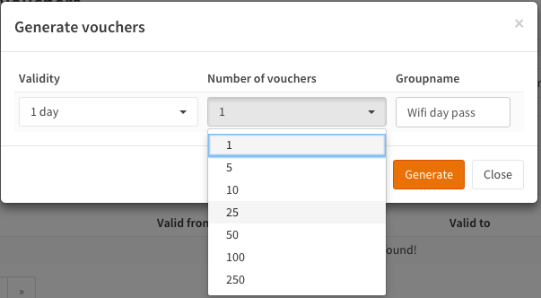

Enter the Validity (1 day), the number of Vouchers and a Groupname (Wifi day pass f.i.).
For the example we create 10 vouchers. Click on **Generate**.

A file will be generated called **wifi day pass.csv**.
The content of this file looks like this:

.. code-block:: guess

    username,password,vouchergroup,validity
    "IgJw@Pqf","MLi+Sb7Ak#","Wifi day pass","86400"
    "++?f[@i[","!m*)e(@;F,","Wifi day pass","86400"
    "bbtK9mBk","f/jCDL3:)b","Wifi day pass","86400"
    "iD%L[jLJ","I#FoZ#g!AY","Wifi day pass","86400"
    "+4bA\E[I","CNavt@0ck+","Wifi day pass","86400"
    "+,fg/\Sv","#22iIL-iQA","Wifi day pass","86400"
    ":;Pc\N#s","Y\HuG9vAN$","Wifi day pass","86400"
    "00nLb=0Q","0*C_\_Nb_x","Wifi day pass","86400"
    "PA$J0YHF","kp!q%9;m)g","Wifi day pass","86400"
    "a,mCxbya","LcnCb#g/di","Wifi day pass","86400"

The content are:

=================== ========================================================
 **username**         *Username the guest needs to login with*
 **password**         *Password the guest needs to login with*
 **vouchergroup**     *The name of the group you created*
 **validity**         *The time the voucher will be valid in seconds*
=================== ========================================================

.. Warning::

    For security reasons the plain text password for the vouchers are NOT stored
    on the firewall.

This file can be used for creating nice guest vouchers (on paper) by just merging
the cvs data with word, open office or any other dtp/text editor.

Create something like this:

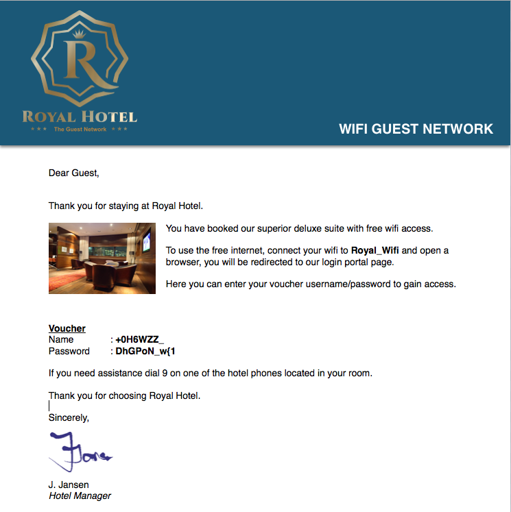

You can select a database to and remove it entirely. This way you can
create a voucher database for the arrival date of guest per guest group
(week, midweek, weekend, etc.) and delete the full database when the guests have
left.

.. Note::
    When a voucher is activated the time will be used regardless of the user being
    logged in or out. For a "used time" solution use a Radius server look at
    :doc:`accounting`

--------------------------------
Step 10 - Voucher Authentication
--------------------------------
Enable the voucher authentication by changing the zone settings.
Go to the tab **Zones** and select the Guest Network by clicking on the pencil icon
right next to it.

Change **Authenticate using** from an empty field to **Vouchers**.

When done click **Save changes** and the **Apply** to apply the new settings.

Now users will see the login form as part of your template:

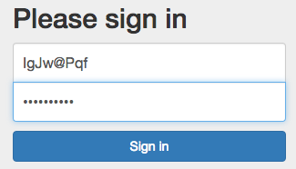

--------------
Check Sessions
--------------
To check the active sessions go to **Services->Captive Portal->Sessions**
Our current session looks like this:

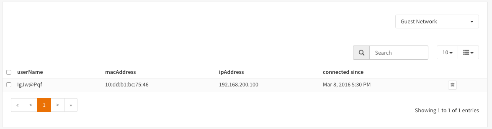

You can drop an active session by clicking on the trashcan.

.. Note::
    Notice the selection box at the upper right corner, with this you can select
    the right zone when you have configured more than one.

--------------------
Check Voucher Status
--------------------
You can check the validity and active status of a voucher by going to the voucher
page of the captive portal (**Services->Captive Protal->Vouchers**) and select
the correct database (Wifi day pass in our example).

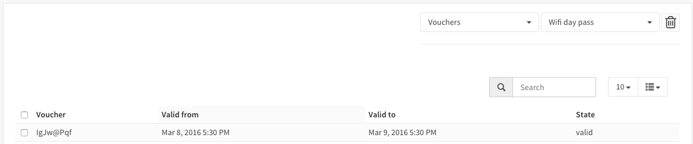

.. Note::
    The state valid means it is activated but still valid.

------------------------
Advanced - Session popup
------------------------
Lets create a Session Popup so user can see some details about there session and
Logout. For this feature we will use OPNsense's build-in api calls.

In particular we will use the following api call (for zone id 0):

.. code-block:: guess

  /api/captiveportal/access/status/0/

The response on this api call looks like this (for an active session):

.. code-block:: json

  {"userName":"IgJw@Pqf",
  "macAddress":"10:dd:b1:bc:75:46",
  "acc_session_timeout":14095,
  "authenticated_via":"Vouchers",
  "packets_out":2834,
  "bytes_in":512869,
  "last_accessed":1457527526,
  "zoneid":0,
  "sessionId":"npd5bd6SIVQeMfIbWBdong==","
  startTime":1457526930.1719,
  "bytes_out":1322351,
  "ipAddress":"192.168.200.100",
  "packets_in":3181,
  "clientState":"AUTHORIZED"}

It would go a bit to far to explain standard html and java scripting used for
our simple popup, but a full demo template can be downloaded:

:download:`Download the example Template (with popup) <resources/template_popup.zip>`

The demo includes a new file called **session_popup.html** with all the logic to
show the time left on the voucher and a logout button. As well as a simple update
to our index.html page to call the popup on a successful login. The latter looks
like this (shown with a bit of context):

.. code-block:: javascript

  // redirect on successful login
  if (data['clientState'] == 'AUTHORIZED') {
      window.open("session_popup.html","Session Status & Logout","width=400, height=400");

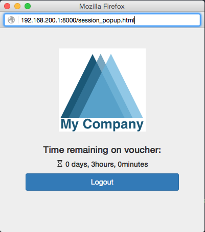

-----------------------------
Advanced - CLI Session Status
-----------------------------
OPNsense has a very powerful CLI that is particularly useful for debugging purposes.
For this example we will use the cli to list the status off all active sessions.

Type the following on the cli prompt to do so (for zone id 0):

.. code-block:: guess

  configctl captiveportal list_clients 0

The output will be something similar to this:

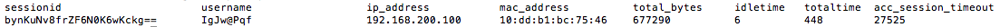
