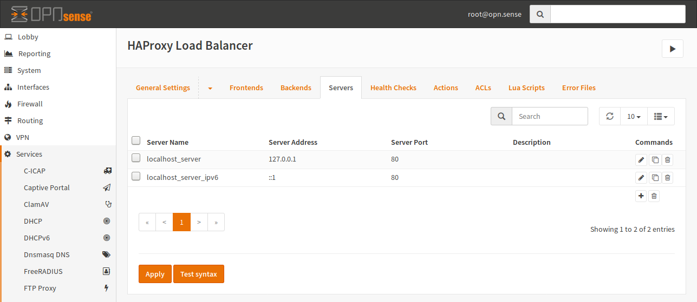
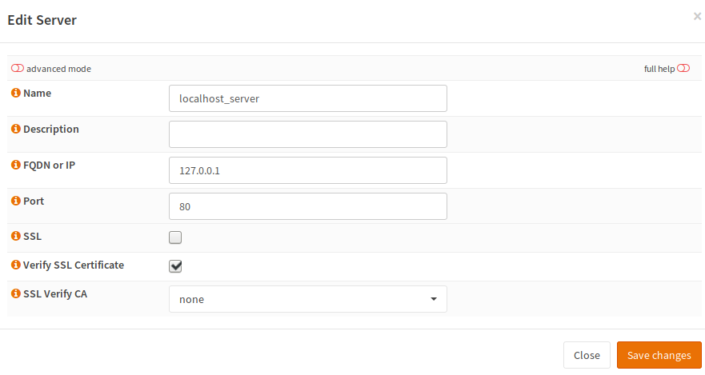
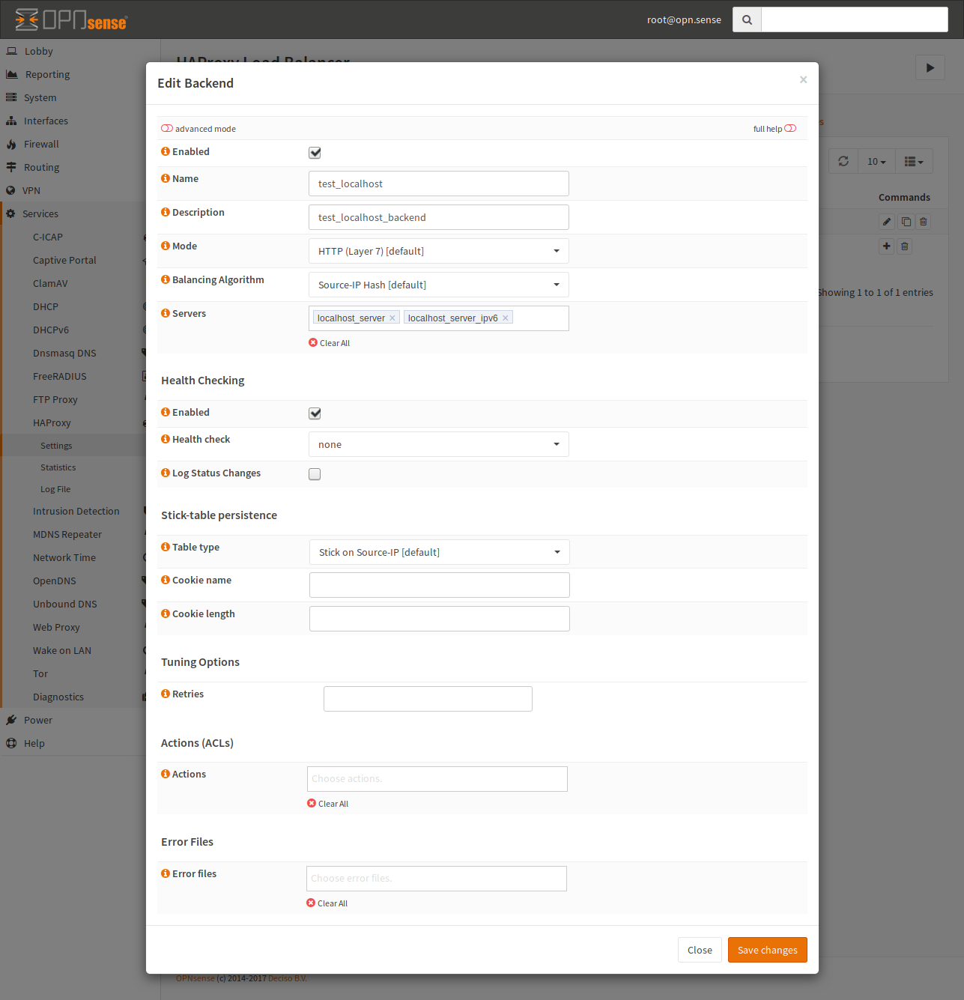
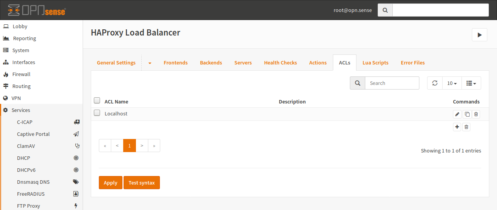
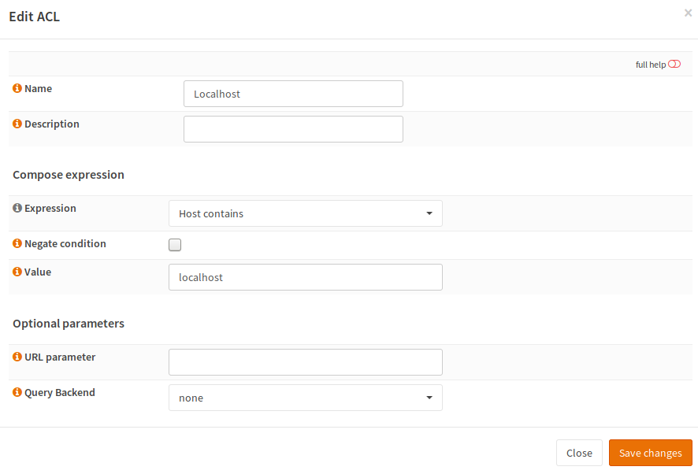
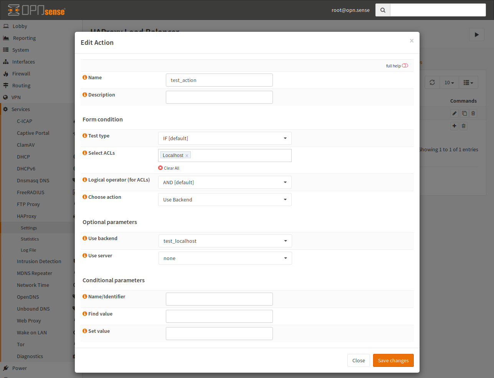
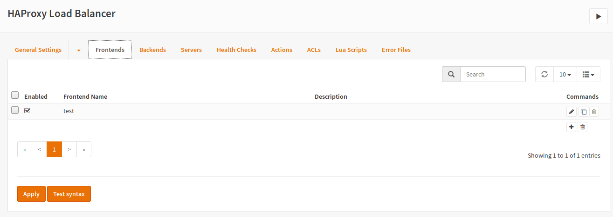
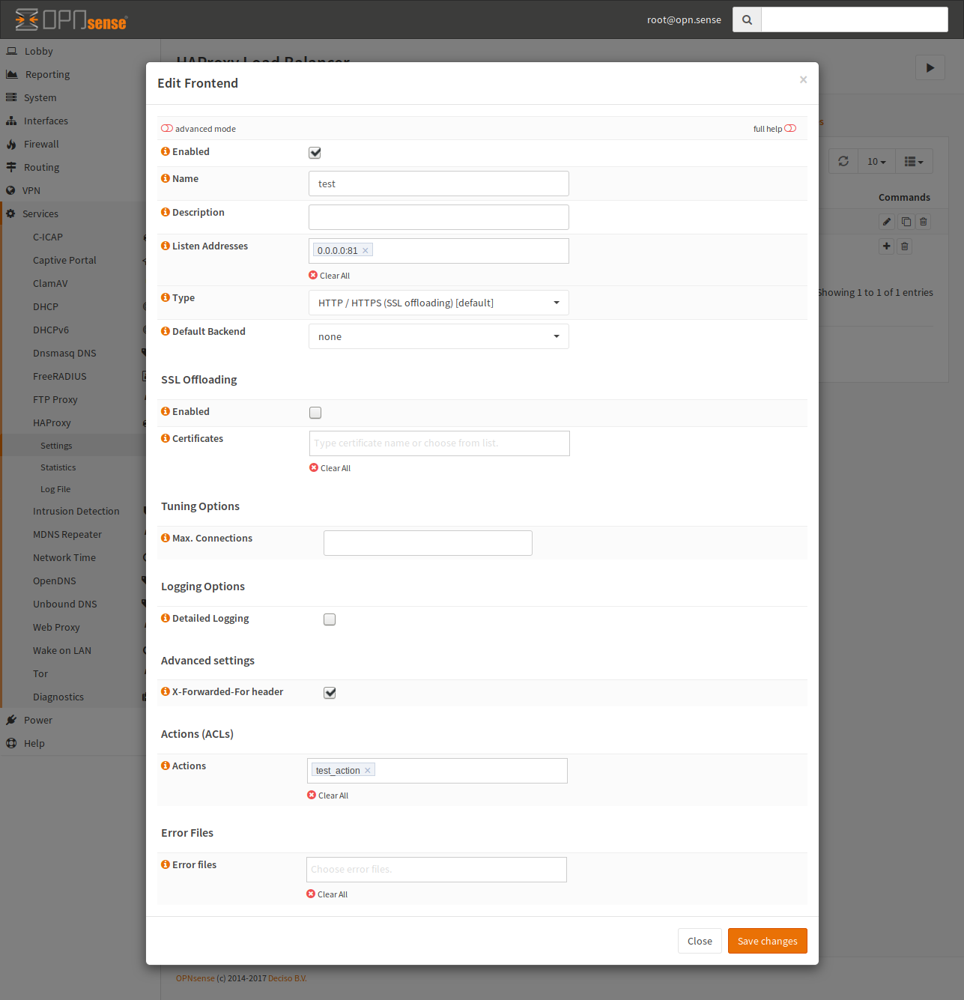
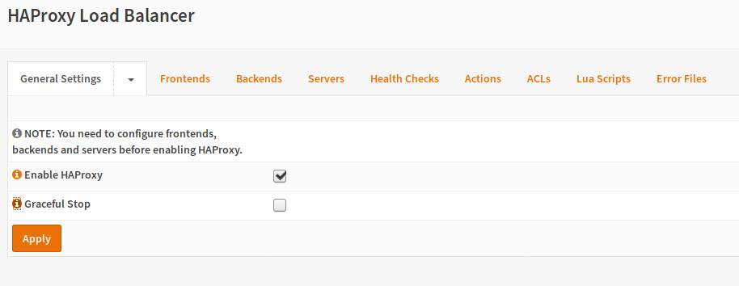

=======
HAProxy
=======

------------
Installation
------------

First of all, you have to install the HAProxy plugin (os-haproxy) from the
plugins view.

.. image:: ../images/menu_plugins.png

-------------------------------------
First Step: Configure Backend Servers
-------------------------------------

On the "Servers" page, click `+` to open a dialog to create a new server.
A server consist of a name, IP and port.
Create an entry for every Server you want to load balance.

For a HTTP Backend, configure like this:

========================== ===========================
**Name**                   Name of this server
**Description**            Keep it empty
**FQDN or IP**             Enter the IP of your Server
**Port**                   Port of the Server
**SSL**                    Keep the default (disabled)
**Verify SSL Certificate** Keep the default (checked)
**SSL Verify CA**          Keep the default (empty)
========================== ===========================

--------------------------------
Second Step: Configure a Backend
--------------------------------

Now, as we have the backend services,
we can build a backend by combining them to groups of
servers, which will serve the same service.
For example if you are hosting a Webservice and want to
scale horizontally, every server in the cluster will be
a "Server", but they will be combined to a so called
"Backend", so HAProxy can load balance between them.

To create a new Backend, click the `+`.

.. image:: images/haproxy_backends.png

And fill out the form:

.. Note::
    The "Balancing Algorithm" field is important to care about as many
    web applications depend on a state.
    For example, if your web application stores session data on a local
    disk, you may get some trouble when using an algorithm like Round
    Robin. In such a case, the request of the same client always needs
    to be sent to the same backend servers.
    For example by default PHP stores session data in files while Ruby
    on Rails stores session information in a cookie by default.
    Please look up your web framework documentation for information how
    this is handled. Consider writeing files as problematic as well if
    there is no shared storage.

======================= ===============================================
**Enabled**             Enable the Backend (checked)
**Name**                Enter a name for the Backend
**Description**         Enter an optional description
**Mode**                Select the mode HTTP as this is an HTTP backend
**Balancing Algorithm** Select an load balancing algorithm
**Servers**             Select the previously configured servers
======================= ===============================================

--------------------------------
Third Step: Configure Conditions
--------------------------------

In this step an Condition will has to be created which is later used to decide
which traffic from a frontend belongs to which backend.

To create a new Condition, you have to go to "Rules & Checks -> Conditions" 
and create one by clicking the `+` button:

(Picture is from Previous Version but it still looks as good as the same)

In the open modal dialog, the following form will show up:

==================== ================================================
**Name**             Choose a name for this Condition
**Description**      Keep it empty or choose one for your information
**Expression**       Select "Host contains"
**Negate condition** Keep it unchecked
**Value**            Enter the (partial) hostname to compare
==================== ================================================

Click "Save changes".

---------------------------------------
Fourth Step: Configure an Rule
---------------------------------------

As promised in the previous step, the Conditions will be used. 
A Rule can use multiple conditions to dicide whcih Rule is going to be used.
To create a new Rule, you have to go to "Rules & Checks -> Rules" 
and create one by clicking the `+` button:

(Picture is from Previous Version but it still looks as good as the same)

.. image:: images/haproxy_actions.png

A form dialog opens and we can fill it out like the following:

(Picture is from Previous Version but it still looks as good as the same)

.. Note::
    You can map multiple Hostnames to the same Backend by adding multiple
    ACLs and choosing the logical operator "OR".

==================== ===================================
**Name**             Choose a name for this Action
**Description**      You can add an optional description
**Test Type**        Keep it at the default ("IF")
**Select ACLs**      Select the ACLs to be used
**Logical operator** Keep the default ("AND")
**Choose action**    Choose "Use Backend"
**Use Server**       Keep the default ("none")
==================== ===================================

-------------------------------
Fifth Step Configure a frontend
-------------------------------

Now its nearly done. The only thing that needs to be configured for HAProxy
is a Public Service.
A Public Service is a a group of bound ports which are used for incoming connections.
From this Public Service we need to know which backend the request will routed to.
For this, the previously configured action is needed.
If you got multiple domains on one IP, you differate them with rules! 
Don't create multiple Public Services.

To create a new Public Service, click the `+` button:

(Picture is from Previous Version but it still looks as good as the same)

The following modal dialog opens and the frontend can be set up:

.. Warning::
    If you configure a port that is already in use, the configuration test
    will be successful but the start of HAProxy will fail silently.
    Please ensure that the used port is free - especially if the number
    conflicts with the web configuration of OPNsense.

    
General Settings
================

=================== ===========================================================================
**Enabled**          Checked
**Name**             Use any name
**Description**      You may keep it empty
**Listen Address**   Enter one or more host:port combinations, use 0.0.0.0:80 for HTTP via IPv4
**Type**             Choose HTTP / HTTPS
**Default Backend**  Keep the default of "None"
=================== ===========================================================================

Advanced settings
=================

Enbable the X-Forwarded-For-header so the backend will know the real IP of
the client.

Actions (ACLs)
==============

Here you have to activate the previously configured actions, so HAProxy
is going to operate based due the rules/actions.
knows where the requests should be sent to. 

All other Options
=================

Keep all other options at the default

----------------------------
Sixth step: Enable and start
----------------------------

This is the last step - on the General tab, we will enable the service
after a config test.

For that, the "Enable HAProxy" checkbox needs to be checked.

On this screen, check "Enable HAProxy" and click "Apply".
If everything went OK HAProxy will start.
Now you need to configure firewall rules for accessing your HAProxy instance.
