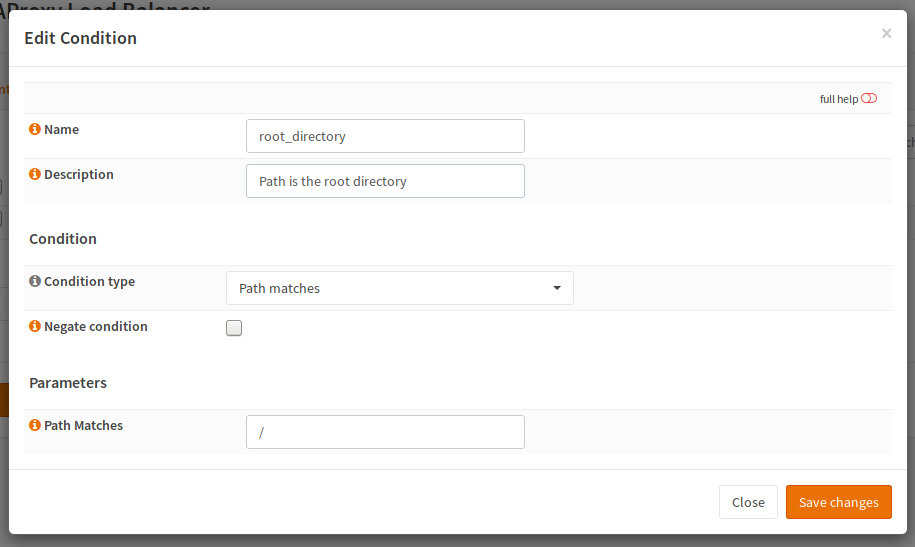
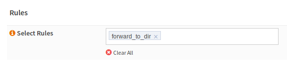
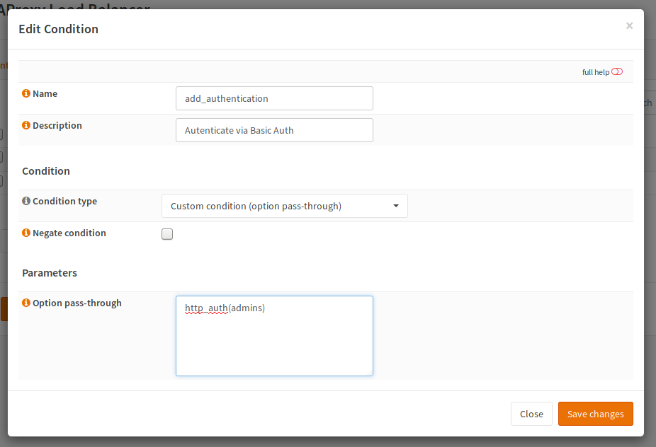
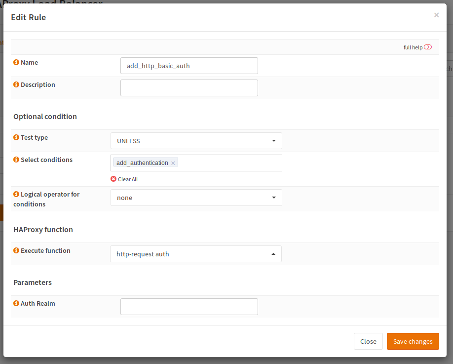
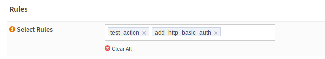

HAProxy How-Tos
===============

Redirect Root directory
-----------------------

Create a condition:

============== ==============
name           root
Condition type Path matches
Path matches   /
============== ==============

Create a Rule:

.. image:: images/haproxy_forward_to_dir_rule.png

======================= ===================================================
name                    forward_to_dir
Test type               IF
conditions              root
Logical ops             none
Execute function        http-request redirect
HTTP Redirect parameter code 301 location http://www.example.net/directory/
======================= ===================================================

Please note that 301 is for a permanent redirect. If you want to do it teporary,
you will have to use another status code.

Under Public Services edit your frontend and add "forward_to_dir" to Select Rules.

Add Basic Authentication to a Service
-------------------------------------

I have a Webapplication which have to be exposed to the outside and doesn't allow authentication.
So HAProxy with basic auth would be just fine to get a mininum of security.

* Go to "Rules & Conditions" - "Conditions" and Add a new one:

=================== =================
name                choose a name
Condition type      Custom
option pass-through http_auth(admins)
=================== =================

* Add a rule:

================ =================================
name             a name for your rule
Test type        UNLESS
condition        select the previously created one
Logical operator none
Execute function http-request auth"
================ =================================

* Go to your frontend and add the ACL to it.

* Go to :menuselection:`Settings --> Global Parameters`, enable the advanced mode (top left), and add your users to configuration
  via the "Custom options"

.. image:: images/haproxy_settings_global_params_auth.png

.. code-block:: none

    userlist admins
    user test1 insecure-password pw1
    user test2 insecure-password pw2

