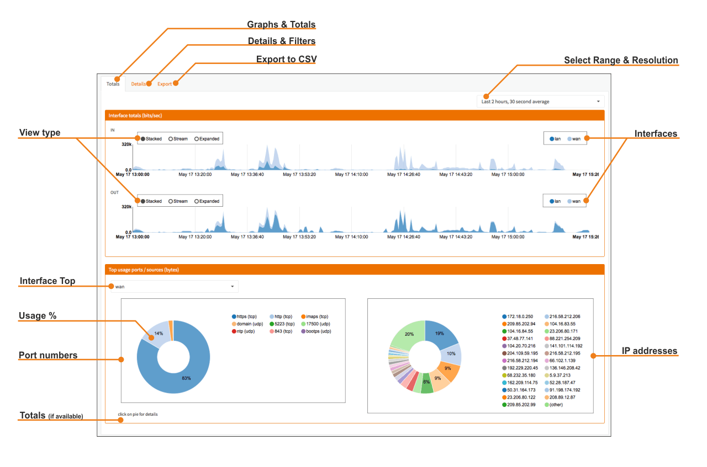
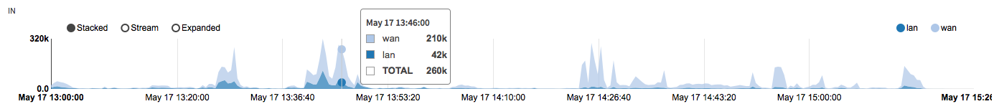
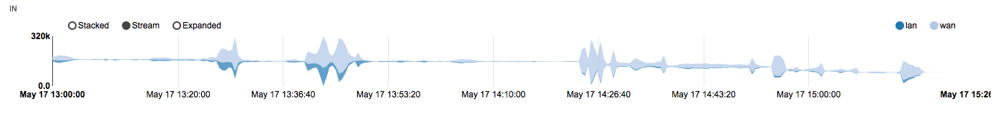
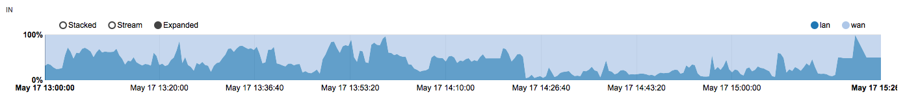
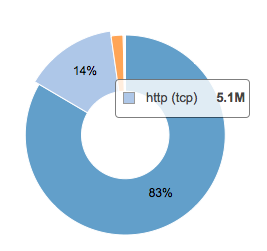
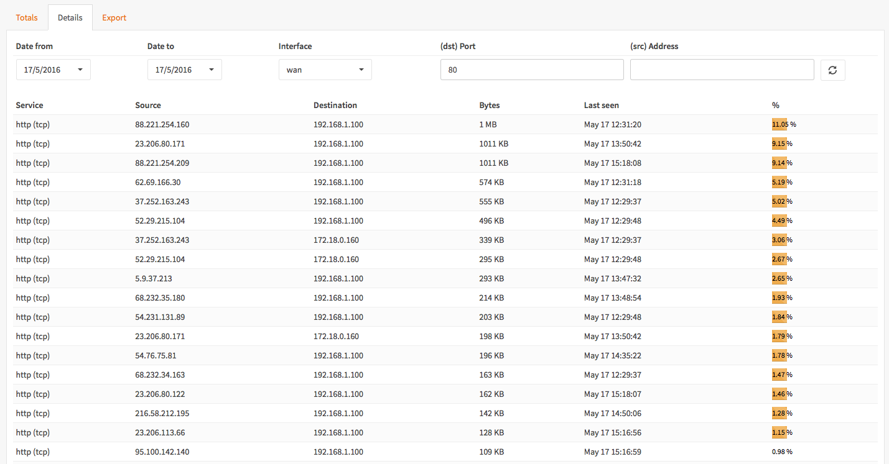
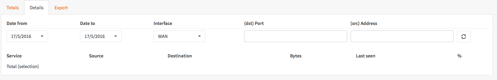
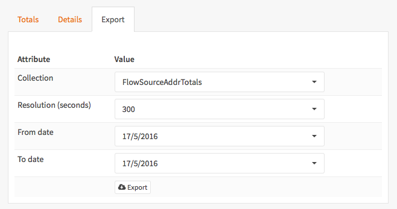
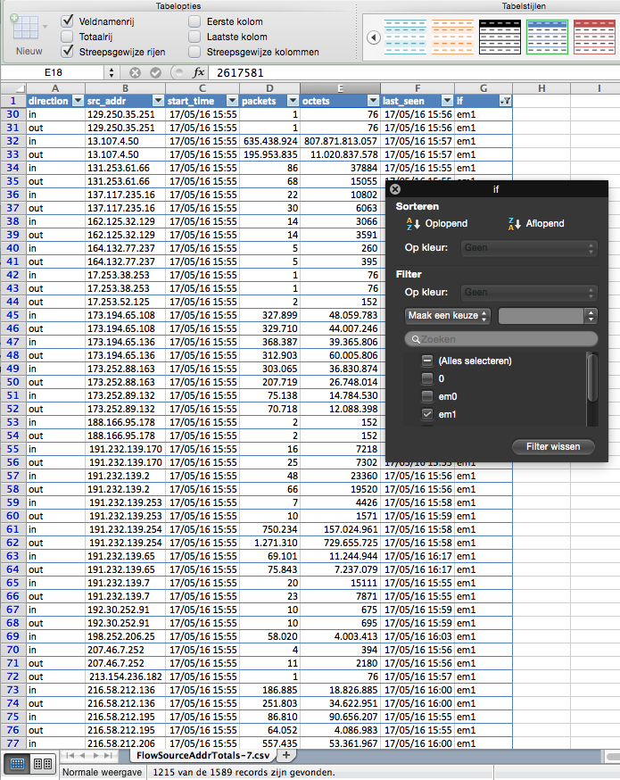

================================
Using Insight - Netflow Analyzer
================================
OPNsense is equipped with a flexible and fast Netflow Analyzer called Insight.
To use Insight, one needs to configure the Netflow exporter for local capturing
of Netflow data. To do so take a look at :doc:`netflow_exporter`.

--------------
User Interface
--------------
Insight is a fully integrated part of OPNsense. Its User Interface is simple yet
powerful. It can be accessed via :menuselection:`Reporting --> Insight`.

Insight offers a full set of analysis tools, ranging from a graphical overview to
a csv exporter for further analysis with your favorite spreadsheet.

---------------
Graphs & Totals
---------------
The default view of Insight is the Top users and Graphical Overview.
This view allows for quick examination of current and past flows, showing a graph
for in and out going traffic for each configured interface.

Select Range & Resolution
-------------------------
In the top right corner a selection can be made for the date range and accuracy
(resolution) of the collected traffic flows.

View Type
---------
One can show the traffic flows in a stacked manner (default), as a stream or expanded
to compare usage with different interfaces.

**Stacked**

**Stream**

**Expanded**

Interfaces
----------
Clicking on an interface disables or enables the graph view, double clicking select
only that interface.

Top Users
------------
The top 25 users are shown for a selected interface, both for ports and ips within
the previously selected date range.

Interface Top
-------------
Select the interface to see the top 25 users.

Port Pie Chart
---------------
The port pie chart shows the percentage per port/application. One can change the
view by clicking or double clicking on one of the shown port names/numbers.

Clicking on a piece of the pie will open a detailed view for further analysis.

IP Addresses Pie Chart
----------------------
The IP addresses pie chart works the same as the ports pie chart and shows the
percentage per IP number. One can change the view by clicking or double clicking
on one of the shown IP numbers.

Clicking on a piece of the pie will open a detailed view for further analysis.

Interface Totals
----------------
Not shown in the screenshot but latest version also includes a Total for the
selected interface, shown are Packets (In, Out, Total) and Bytes (In, Out, Total).

------------
Details View
------------
One can open the details view by clicking on one of the pieces of a pie chart or
click on the tab **Details**.

When opening the details view by clicking on the tab one can make a new query.

After selecting a valid date range (form/to) and interface one can further limit
the output by filtering on port or IP address. Select the refresh icon to update
the detailed output. Leave Port and Address empty for a full detailed listing.

.. image:: images/insight_full_details.png
   :width: 100%

-----------
Export View
-----------
The **Export** view allows you to export the data for further analysis in your favorite
spreadsheet or other data analysis application.

To export data, select a **Collection** :

* FlowSourceAddrTotals - Totals per source address
* FlowInterfaceTotals - Totals per interface
* FlowDstPortTotals - Totals per destination port
* FlowSourceAddrDetails - Full details per source address

Select the **Resolution** in seconds (300,3600,86400)

Then select a date range (from/to) and click the **export** button.

