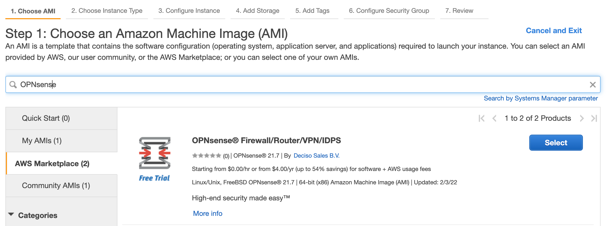

=============================
Installing OPNsense AWS image
=============================
.. image:: images/amazon-web-services.png
    :width: 100%

Our EC2 image is available in the `aws marketplace <https://aws.amazon.com/marketplace/pp/prodview-lu5v2tokic3py>`__.

---------------------
Step 1 - New Instance
---------------------

To start a new instance go to "instances", followed by "launch instance" in your EC2 view.

Next go to "AWS Marketplace" and search "OPNsense". Our official image is sold via Deciso Sales B.V..

--------------------
Step 2 - Select Type
--------------------
Choose an instance type

.. image:: images/aws_launch_new_image.png
    :width: 100%

------------------------------------
Step 3 - Configure Instance Details
------------------------------------

Here you can configure your network details, by default a network is assigned which is accesible from an external IPv4
address.

At the bottom of the page you can also supply "User data" in the "Advanced Details" section, you can use this to
set an initial password for the `ec2-user`.

.. Note::

    When a password is omited, one will be automatically generated for you and displayed on the console (get system log).

.. Note:

    To supply a default password, use the following format `password=mypassword` after which the `ec2-user` can login with `mypassword`.

-------------------------
Step 4 - Add Storage
-------------------------

Here you can change the initial storage size and type of volume to use.

-------------------------
Step 5 - Add Tags
-------------------------

Optionally you may add tags to the instance, it's safe to leave this empty.

---------------------------------
Step 6 - Configure security group
---------------------------------
To configure security group, make sure you allow HTTPS access from your own network.
Since SSH is also enabled by default on these images, you may enable port 22 (SSH) too from your network.

.. image:: images/aws_configure_security_group.png
    :width: 100%

-----------------------------
Step 7 - Review your settings
-----------------------------

.. image:: images/aws_review_settings.png
    :width: 100%

--------------------
Step 8 - SSH keypair
--------------------
Select ssh keypair or skip, the selected ssh key is attached to the `ec2-user`, you can change this afterwards
from the usermanager. (:menuselection:`System -> Access -> Users`).

.. image:: images/aws_ssh_keypair.png
    :width: 100%

---------------------------
Step 9 - Review status page
---------------------------

.. image:: images/aws_status.png
    :width: 100%

-------------------------
Step 10 - AWS instances
-------------------------
Go to your AWS instances

.. image:: images/aws_instances.png
    :width: 100%

Select the image, go to “image settings” then “get system log” to obtain the
initial password for the `ec2-user` (if not specified in the user data) and the initial root password.

.. Note::

    Sometimes it can take a bit of time before the console settings appear in the "system log", in our experience
    the output is available when the `Status check` reports it's finished.

---------------------------------
Step 11 - Initial root password
---------------------------------
Copy your initial root password (line ** set initial….)

.. code-block::

    .....
    Configuring system logging...done.
    >>> Invoking start script 'aws'
    **********************************************************************************************************
    *** set initial ec2-user password to : J4heQUAaRWJFGkXrfUKssjQ9jyFiBmaRgqaBiYRK7iiL2lUtvG
    *** !!! remember to change this immediately
    *** openssh-key provided, set to ec2-user
    *** set initial root password to : SNFpd2lcefYXXjyRezPrloTWTF3LjhgZPV3zLuDxEdVkiBGWxn
    *** remember to change this immediately
    **********************************************************************************************************
    >>> Invoking start script 'newwanip'
    Reconfiguring IPv4 on xn0: OK
    Reconfiguring routes: OK
    >>> Invoking start script 'freebsd'
    >>> Invoking start script 'syslog-ng'
    Stopping syslog_ng.
    Waiting for PIDS: 57924.
    Starting syslog_ng.
    >>> Invoking start script 'carp'
    >>> Invoking start script 'cron'
    Starting Cron: OK
    >>> Invoking start script 'beep'
    Root file system: /dev/gpt/rootfs
    Sat Feb  5 17:58:45 UTC 2022

    *** OPNsense.localdomain: OPNsense 21.7.7 (amd64/OpenSSL) ***

     WAN (xn0)       -> v4/DHCP4: 172.31.27.130/20

     HTTPS: SHA256 52 87 3F 28 48 59 A3 7D 59 66 26 36 01 2C 77 61
                   FB 8E 78 C8 C4 C4 80 2C 97 C6 67 AA CB 28 48 60
     SSH:   SHA256 pwupAQ6U+TOKoI1NAvcFpKF90Is02W0YMem7CNPG9j8 (ECDSA)
     SSH:   SHA256 +JOMcgZ14lUnUxp4jEbEWf7Q+OvHJufvjhFzybJG1/M (ED25519)
     SSH:   SHA256 2mR9csHFwDgBl7SGfOPeW2r9E15zMP9OuMpHnBrGwUI (RSA)

    FreeBSD/amd64 (OPNsense.localdomain) (ttyu0)

    login:

.. Tip::

    When the ec2 console doesn't show the initial password you can also use the configured ssh shell to reset the root
    password using  :code:`sudo /usr/local/sbin/opnsense-shell` and option :code:`3` in the menu.

--------------------------------------------
Step 11 - Search current address and login
--------------------------------------------

.. image:: images/aws_search_current_ip.png
    :width: 100%

Login to OPNsense using the address provided.
