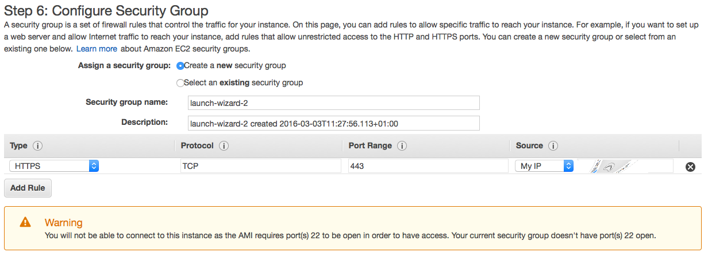
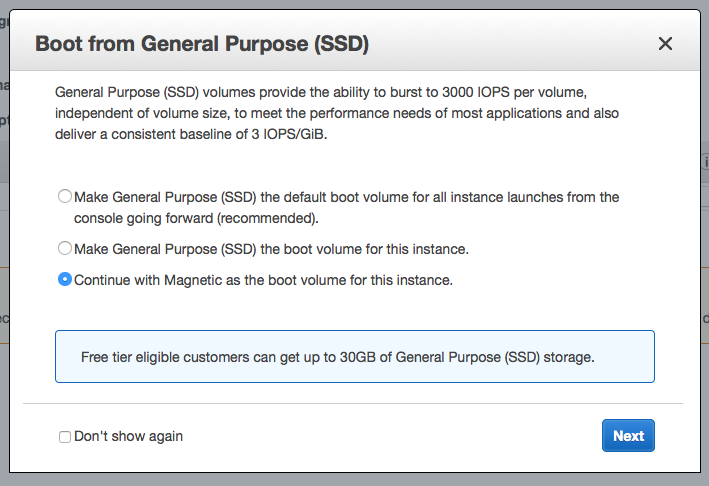
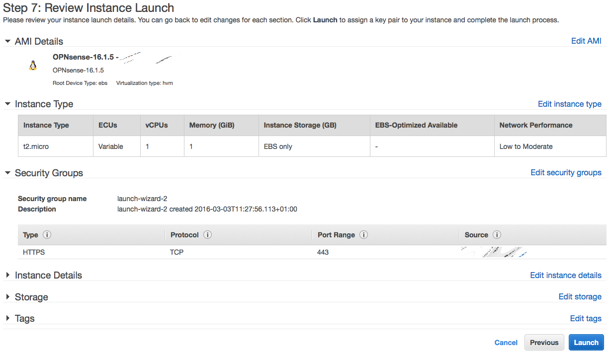
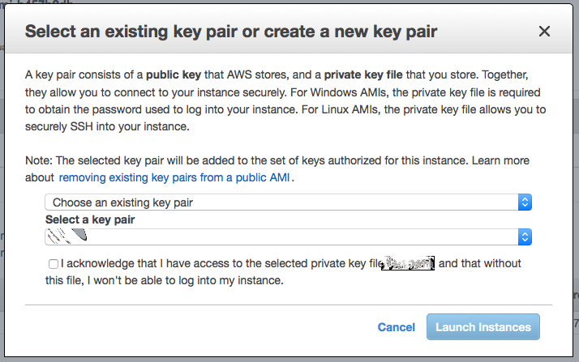
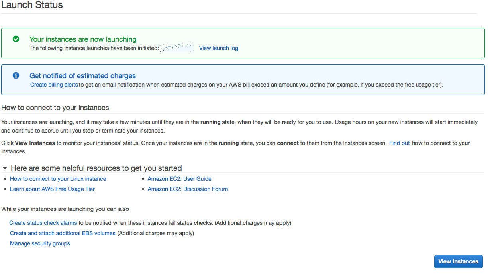
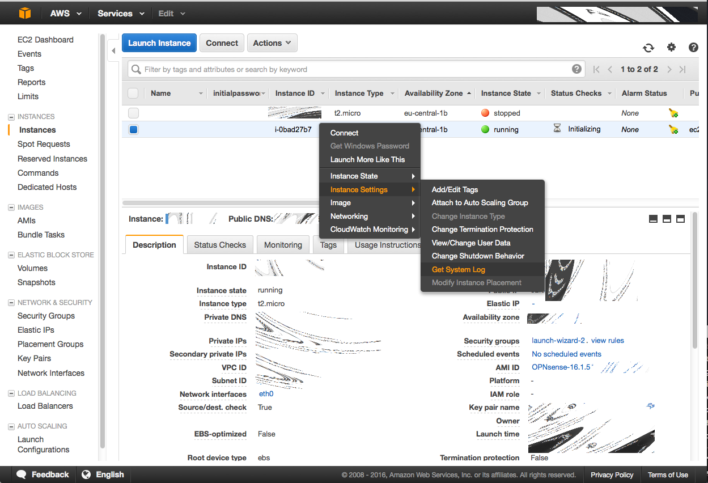
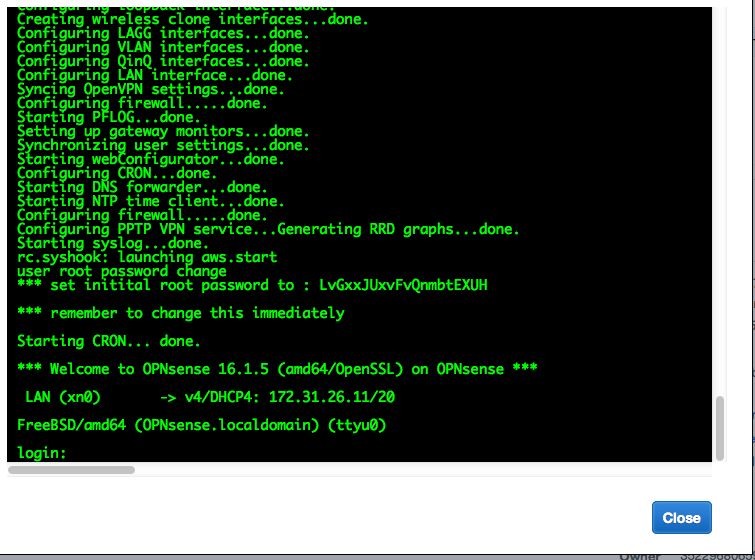
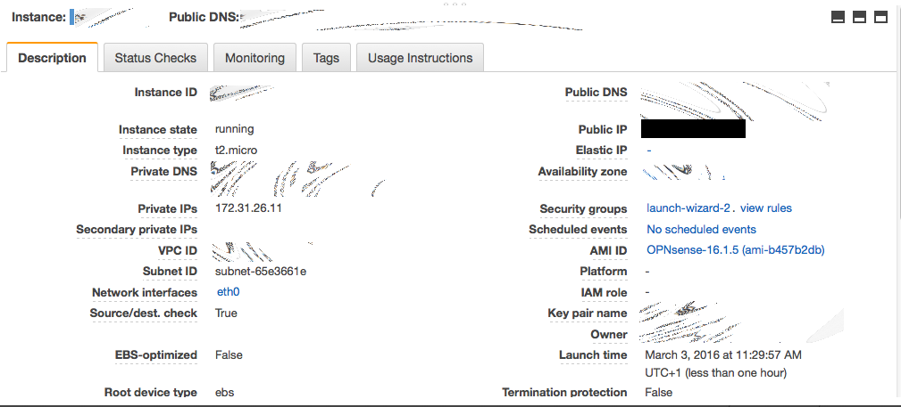

=============================
Installing OPNsense AWS image
=============================

To apply for access to the OPNsense Amazon AWS EC2 cloud image, you need:

* An active support subscription
    see: https://opnsense.org/support-overview/commercial-support/)
* Supply your Amazon Account Number
    to share the Amazon Machine Image with.

---------------------
Step 1 - New Instance
---------------------
Start a new instance and then go to "instances", followed by "launch instance"
and then "My AMIs", don't forget to select "Shared with me"

--------------------
Step 2 - Select Type
--------------------
Choose an instance type

.. image:: images/aws_launch_new_image.png
    :width: 100%

---------------------------------
Step 3 - Configure security group
---------------------------------
To configure security group, make sure you allow https access from your own network.

-------------------------
Step 4 - Configure a disk
-------------------------

-----------------------------
Step 5 - Review your settings
-----------------------------

--------------------
Step 6 - SSH keypair
--------------------
Select ssh keypair or skip, the ssh key isn’t used for OPNsense, ssh is disabled by default.

---------------------------
Step 7 - Review status page
---------------------------

----------------------
Step 8 - AWS instances
----------------------
Go to your AWS instances

Select the image, go to “image settings” then “get system log” to obtain the
initial password

------------------------------
Step 9 - Initial root password
------------------------------
Copy your initial root password (line ** set initial….)

--------------------------------
Step 10 - Search current address
--------------------------------

Login to OPNsense using the address provided.
