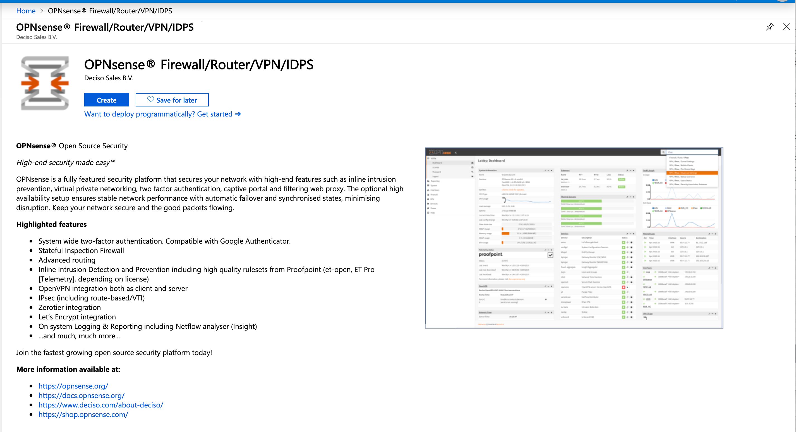
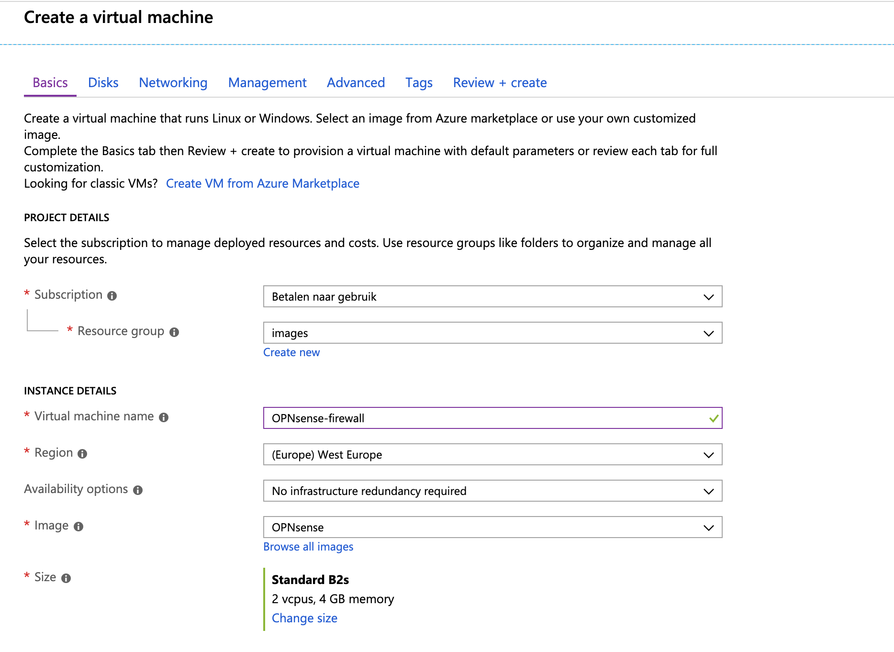
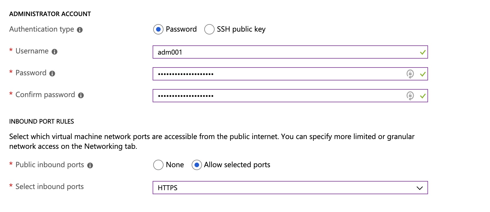
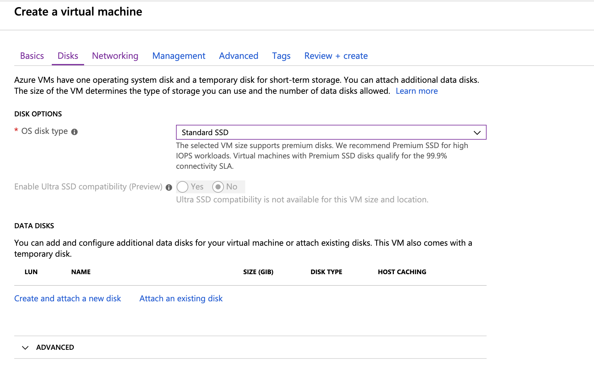
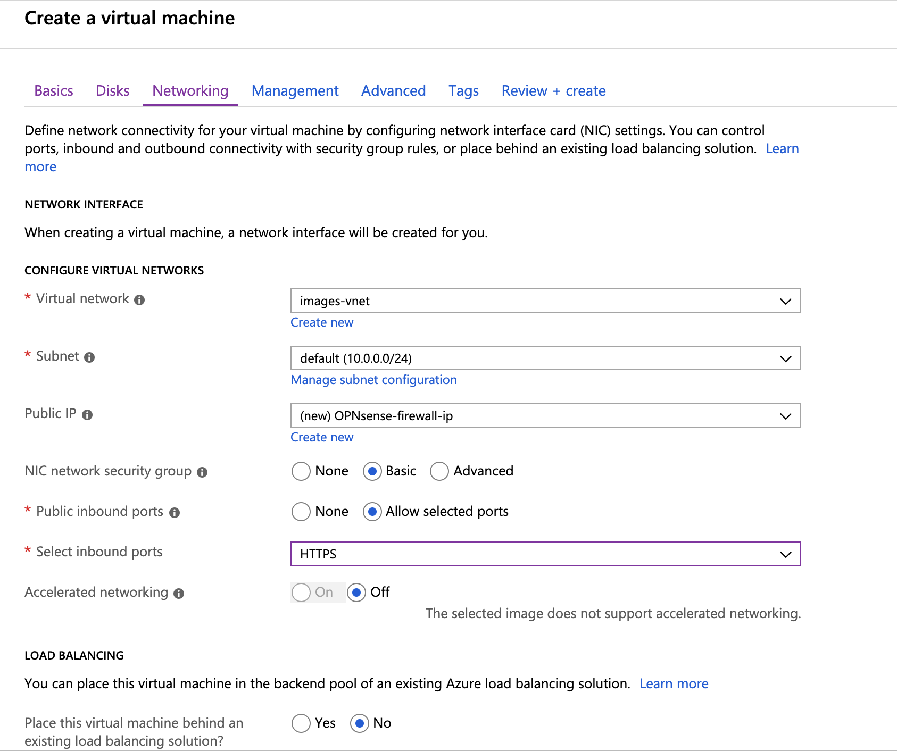
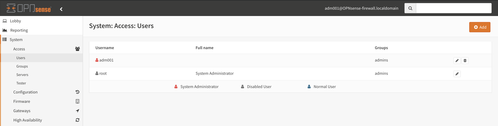

==================================
OPNsense Azure Virtual Appliance
==================================

OPNsense is a fully featured security platform that secures your network with high-end features such as
inline intrusion prevention, virtual private networking, two factor authentication,
captive portal and filtering web proxy. The optional high availability setup ensures stable network performance
with automatic failover and synchronised states, minimising disruption.
Keep your network secure and the good packets flowing.

The Virtual Appliance is available on the Microsoft Azure Marketplace (`here <https://azuremarketplace.microsoft.com/en-en/marketplace/apps/decisosalesbv.opnsense?tab=Overview>`__).

Our installation manual will guide you through a simple installation scenario using 1 network interface, for
more advanced network setups you best checkout the Azure `documentation <https://docs.microsoft.com/en-en/azure/virtual-machines/linux/multiple-nics>`__.

-------------------------
Setup : Basic settings
-------------------------

The Marketplace create button guides you to the initial virtual machine setup, choose your subscription and system
preferences here and name your virtual machine.

Next make sure you create an initial administrative user, since some names are reserved (like admin and root), you
need to choose another one here. In our example we choose :code:`adm001` here.

.. Note::

    You can enable the root user after installation, the setup user can access the system using ssh or https after installation
    todo so.

-------------------------
Setup : Disks
-------------------------

Next you can choose a disk type to use, **standard SSD** is fast enough for most workloads.

-------------------------
Setup : Network
-------------------------

For our example, we kept our settings simple using a **private IP** which is accessible over port **443 (https)**
after bootup. Most settings can be changed after deployment.

.. Note::

    Microsoft has quite some information available about different networking settings and options
    `here <https://docs.microsoft.com/en-en/azure/virtual-machines/windows/network-overview>`__

------------------------
Create
------------------------

Proceed to **Review + create** to finalize the deployment.

------------------------
Login to your instance
------------------------

When the virtual machine is created and booted for the first time, you can login using the assigned user (:code:`adm001`),
now you can enable the root user if you like in :menuselection:`System -> Access -> Users`

.. Note::

    Our Azure virtual appliance has ssh enabled by default, you can change these settings in :menuselection:`System -> Settings -> Administration`
