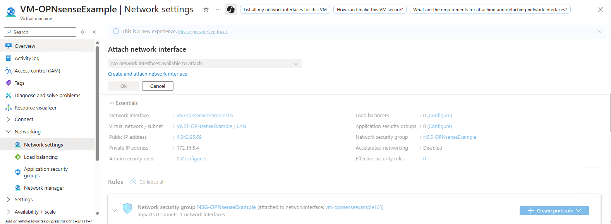
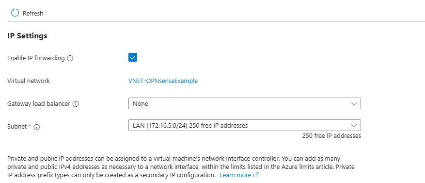
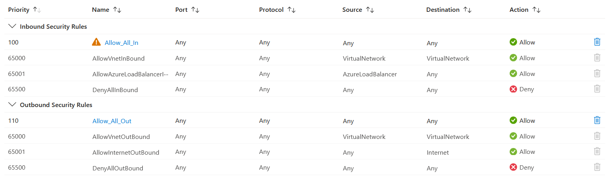
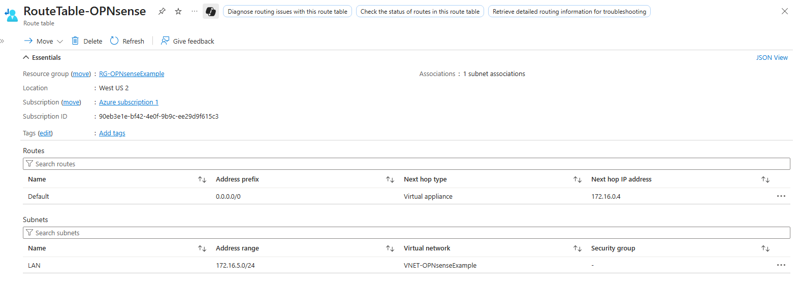

==================================================================
OPNsense Azure Virtual Appliance Setup - 2 Network Interface Cards
==================================================================
After deploying the OPNsense Azure market image, the Virtual Machine will have a single
network interface card which OPNsense configures as a LAN interface. To
support use cases that involve routing outbound traffic through the firewall, you will need 
to add a second network interface card to the VM to serve as a WAN interface. This guide will 
demonstrate one way to accomplish this.

Suggested reading on the Azure Platform includes but is not limited to:
`Routing traffic to an NVA <https://learn.microsoft.com/en-us/azure/virtual-network/tutorial-create-route-table?tabs=portal>`_
, `User Defined Routing <https://learn.microsoft.com/en-us/azure/virtual-network/virtual-networks-udr-overview>`_
, `Troubleshooting NVAs <https://learn.microsoft.com/en-us/azure/virtual-network/virtual-network-troubleshoot-nva?tabs=portal>`_
, `Deploying highly available NVAs <https://learn.microsoft.com/en-us/azure/architecture/networking/guide/network-virtual-appliance-high-availability>`_

.. Tip::

    Azure Bastion can provide RDP to a VM or SSH access through Azure network routes, 
    which can be helpful while making changes that can affect external connectivity.

-------------------------------------
Azure Setup : Network Interface Cards
-------------------------------------
Create and attach a second network interface card to the virtual machine (requires VM shutdown.) 
Set the networkinterface card to separate, dedicated WAN subnet in your Azure Virtual Network.

Importantly, turn on IP Forwarding for both network interface cards. This setting, which 
is off by default, allows the VM to accept and send traffic for destinations other than itself.

Boot the firewall VM again after completing these steps.

.. Tip::

    Now is a good time to also set the IP configurations on both network interface cards to
    static as they default to dynamic.

----------------------------------------
OPNsense Setup : Interface Configuration
----------------------------------------
Next, update the OPNsense configuration to set the newly added network
interface card as the WAN interface.

Navigate to :menuselection:`Interfaces--> Assignments` to set the newly available device
as the WAN interface. After adding, enable the new interface and set the IPv4 configuration
to DHCP. Once you have this interface configured, set up an appropriate firewall
rule to provide access inbound to management ports if accessing externally.

.. Warning::

    Be aware of the risk of exposing management ports externally. Narrow allowance scope if possible.

--------------------------------------
OPNsense Setup : Gateway Configuration
--------------------------------------

.. Danger::

    The following change will break public routing to LAN interface. If you are managing the
    firewall externally, ensure you have the inbound rule set up to provide access to your IP
    from the WAN interface.

Then from :menuselection:`System--> Gateways --> Configuration` define an outbound route
through WAN interface. This will need to be set to the Azure subnet gateway, which exists at
the first IP of the subnet (e.g. 172.16.0.1 for 172.16.0.0/24) After this is completed, set 
the priority of this gateway lower than the existing LAN gateway as this will be the desired 
default outbound route. At this point if connecting externally, routing asymmetry will break
any external connectivity to the LAN interface.

----------------------
Azure Setup: Public IP
----------------------
You will need to assign a public IP to the network interface card for your WAN interface. Disassociating
the public IP from the LAN NIC and associating to the WAN NIC is convenient because the public IP
will no longer be useful on the LAN NIC and it can otherwise be removed.

------------------------------------
Azure Setup: Network Security Groups
------------------------------------

It is also necessary that the WAN NIC has a Network Security Group attached to it. This is necessary to
satisfy the requirements of the Standard SKU Public IP, which will otherwise deny traffic without an NSG
attached. Since the OPNsense is a network firewall, setting an Any-to-Any rule for both Inbound and Outbound
rules to bypass the NSG is typical.

 
Furthermore, the NSG attached to the LAN NIC can be detached to avoid complications.

After doing this, you should be able to reconnect to the OPNsense for external management.

-----------------------------
OPNsense Setup : Outbound NAT
-----------------------------
You will need to configure outbound NAT manually for the WAN interface. See the OPNsense NAT
documentation section if necessary.
 
-------------------------
Azure Setup : Route Table
-------------------------
The components are in place to enable routing subnet traffic through the OPNsense firewall. Deploy a
new route table in Azure. For the route table, define a route for 0.0.0.0/0 with the next hop as the
internal ip the OPNsense LAN interface. Associate this route table with your LAN subnet. Confirm you
have outbound connectivity through the firewall.

 
The environment will now be configured for the internal LAN subnet to utilize the OPNsense firewall
as a gateway.