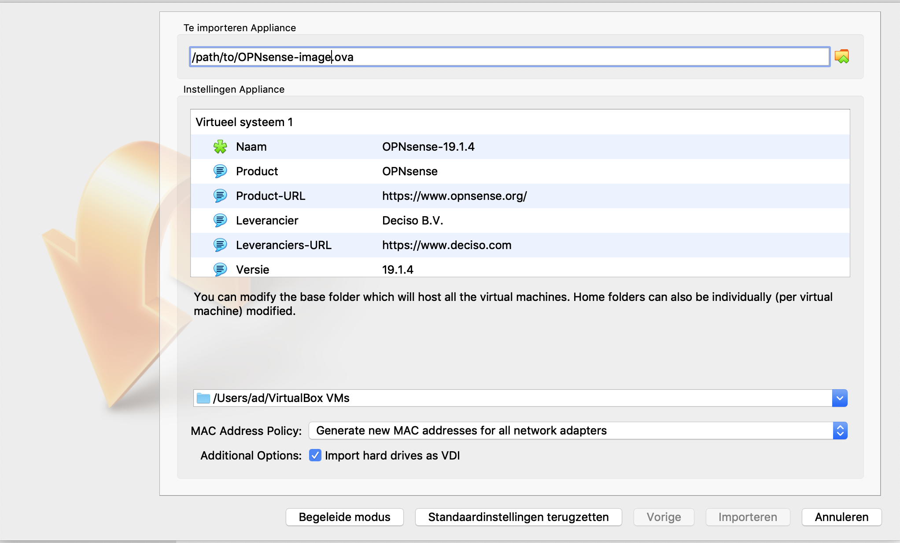

=============================
Installing OPNsense OVA image
=============================

OPNsense is available as an Open Virtual Appliance (OVA) package, which can be deployed in various
virtualization products (e.g. VMWare, Virtualbox).

The image is not provided as a community free download, but can be acquired from Deciso.

In this document we describe the simple steps when deploying in VirtualBox, other supported platforms function quite
similar.

---------------------------
Step 1 - Import appliance
---------------------------

In the top menu, choose :menuselection:`File --> Import appliance` and select the image you downloaded, it should
show a dialog like the following.

Just click import, accept the license and the image should be transferred to your machine.

--------------------------
Step 2 - Network setup
--------------------------

The OVA template comes with two interfaces configured by default (you can add more later if needed).
Always choose the right type of network before using OPNsense, the imported adapters might not be assigned to a type after import.

.. Note::

    Please be aware that the order of the network cards in the virtualization product may differ from how they are
    presented to the operating system. In VirtualBox "Adapter 1" seems to connect to WAN (em1)

---------------------------------
Step 3 - Initial configuration
---------------------------------

The virtual machine is operational now, initial configuration is performed similar to other setups, as described in
:doc:`../install`.
