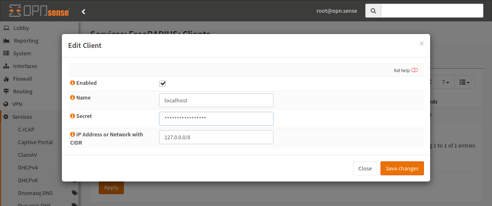
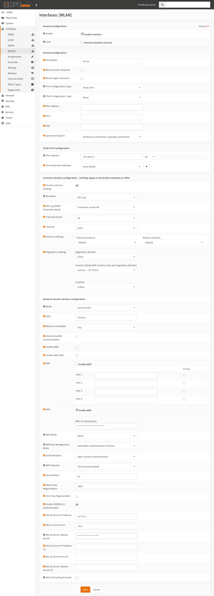
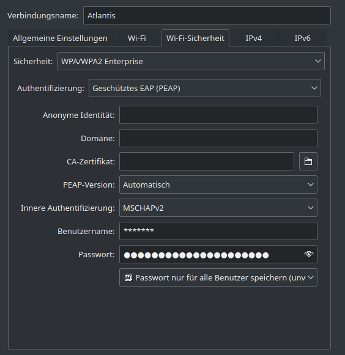

========================================
Interfaces: Wireless Networks (INTERNAL)
========================================

This page is about setting up a wireless interface in access point mode to
create your own WLAN. In this mode, your Laptops and handhelds can connect
to your OPNsense without an external access point for home and enterprise
environments. For home networks step over step two and don't setup the
802.1X service in the network settings.
For external access point, just create a cabled network (usually Ethernet)
and connect the access point to the other end.

.. Warning::

    FreeBSD supports wireless adapters in access point (infrastructure) mode,
    but this functionality is limited to some drivers and there may be some,
    which do not support all options available via the web interface.
    Please make sure that you buy a wireless card that is supported to avoid
    these problems.

.. Note::

    This guide requires the FreeRADIUS plugin to be installed and enabled (via :menuselection:`System --> Firmware --> Plugins` and :menuselection:`Services --> FreeRADIUS --> General`) .

Configuration
=============

Step 1
------

Create a wireless clone interface and assign it.

Step 2 - Prepare RADIUS
-----------------------

Create a new client, which is the AP.
For example, name it localhost, choose a secret and the CIDR 127.0.0.0/8.
The secret is later used in the wireless settings.

.. image:: images/interface_wireless_radius_4.png

Next, switch to the users menu and create a new user (for example for yourself).
The username and the password are used to authenticate later.
The rest of the settings can be left on their defaults.

Step 3 - Prepare WLAN
---------------------

======================= ========================================
Enable                  Check
Description             WLAN
IPv4 Configuration Type Static IPv4
======================= ========================================

======================= ========================================
IPv4 address            A network
IPv4 Upstream Gateway   WLAN
======================= ========================================

================================ ==========================================================
Persist common settings          Check (save for all clones)
Standard                         802.11g or another standard your adapter supports
Regulatory settings              Choose your country
Mode                             Access Point
SSID                             Name of the wireless network
WEP                              Unchecked
WPA                              Checked with your PSK (WLAN password if wanted)
WPA Mode                         WPA2
WPA Key Management Mode          Extensible Authentication
Authentication                   Open System Authentication
WPA Pairwise                     AES
Enable IEEE802.1X Authentication Check if you want to use RADIUS authentication
802.1X Server IP Address         127.0.0.1 (if you want RADIUS)
802.1X Server Port               1812 (if you want RADIUS)
802.1X Server Shared Secret      The password you configured in step 2 (if you want RADIUS)
================================ ==========================================================

Step 4 - Connect
----------------

.. Note::
    This is system specific - this screenshot is for a Linux distribution with
    KDE Plasma Workspaces 5, with the system language set to German.

To connect to the network, set the security setting to "WPA/WPA2 Enterprise"
and the authentication setting to "Protected EAP (PEAP)".
The inner authentication should be set to MSCHAPv2, and the username and password are the ones you
set up in the RADIUS plugin.
