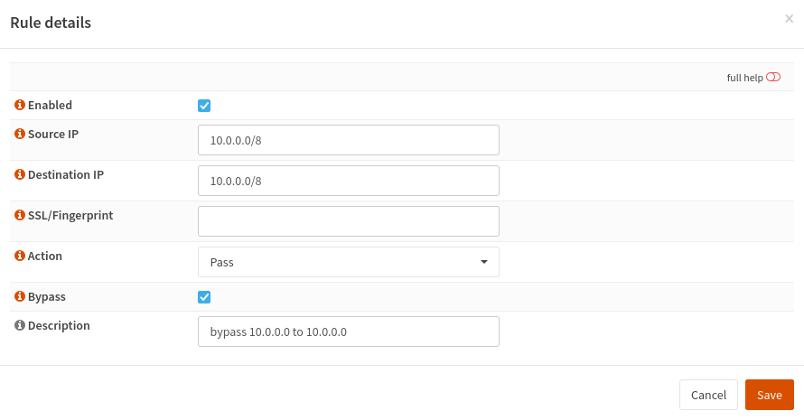

==========================
IPS Bypass local traffic
==========================

This tutorial explains how to bypass traffic between local attached networks. Following this tutorial will result in traffic only being inspected between external and internal networks.

-------------
Prerequisites
-------------

.. Note::

    Some features described on this page were added in version 27.X.
    Always keep your system up to date.

To start go to :menuselection:`Services --> Intrusion Detection`

|ids_menu|

------------
User defined
------------

Select the tab **User defined**.

|ids_tabs_user|

-----------------
Create a new Rule
-----------------

Select |add| to add a new rule. 
Create a rule for each of the RFC1918 Private IPv4 address ranges. If you use IPv6, create an additional rule for your IPv6 Prefix.

-----------------
Example Rules
-----------------

-------------------
Apply configuration
-------------------
First apply the configuration by pressing the **Apply** button at the bottom of
the form.

.. image:: images/applybtn.png
