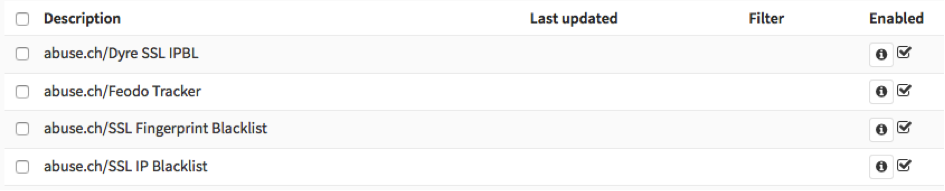
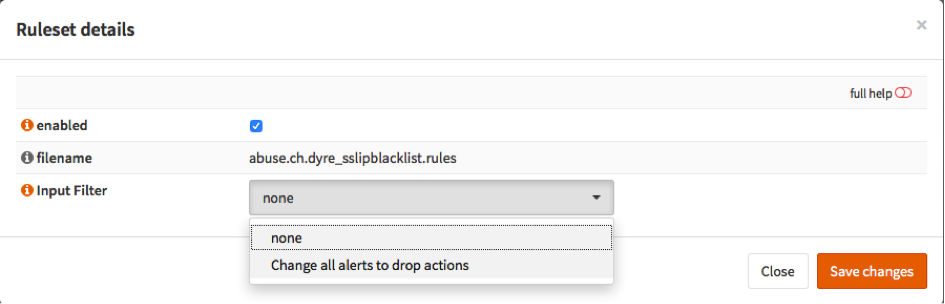
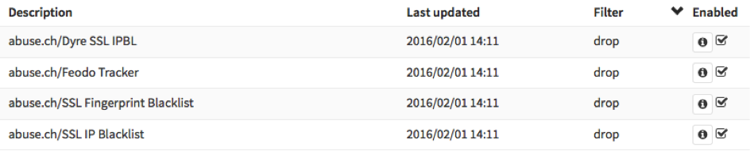
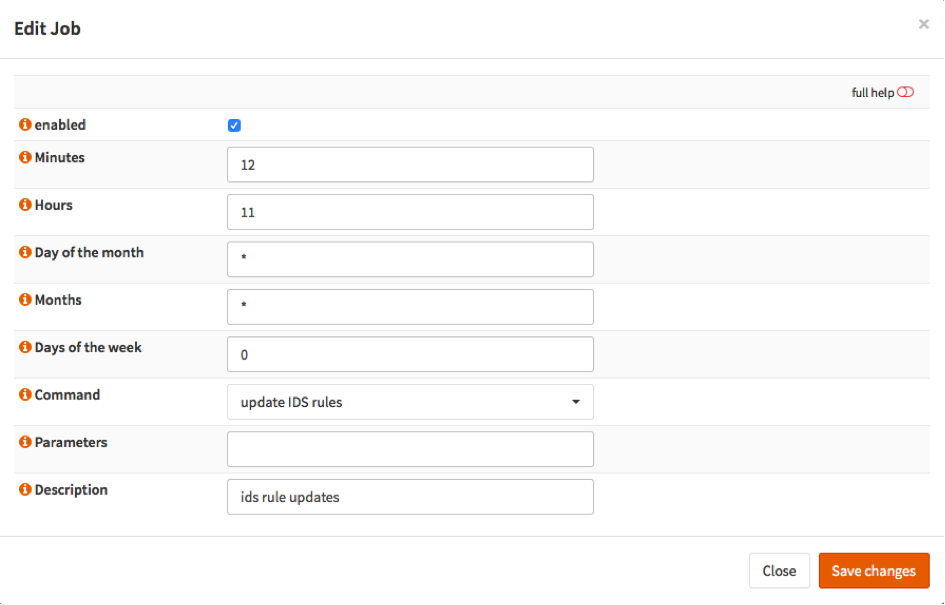
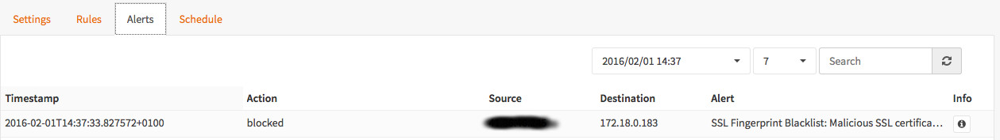

=================================
IPS SSLBlacklists & Feodo Tracker
=================================

This tutorial explains how to setup the IPS system to drop SSL certificates
listed on the `abuse.ch <https://www.abuse.ch>`__ SSL Blacklists & Feodo Tracker.

Feodo (also known as Cridex or Bugat) is a Trojan used to commit e-banking fraud
and steal sensitive information from the victim’s computer, such as credit card
details or credentials. For more information see https://feodotracker.abuse.ch

-------------
Prerequisites
-------------
* Always upgrade to latest release first.
  See :doc:`/manual/install` and/or upgrade to latest release:
  **System->Firmware: Fetch updates**

.. image:: images/firmware.png
    :width: 100%

* Minimum Advisable Memory is 2 Gigabyte and sufficient free disk space for
  logging (>10GB advisable).

* Disable all Hardware Offloading
  Under **Interface-Settings**

.. image:: images/disable_offloading.png
    :width: 100%

.. warning::

  After applying you need to reboot OPNsense otherwise offloading may not
  completely be disabled and IPS mode will not function.

.. Note::

    Some features described on this page were added in version 16.1.1.
    Always keep your system up to date.

--------------------------------------
Setup Intrusion Detection & Prevention
--------------------------------------
To enable IDS/IPS just go to Services->Intrusion Detection and select **enabled
& IPS mode**. Make sure you have selected the right interface for the intrusion
detection system too run on. For our example we will use the WAN interface, as
that will most likely be you connection with the public Internet.

..  image:: images/idps.png
    :width: 100%

-------------------
Apply configuration
-------------------
First apply the configuration by pressing the **Apply** button at the bottom of
the form.

.. image:: images/applybtn.png
    :width: 100%

---------------
Fetch Rule sets
---------------
For this example we will only fetch the abuse.ch SSL & Dodo Tracker rulesets.
To do so: select Enabled after each one.

To download the rule sets press **Download & Update Rules**.

.. image:: images/downloadbtn.png
    :width: 100%

-----------------------
Change default behavior
-----------------------
Now click on the info button   right after each rule and change Input Filter
from none to drop actions.

When done it should like this:

------------------------
Apply fraud drop actions
------------------------
Now press **Download & Update Rules** again to change the behavior to drop.

.. image:: images/downloadbtn.png
    :width: 100%

---------------
Keep up to date
---------------
Now schedule a regular fetch to keep your server up to date.

Click on schedule, a popup window will appear:

Select **enabled** and choose a time. For the example it is set to each day at 11:12.
Select **Save changes** and wait until you have returned to the IDS screen.

----
DONE
----
Your system has now been fully setup to drop known fraudulent SSL certificates
as well data phishing attempts by utilizing the Feodo tracking list.

------------
Sample alert
------------
Currently there is no test service available to check your block rules against,
however here is a sample of an actual alert that has been blocked:

