==================
IPS GeoIP Blocking
==================

This tutorial explains how to setup the IPS system to block ip's based on their
geographic location. This option is made possible by the integration of the
Maxmind GeoLite2 Country database. More information can be found here: http://dev.maxmind.com/geoip/geoip2/geolite2/

-------------
Prerequisites
-------------
* Always upgrade to latest release first.
  See :doc:`/manual/install` and/or upgrade to latest release:
  **System->Firmware: Fetch updates**

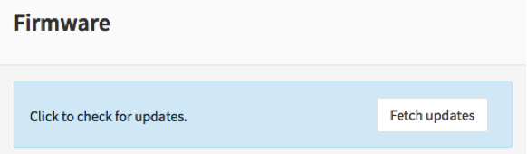

* Minimum Advisable Memory is 2 Gigabyte and sufficient free disk space for
  logging (>10GB advisable).

* Disable all Hardware Offloading
  Under **Interface-Settings**

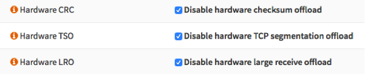

.. warning::

  After applying you need to reboot OPNsense otherwise offloading may not
  completely be disabled and IPS mode will not function.

To start go to **Services->Intrusion Detection**

|ids_menu|

------------
User defined
------------

Select the tab **User defined**.

|ids_tabs_user|

-----------------
Create a new Rule
-----------------

Select |add| to add a new rule.

Select Country:

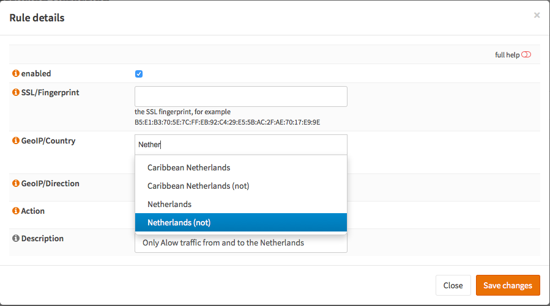

We selected **Netherlands(not)** as this server needs to be accessible within
The Netherlands, this will drop all other traffic in both directions.

Select the Action (Alert or Drop):

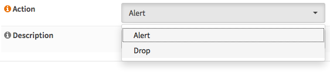

Add a description:

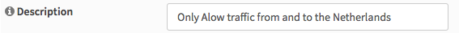

And click **Save changes** |save|

---------------------------------------
Enable Intrusion Detection & Prevention
---------------------------------------
To enable IDS/IPS just go to Services->Intrusion Detection and select **enabled
& IPS mode**. Make sure you have selected the right interface for the intrusion
detection system too run on. For our example we will use the WAN interface, as
that will most likely be you connection with the public Internet.

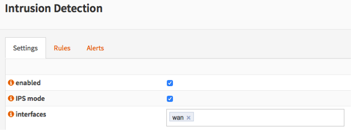

-------------------
Apply configuration
-------------------
If this is the first GeoIP rule you add then you need to **Download & Update Rules**

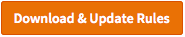

Then apply the configuration by pressing the **Apply** button at the bottom of
the form.

.. image:: images/applybtn.png
    :width: 100%

------------
Sample Alert
------------
See a sample of an alert message below.

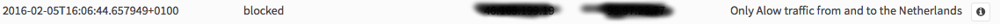

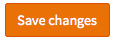
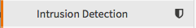
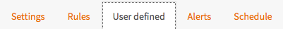

