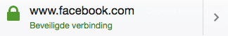
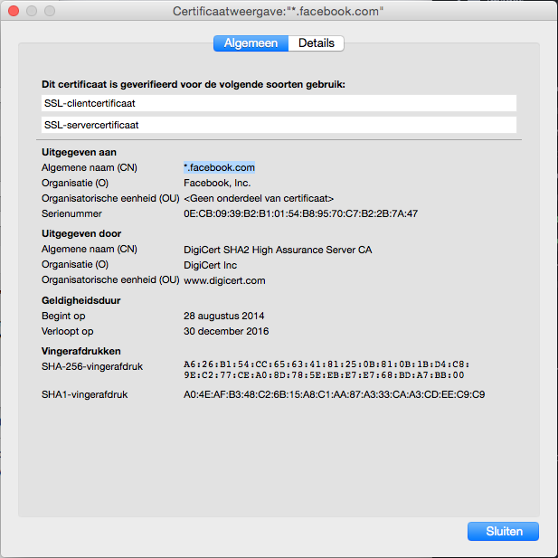
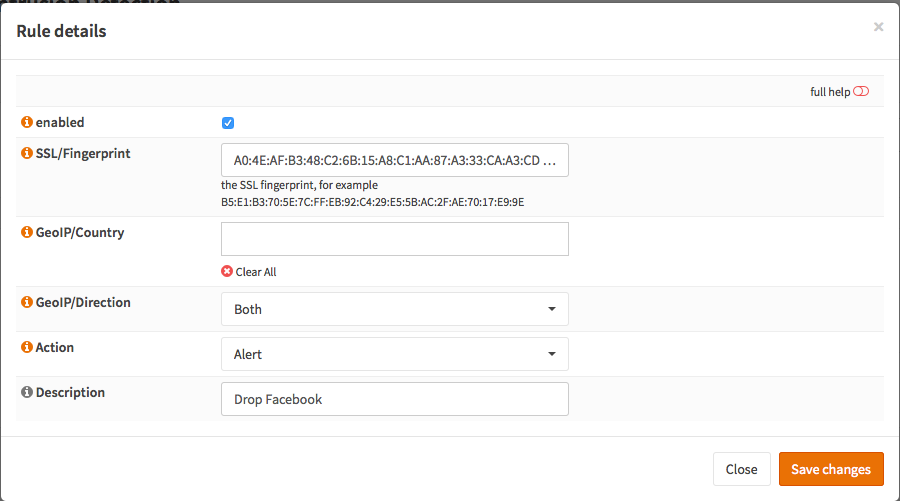
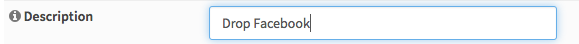
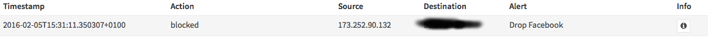
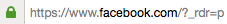

==========================
IPS Block SSL certificates
==========================

This tutorial explains how to setup the IPS system to block ssl certificates based on their
SHA1 fingerprint.

-------------
Prerequisites
-------------
* Always upgrade to latest release first.
  See :doc:`/manual/install` and/or upgrade to latest release:
  **System->Firmware: Fetch updates**

.. image:: images/firmware.png
    :width: 100%

* Minimum Advisable Memory is 2 Gigabyte and sufficient free disk space for
  logging (>10GB advisable).

* Disable all Hardware Offloading
  Under **Interface-Settings**

.. image:: images/disable_offloading.png
    :width: 100%

.. warning::

  After applying you need to reboot OPNsense otherwise offloading may not
  completely be disabled and IPS mode will not function.

To start go to **Services->Intrusion Detection**

|ids_menu|

------------
User defined
------------

Select the tab **User defined**.

|ids_tabs_user|

-----------------
Create a new Rule
-----------------

Select |add| to add a new rule.

Get fingerprint of website
--------------------------
It is relatively easy to find out the SSL fingerprint of a website.
For demonstration we will block facebook and use Firefox to determine the fingerprint.

Open your browser and go to https://facebook.com when loaded click on the lock
next to the address : |lock|.

Now you will see something similar to:

Click on the arrow ( **>** ) and then Select **More Information**
Now open the certificate details and you will see something that looks like this:

Copy the SHA1 certificate fingerprint (A0:4E:AF:B3:48:C2:6B:15:A8:C1:AA:87:A3:33:CA:A3:CD:EE:C9:C9).

Paste this into the new rule:

Select the Action (Alert or Drop):

.. image:: images/ips_action.png
    :width: 100%

Add a description:

And click **Save changes** |save|

---------------------------------------
Enable Intrusion Detection & Prevention
---------------------------------------
To enable IDS/IPS just go to Services->Intrusion Detection and select **enabled
& IPS mode**. Make sure you have selected the right interface for the intrusion
detection system too run on. For our example we will use the WAN interface, as
that will most likely be you connection with the public Internet.

..  image:: images/idps.png
    :width: 100%

-------------------
Apply configuration
-------------------
First apply the configuration by pressing the **Apply** button at the bottom of
the form.

.. image:: images/applybtn.png
    :width: 100%

----------------------------
Clear Browser Cache and test
----------------------------
Since your browser has cached the ssl certificate you will need to clear your
cache first. After that you can test and will see the following in **Alerts**:

.. Note::

    If the browser has cached the certificate no SSL certificate exchange will be
    done and the website will not be blocked.

.. |save| image:: images/ips_save.png
.. |ids_menu| image:: images/ids_menu.png
.. |ids_tabs_user| image:: images/ids_tabs_user.png
.. |add| image:: images/ids_tabs_user_add.png

