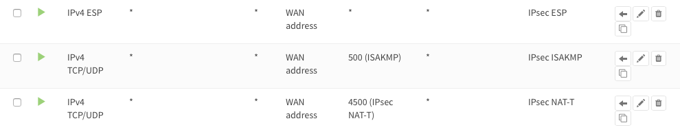
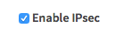
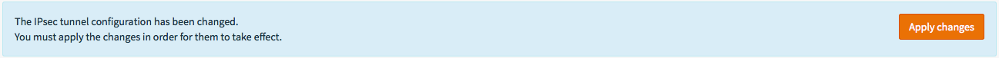
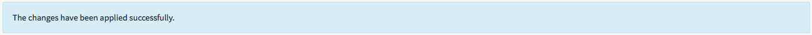
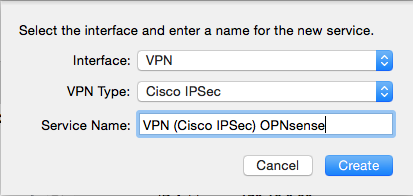
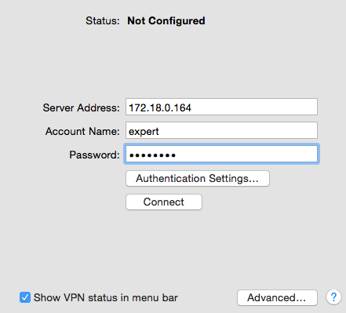
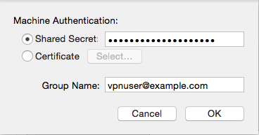

========================
Setup IPsec Road-Warrior
========================
Road Warriors are remote users who need secure access to the companies infrastructure.
IPsec Mobile Clients offer a solution that is easy to setup with OSX (native)
and is know to work with iOS as well as many Android devices.

For more flexibility use SSL VPN's, OPNsense utilizes OpenVPN for this purpose.

With this example we'll show you how to configure the Mobile Client Setup in
OPNsense and give you configuration examples for:

* OSX
* iOS
* Android

.. Note::

   For the sample we will use a private ip for our WAN connection.
   This requires us to disable the default block rule on wan to allow private traffic.
   To do so, go to the **Interfaces->[WAN]** and uncheck "Block private networks".
   *(Dont forget to save and apply)*

   .. image:: images/block_private_networks.png

-----------------------------

------------
Sample Setup
------------
For the sample configuration we configure OPNsense

**Company Network with Remote Client**

.. nwdiag::
  :scale: 100%

    nwdiag {

      span_width = 90;
      node_width = 180;
      Internet [shape = "cisco.cloud"];
      fileserver [label="File Server",shape="cisco.fileserver",address="192.168.1.10"];
      fileserver -- switchlan;

      network LAN {
        switchlan [label="",shape = "cisco.workgroup_switch"];
        label = " LAN";
        address ="192.168.1.1.x/24";
        fw1 [address="192.168.1.1/24"];
      }

      network WAN  {
        label = " WAN";
        fw1 [shape = "cisco.firewall", address="172.18.0.164"];
        Internet;
      }

      network Remote {
          Internet;
          laptop [address="172.10.10.55 (WANIP),10.10.0.1 (IPsec)",label="Remote User",shape="cisco.laptop"];
      }
    }

Company Network
---------------
==================== =============================
 **Hostname**         fw1
 **WAN IP**           172.18.0.164
 **LAN IP**           192.168.1.0/24
 **LAN DHCP Range**   192.168.1.100-192.168.1.200
 **IPsec Clients**    10.10.0.0/24
==================== =============================

---------------------------
Firewall Rules Mobile Users
---------------------------
To allow IPsec Tunnel Connections, the following should be allowed on WAN.

* Protocol ESP
* UDP Traffic on Port 500 (ISAKMP)
* UDP Traffic on Port 4500 (NAT-T)

To allow traffic passing to your LAN subnet you need to add a rule to the IPsec
interface.

-----------------------
Step 1 - Mobile Clients
-----------------------
First we will need to setup the mobile clients network and authentication methods.
Go to **VPN->IPsec->Mobile Clients**

For our example will use the following settings:

IKE Extensions
--------------
========================= ================ ================================================
**Enable**                 checked          *check to enable mobile clients*
**User Authentication**    Local Database   *For the example we use the Local Database*
**Group Authentication**   none             *Leave on none*
**Virtual Address Pool**   10.0.0.0/24      *Enter the IP range for the remote clients*
========================= ================ ================================================

You can select other options, but we will leave them all unchecked for this
example.

**Save** your settings and select **Create Phase1** when it appears.
Then enter the Mobile Client Phase 1 setting.

-------------------------------
Step 2 - Phase 1 Mobile Clients
-------------------------------

Phase 1 General information
---------------------------
========================= ============= ================================================
**Connection method**      default       *default is 'Start on traffic'*
**Key Exchange version**   V1            *only V1 is supported for mobile clients*
**Internet Protocol**      IPv4
**Interface**              WAN           *choose the interface connected to the internet*
**Description**            MobileIPsec   *freely chosen description*
========================= ============= ================================================

Phase 1 proposal (Authentication)
---------------------------------
=========================== ====================== ======================================
 **Authentication method**   Mutual PSK +Xauth      *Using a Pre-shared Key and Login*
 **Negotiation mode**        Agressive              *Select Aggressive*
 **My identifier**           My IP address          *Simple identification for fixed ip*
 **Peer identifier**         User distinguished     *Identification for peer*
 *Peer identifier*           vpnuser@example.com    *Our freely chosen identifier*
 **Pre-Shared Key**          At4aDMOAOub2NwT6gMHA   *Random key*. **CREATE YOUR OWN!**
=========================== ====================== ======================================

Phase 1 proposal (Algorithms)
-----------------------------
========================== ============= ===========================================================
 **Encryption algorithm**   AES           *For our sample we will Use AES/256 bits*
 **Hash algoritm**          SHA1          *SHA1 for compatibility, you can try a stronger hash*
 **DH key group**           1024 bit      *1024 bit for compatibility, you can try stronger group*
 **Lifetime**               28800 sec     *lifetime before renegotiation*
========================== ============= ===========================================================

Advanced Options
----------------
======================= =========== ===================================================
**Disable Rekey**        Unchecked   *Renegotiate when connection is about to expire*
**Disable Reauth**       Unchecked   *For IKEv2 only re-authenticate peer on rekeying*
**NAT Traversal**        Enabled     *Enable for IKEv1*
**Dead Peer Detection**  Unchecked
======================= =========== ===================================================

Save your setting by pressing:

Now you should see the following screen:

-------------------------------
Step 3 - Phase 2 Mobile Clients
-------------------------------
Press the button that says '+ Show 0 Phase-2 entries'

You will see an empty list:

Now press the *+* at the right of this list to add a Phase 2 entry.

General information
-------------------
======================= ================== =============================
 **Mode**                Tunnel IPv4        *Select Tunnel mode*
 **Description**         MobileIPsecP2      *Freely chosen description*
======================= ================== =============================

Local Network
-------------
======================= ================== ==============================
 **Local Network**       LAN subnet        *Route the local LAN subnet*
======================= ================== ==============================

Phase 2 proposal (SA/Key Exchange)
----------------------------------
=========================== ============ ==========================================
**Protocol**                 ESP           *Choose ESP for encryption*
**Encryption algorithms**    AES / 256     *For the sample we use AES 256*
**Hash algorithms**          SHA1          *You may also try stronger SHA512*
**PFS Key group**            off           *Enable a group fro stronger security*
**Lifetime**                 3600 sec
=========================== ============ ==========================================

Save your setting by pressing:

-----------------------------

Enable IPsec, Select:

Save:

And Apply changes:

------------------

-----------------------------

------------------------
Step 4 - Add IPsec Users
------------------------
For this example we will create a new user who may access the mobile IPsec vpn.

Go to **System->Access->Users** and press the **+** sign in the lower right corner
to add a new user.

Enter the following into the form:

=============== ==========
 **User Name**   expert
 **Password**    &test!9T
=============== ==========

**Save** this user and reopen in edit mode to add privileges.

Add privilege **User - VPN - IPsec xauth Dialin** by pressing the **+** under
**Effective Privileges**.

**Save** to apply.

----------------------

-------------------------
Step 5 - Configure Client
-------------------------
To illustrate the client setup we will look at the configuration under OSX, including
some screenshots. The configurations for Android and iOS will be settings only.

.. Note::
      Configuration samples listed here where created using latest OSX, iOS and
      Android devices on time of publication in February 2016.

--------------------
Configure OSX Client
--------------------

Start with opening your network settings (System Preferences -> Network) and
Add a new network by pressing the + in the lower left corner.

Now select **VPN** and **Cisco IPSec**, give your connection a name and press **Create**.

Now enter the details for our connection:

Next press **Authentication Settings** to add the group name and pre-shared key.

Press **OK** to save these settings and then **Apply** to apply them.

Now test the connection by selecting it from the list and hit **Connect**.

**Done**

--------------------
Configure iOS Client
--------------------
To add a VPN connection on an iOS device go to **Setting->General->VPN**.
Select **Add VPN Configuration** chose **IPsec** and use the Following Settings:

========================== ======================= ========================================
  **Description**           IPsec OPNsense          *Freely chosen description*
  **Server**                172.18.0.164            *Our server address*
  **Account**               expert                  *Username of the remote account*
  **Password**              &test!9T                *Leave blank to be prompted every time*
  **IPsec-id**              vpnuser@example.com     *The peer identity we chose*
  **Preshared IPsec-key**   At4aDMOAOub2NwT6gMHA    *Our PSK*
========================== ======================= ========================================

------------------------
Configure Android Client
------------------------
To add a VPN connection on an Android device go to **Settings -> Connections ->
more networks** , select **VPN**. Press the **+** in the top right corner to add
a new vpn connection.

Use the Following Settings:

========================== ======================= =============================
  **Name**                  IPsec OPNsense         *Freely chosen name*
  **Type**                  IPSec Xauth PSK        *As configured in OPNsense*
  **Server address**        172.18.0.164           *Our server address*
  **IPsec-id**              vpnuser@example.com    *The peer identity we chose*
  **Preshared IPsec-key**   At4aDMOAOub2NwT6gMHA   *Our PSK*
========================== ======================= =============================

**Save** and try connecting. To connect enter Username and Password for the user
*expert* we created in this example.
