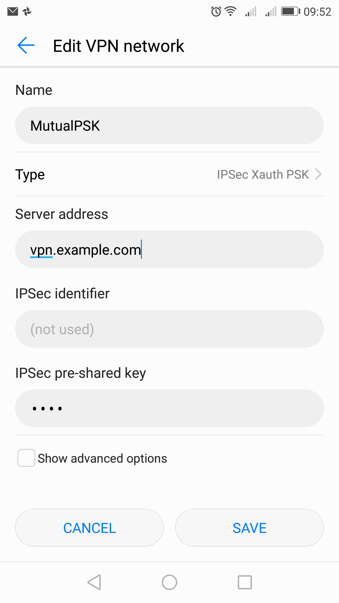
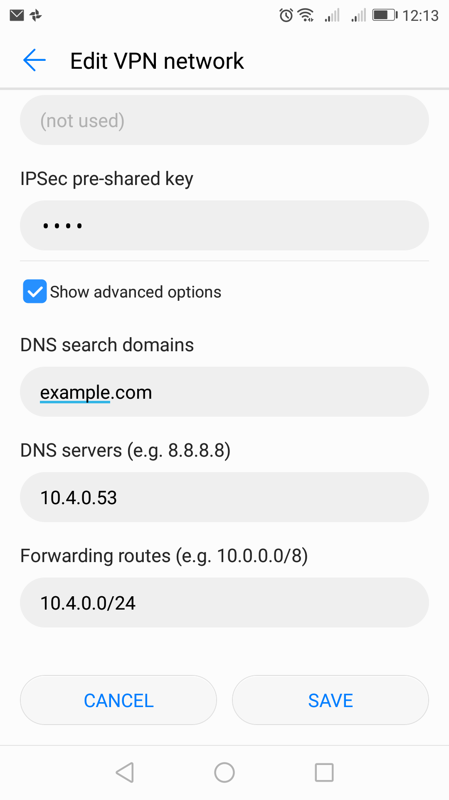
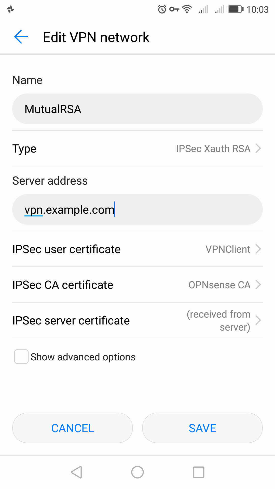
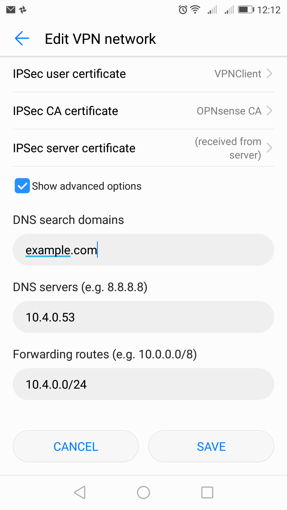
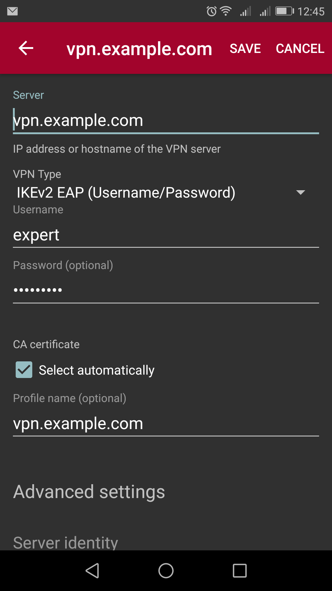
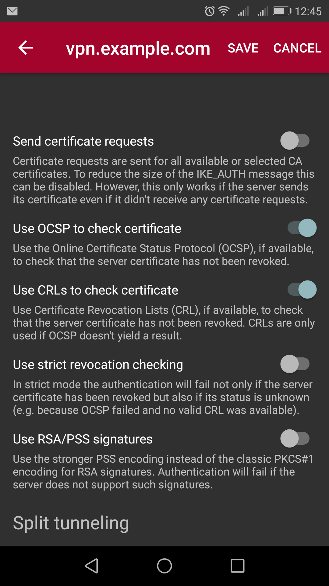
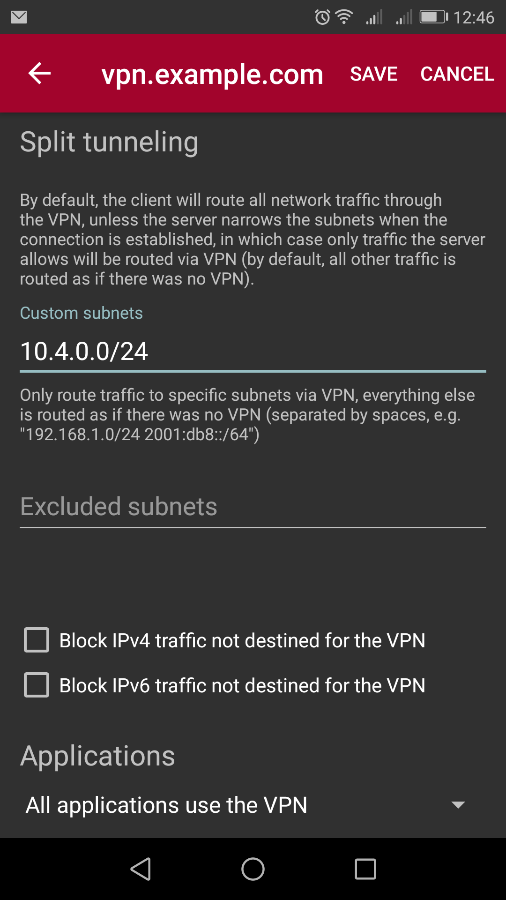
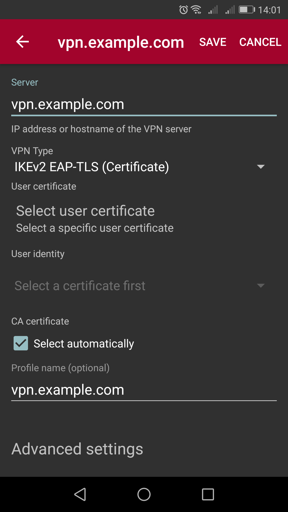
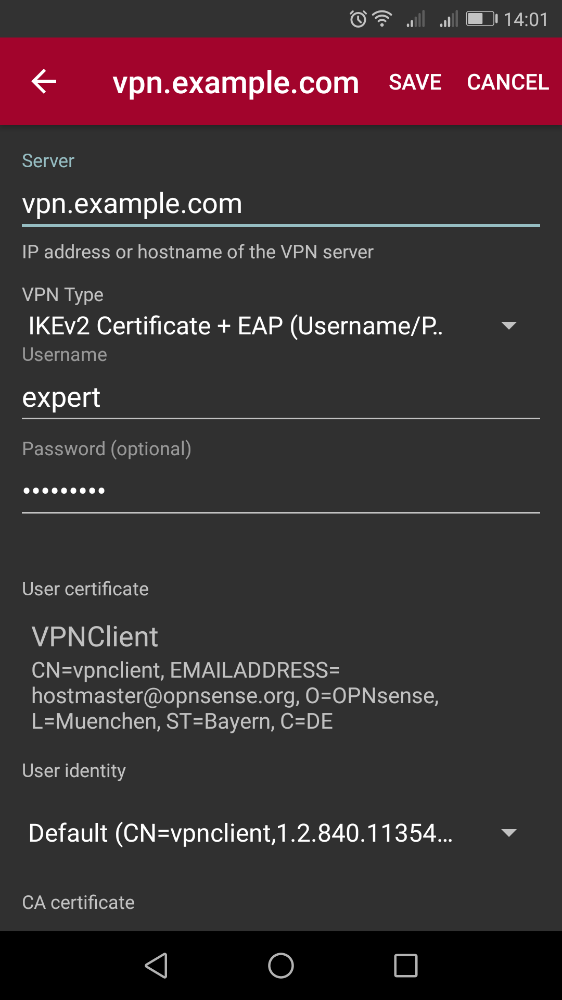

====================================
IPsec: Setup Android Remote Access
====================================

.. contents:: Index

Here you can see the configuration options for all compatible VPN types.
We assume that you are familiar with adding a new VPN connection.

All screenshot were taken from Android version 7.

---------------------------
Step 1 - Install Certificte
---------------------------

For all RSA or IKEv2 related VPN configuration we need to install the Root CA and sometimes also
the client certificate. The easiest way is to send yourself the client certificate and Root CA per
e-mail and download the files. Under settings search for "cert" and you will be prompted for 
**Install certificates**. Navigate to the download directory and install the Root CA and - when configured - 
the client certificate.

---------------------------
Step 2 - Add VPN Connection
---------------------------

Add a new VPN connection via **Settings->More->VPN**, give a **Name** and choose the type you need.
Under **Server address** use your FQDN of the Firewall, also keep in mind that it has to match with the
CN of your certificate! Opening **Advanced options** you can set **DNS search domains**, **DNS servers**
or **Forwarding routes**, which is the network you configures in Phase2 of your mobile VPN.

If you want to use IKEv2 you have to use the strongswan app via App Store, as Android stock VPN only 
supports IKEv1.

See the following screenshots for the different VPN types:

------------------
Mutual PSK + XAuth
------------------

   

   
------------------
Mutual RSA + XAuth
------------------

   

----------------------------------
IKEv2 + EAP-MSCHAPv2 or EAP-RADIUS
----------------------------------

   

   

---------------
IKEv2 + EAP-TLS
---------------

For EAP-TLS choose RSA (local)+ EAP-TLS (remote) in your OPNsense configuration.

   
---------------------------------
IKEv2 + Mutual RSA + EAP-MSCHAPv2
---------------------------------

This is the most secure combination!

   
